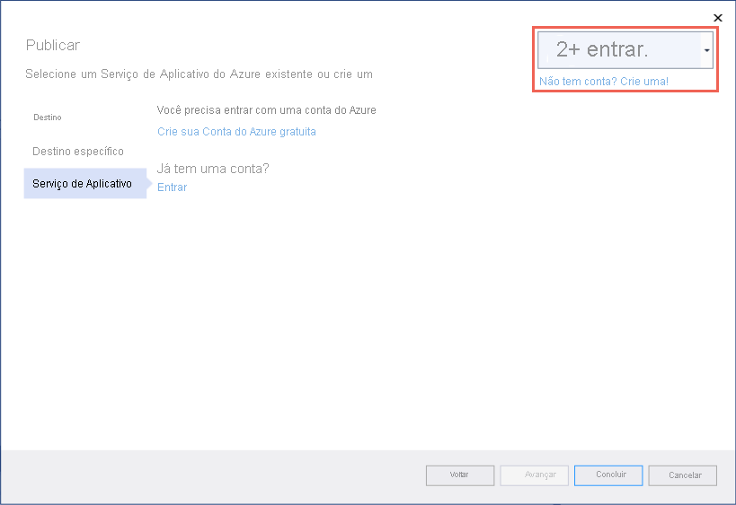
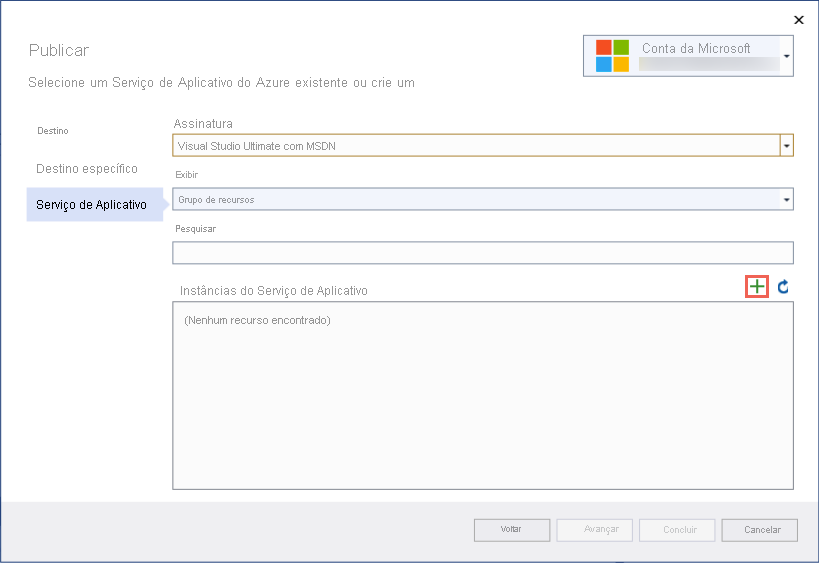
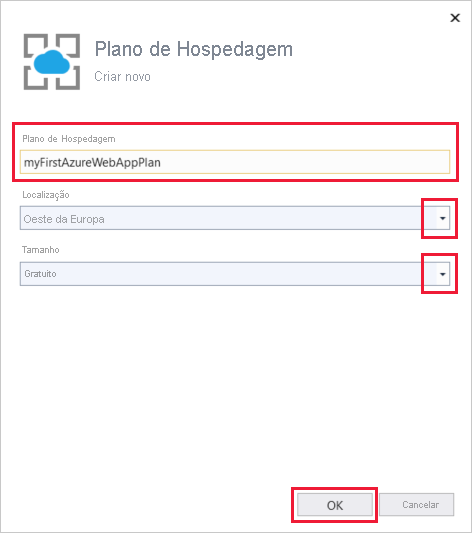
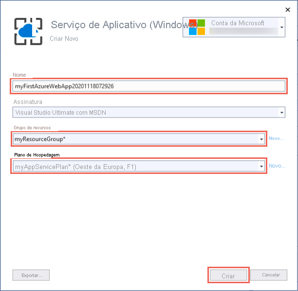
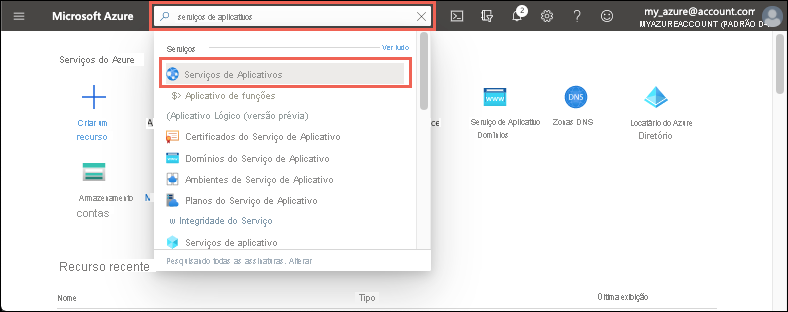

# <a name="quickstart-create-an-aspnet-core-web-app-in-azure"></a>Início Rápido: Criar um aplicativo Web ASP.NET Core no Azure

::: zone pivot="platform-windows"  

Neste início rápido, você aprenderá a criar e implantar seu primeiro aplicativo Web ASP.NET Core no <abbr title="Um serviço baseado em HTTP para hospedagem de aplicativos Web, APIs REST e aplicativos de back-end móveis.">Serviço de aplicativo do Azure</abbr>. O Serviço de Aplicativo dá suporte a aplicativos .NET 5.0.

Quando terminar, você terá um grupo de recursos do Azure <abbr title="Um contêiner lógico para recursos do Azure relacionados que você pode gerenciar como uma unidade.">grupo de recursos</abbr>, composto por um <abbr title="O plano que especifica o local, o tamanho e os recursos do farm de servidores Web que hospeda o aplicativo.">Plano do Serviço de Aplicativo</abbr> e um <abbr title="A representação do aplicativo Web, que contém o código do aplicativo, os nomes de host DNS, os certificados e os recursos relacionados.">Aplicativo de Serviço de Aplicativo</abbr> com um aplicativo ASP.NET Core de exemplo implantado.

<hr/> 

## <a name="1-prepare-your-environment"></a>1. Prepare o seu ambiente

- **Obtenha uma conta do Azure** com uma assinatura ativa <abbr title="A estrutura organizacional básica na qual você gerencia recursos no Azure, normalmente associada a um indivíduo ou departamento da organização.">subscription</abbr>. [Crie uma conta gratuitamente](https://azure.microsoft.com/free/dotnet/).
- **Instale o <a href="https://www.visualstudio.com/downloads/" target="_blank">Visual Studio 2019</a>** com a carga de trabalho de **desenvolvimento Web e do ASP.NET**.

<details>
<summary>Já tem o Visual Studio 2019?</summary>
Se você já instalou o Visual Studio 2019:

<ul>
<li><strong>Instale as atualizações mais recentes</strong> no Visual Studio selecionando <strong>Ajuda</strong> &gt; <strong>Verificar Atualizações</strong>. As atualizações mais recentes contêm o SDK do .NET 5.0.</li>
<li><strong>Adicione a carga de trabalho</strong> selecionando <strong>Ferramentas</strong> &gt; <strong>Obter Ferramentas e Recursos</strong>.</li>
</ul>
</details>

<hr/> 

## <a name="2-create-an-aspnet-core-web-app"></a>2. Criar um aplicativo Web ASP.NET Core

1. Abra o Visual Studio e selecione **Criar um projeto**.

1. Em **Criar um projeto**, selecione **Aplicativo Web ASP.NET Core** e confirme se **C#** está listado nas linguagens para essa escolha e, em seguida, selecione **Avançar**.

1. Em **Configurar seu novo projeto**, dê ao projeto de aplicativo Web o nome *myFirstAzureWebApp* e selecione **Criar**.

   

1. Para um aplicativo .NET 5.0, selecione **ASP.NET Core 5.0** na lista suspensa. Caso contrário, use o valor padrão.

1. Você pode implantar qualquer tipo de aplicativo Web ASP.NET Core no Azure, mas para este guia de início rápido, escolha o modelo **Aplicativo Web ASP.NET Core**. Defina **Autenticação** como **Sem Autenticação** e não deixe nenhuma outra opção selecionada. Em seguida, selecione **Criar**.

    
   
1. No menu do Visual Studio, selecione **Depurar** > **Iniciar Sem Depuração** para executar o aplicativo Web localmente.

   

<hr/> 

## <a name="3-publish-your-web-app"></a>3. Publicar seu aplicativo Web

1. No **Gerenciador de Soluções**, clique com o botão direito do mouse no projeto **myFirstAzureWebApp** e selecione **Publicar**. 

1. Em **Publicar**, selecione **Azure** e clique em **Avançar**.

1. As opções dependem de você já ter entrado no Azure e de ter uma conta do Visual Studio vinculada a uma conta do Azure. Selecione **Adicionar uma conta** ou **Entrar** para entrar em sua assinatura do Azure. Se você já estiver conectado, selecione a conta que deseja.

   

1. À direita de **Instâncias do Serviço de Aplicativo**, clique em **+** .

   

1. Em **Assinatura**, aceite a assinatura que está listada ou selecione uma nova na lista suspensa.

1. Para **Grupo de recursos**, selecione **Novo**. Em **Nome do novo grupo de recursos**, insira *myResourceGroup* e selecione **OK**. 

1. Em **Plano de Hospedagem**, selecione **Novo**. 

1. Na caixa de diálogo **Plano de Hospedagem: Criar novo**, insira os valores especificados na tabela a seguir:

   | Configuração  | Valor sugerido |
   | -------- | --------------- |
   | **Plano de hospedagem**  | *myFirstAzureWebAppPlan* |
   | **Localidade**      | *Oeste da Europa* |
   | **Tamanho**          | *Gratuito* |
   
   

1. Em **Nome**, insira um nome de aplicativo exclusivo.

    <details>
        <summary>Quais caracteres posso usar?</summary>
        Os caracteres válidos são a-z, A-Z, 0-9 e -. Você pode aceitar o nome exclusivo gerado automaticamente. A URL do aplicativo Web é http://<code>&lt;app-name&gt;.azurewebsites.net</code>, em que <code>&lt;app-name&gt;</code> é o nome do aplicativo.
    </details>

1. Selecione **Criar** para criar os recursos do Azure. 

   

1. Aguarde até que o assistente termine de criar os recursos do Azure. Escolha **Concluir** para fechar o assistente.

1. Na página **Publicar**, clique em **Publicar** para implantar o projeto. 

    <details>
        <summary>O que o Visual Studio está fazendo?</summary>
        O Visual Studio compila, empacota e publica o aplicativo no Azure e, em seguida, inicia o aplicativo no navegador padrão.
    </details>

   

<hr/> 

## <a name="4-update-the-app-and-redeploy"></a>4. Atualizar o aplicativo e reimplantar

1. No **Gerenciador de Soluções**, em seu projeto, abra **Páginas** > **Index.cshtml**.

1. Substitua toda a marcação `<div>` pelo seguinte código:

   ```html
   <div class="jumbotron">
       <h1>ASP.NET in Azure!</h1>
       <p class="lead">This is a simple app that we've built that demonstrates how to deploy a .NET app to Azure App Service.</p>
   </div>
   ```

1. Para implantar novamente no Azure, clique com o botão direito do mouse no projeto **myFirstAzureWebApp**, no **Gerenciador de Soluções** e selecione **Publicar**.

1. Na página de resumo **Publicar**, selecione **Publicar**.

   <!--  -->

    Quando a publicação está concluída, o Visual Studio inicia um navegador para a URL do aplicativo Web.

    

<hr/> 

## <a name="5-manage-the-azure-app"></a>5. Gerenciar o aplicativo do Azure

1. Vá até o [portal do Azure](https://portal.azure.com) e procure e selecione **Serviços de Aplicativos**.

    
    
1. Na página **Serviços de Aplicativos**, selecione o nome do seu aplicativo Web.

    :::image type="content" source="./media/quickstart-dotnetcore/select-app-service.png" alt-text="Captura de tela da página Serviços de Aplicativos com um aplicativo Web de exemplo selecionado.":::

1. A página **Visão Geral** do aplicativo Web contém opções para gerenciamento básico, como procurar, parar, iniciar, reiniciar e excluir. O menu à esquerda fornece páginas adicionais para configurar o aplicativo.

    
    
<hr/> 

## <a name="6-clean-up-resources"></a>6. Limpar os recursos

1. No menu do portal do Azure ou na **Página inicial**, selecione **Grupos de recursos**. Em seguida, na página **Grupos de recursos**, selecione **myResourceGroup**.

1. Na página **myResourceGroup**, certifique-se de que os recursos listados são aqueles que deseja excluir.

1. Selecione **Excluir grupo de recursos**, digite **myResourceGroup** na caixa de texto para confirmar e selecione **Excluir**.

<hr/> 

## <a name="next-steps"></a>Próximas etapas

Avance para o próximo artigo para saber como criar um aplicativo .NET Core e conectá-lo a um Banco de Dados SQL:

- [ASP.NET Core com o Banco de Dados SQL](tutorial-dotnetcore-sqldb-app.md)
- [Configurar o aplicativo ASP.NET Core](configure-language-dotnetcore.md)

::: zone-end  

::: zone pivot="platform-linux"
Este início rápido mostra como criar um aplicativo [.NET Core](/aspnet/core/) no <abbr title="O Serviço de Aplicativo no Linux fornece um serviço de hospedagem na Web altamente escalonável e com aplicação automática de patches usando o sistema operacional Linux.">Serviço de Aplicativo no Linux</abbr>. Crie o aplicativo usando a [CLI do Azure](/cli/azure/get-started-with-azure-cli) e use o Git para implantar o código .NET Core no aplicativo.

<hr/> 

## <a name="1-prepare-your-environment"></a>1. Prepare o seu ambiente

- **Obtenha uma conta do Azure** com uma assinatura ativa. [Crie uma conta gratuitamente](https://azure.microsoft.com/free/dotnet/).
- **Instale** o <a href="https://dotnet.microsoft.com/download/dotnet-core/3.1" target="_blank">SDK do .NET Core 3.1</a> ou o <a href="https://dotnet.microsoft.com/download/dotnet/5.0" target="_blank">SDK do .NET 5.0</a> mais recente.
- **<a href="/cli/azure/install-azure-cli" target="_blank">Instalar a última CLI do Azure</a>** .

[Está com problemas? Fale conosco.](https://aka.ms/DotNetAppServiceLinuxQuickStart)

<hr/> 

## <a name="2-create-the-app-locally"></a>2. Criar o aplicativo localmente

1. Execute `mkdir hellodotnetcore` para criar o diretório.

    ```bash
    mkdir hellodotnetcore
    ```

1. Execute `cd hellodotnetcore` para alterar o diretório. 

    ```bash
    cd hellodotnetcore
    ```

1. Execute `dotnet new web` para criar um aplicativo .NET Core.

    ```bash
    dotnet new web
    ```

<hr/> 

## <a name="3-run-the-app-locally"></a>3. Executar o aplicativo localmente

1. Execute `dotnet run` para ver como ele fica quando você o implanta no Azure.

    ```bash
    dotnet run
    ```
    
1. **Abra um navegador da Web** e navegue até o aplicativo em `http://localhost:5000`.


[Está com problemas? Fale conosco.](https://aka.ms/DotNetAppServiceLinuxQuickStart)

<hr/> 

## <a name="4-sign-into-azure"></a>4. Entrar no Azure

Execute `az login` para entrar no Azure.

```azurecli
az login
```

[Está com problemas? Fale conosco.](https://aka.ms/DotNetAppServiceLinuxQuickStart)

<hr/> 

## <a name="5-deploy-the-app"></a>5. Implantar o aplicativo

1. **Execute** `az webapp up` na pasta local. **Substitua** <app-name> por um nome globalmente exclusivo.

    ```azurecli
    az webapp up --sku F1 --name <app-name> --os-type linux
    ```
    
    <details>
    <summary>Solução de problemas</summary>
    <ul>
    <li>Se o comando <code>az</code> não for reconhecido, verifique se você tem a CLI do Azure instalada conforme descrito em <a href="#1-prepare-your-environment">Preparar o ambiente</a>.</li>
    <li>Substitua <code>&lt;app-name&gt;</code> por um nome que seja exclusivo em todo o Azure (<em>os caracteres válidos são <code>a-z</code>, <code>0-9</code> e <code>-</code></em>). Um bom padrão é usar uma combinação do nome da empresa e um identificador de aplicativo.</li>
    <li>O argumento <code>--sku F1</code> cria o aplicativo Web no tipo de preço Gratuito. Omita esse argumento para usar um nível Premium mais rápido, o que incorre em um custo por hora.</li>
    <li>Opcionalmente, você pode incluir o argumento <code>--location &lt;location-name&gt;</code>, em que <code>&lt;location-name&gt;</code> é uma região do Azure disponível. Você pode recuperar uma lista de regiões permitidas para sua conta do Azure executando o comando <a href="/cli/azure/appservice#az-appservice-list-locations"><code>az account list-locations</code></a>.</li>
    </ul>
    </details>
    
1. Aguarde até que o comando seja concluído. Pode levar alguns minutos e termina com "Você pode iniciar o aplicativo em http://&lt;app-name&gt;.azurewebsites.net".

    <details>
    <summary>O que <code>az webapp up</code> está fazendo?</summary>
    <p>O comando <code>az webapp up</code> realiza as seguintes ações:</p>
    <ul>
    <li>Criar um grupo de recursos padrão.</li>
    <li>Criar um plano do Serviço de Aplicativo padrão.</li>
    <li><a href="/cli/azure/webapp#az-webapp-create">Criar um aplicativo do Serviço de Aplicativo</a> com o nome especificado.</li>
    <li>Faz a <a href="/azure/app-service/deploy-zip">implantação de Zip</a> dos arquivos do diretório de trabalho atual para o aplicativo.</li>
    <li>Durante a execução, ele fornece mensagens sobre a criação de recursos, o registro em log e a implantação do ZIP.</li>
    </ul>
    </details>
    
# <a name="net-core-31"></a>[.NET Core 3.1](#tab/netcore31)


# <a name="net-50"></a>[.NET 5.0](#tab/net50)


---

[Está com problemas? Fale conosco.](https://aka.ms/DotNetAppServiceLinuxQuickStart)

<hr/> 

## <a name="6-browse-to-the-app"></a>6. Navegar até o aplicativo

**Navegue até o aplicativo implantado** usando o navegador da Web.

```bash
http://<app_name>.azurewebsites.net
```


[Está com problemas? Fale conosco.](https://aka.ms/DotNetAppServiceLinuxQuickStart)

<hr/> 

## <a name="7-update-and-redeploy-the-code"></a>7. Atualizar e reimplantar o código

1. **Abra o arquivo _Startup.cs_**  no diretório local. 

1. **Faça uma pequena alteração** no texto na chamada de método `context.Response.WriteAsync`.

    ```csharp
    await context.Response.WriteAsync("Hello Azure!");
    ```
    
1. **Salve suas alterações**.

1. **Execute** `az webapp up` para reimplantar:

    ```azurecli
    az webapp up --os-type linux
    ```
    
    <details>
    <summary>O que está <code>az webapp up</code> fazendo desta vez?</summary>
    Na primeira vez que você executou o comando, ele salvou o nome do aplicativo, o grupo de recursos e o plano do Serviço de Aplicativo no arquivo <i>.azure/config</i> na raiz do projeto. Quando você o executa novamente na raiz do projeto, ele usa os valores salvos em <i>.azure/config</i>, detecta que os recursos do Serviço de Aplicativo já existem e executa a implantação do Zip novamente.
    </details>
    
1. Após a conclusão da implantação, **clique em atualizar** na janela do navegador que foi aberta anteriormente.

    
    
[Está com problemas? Fale conosco.](https://aka.ms/DotNetAppServiceLinuxQuickStart)

<hr/> 

## <a name="8-manage-your-new-azure-app"></a>8. Gerenciar seu novo aplicativo do Azure

1. Acesse o <a href="https://portal.azure.com" target="_blank">portal do Azure</a>.

1. No menu à esquerda, clique em **Serviços de Aplicativos** e, em seguida, clique no nome do aplicativo do Azure.

    :::image type="content" source="./media/quickstart-dotnetcore/portal-app-service-list-up.png" alt-text="Captura de tela da página Serviços de Aplicativos mostrando um exemplo de aplicativo do Azure selecionado.":::

1. Na página de visão geral, você pode executar tarefas básicas de gerenciamento como procurar, parar, iniciar, reiniciar e excluir. O menu à esquerda fornece páginas diferentes para configurar seu aplicativo. 

    
    
<hr/> 

## <a name="9-clean-up-resources"></a>9. Limpar os recursos

**Execute** `az group delete --name myResourceGroup` para excluir o grupo de recursos.

```azurecli-interactive
az group delete --name myResourceGroup
```

[Está com problemas? Fale conosco.](https://aka.ms/DotNetAppServiceLinuxQuickStart)

<hr/> 

## <a name="next-steps"></a>Próximas etapas

- [Tutorial: Aplicativo ASP.NET Core com o Banco de Dados SQL](tutorial-dotnetcore-sqldb-app.md)
- [Configurar o aplicativo ASP.NET Core](configure-language-dotnetcore.md)

::: zone-end
