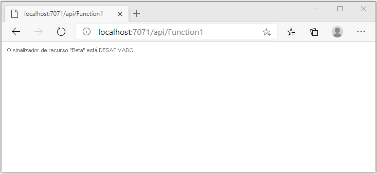
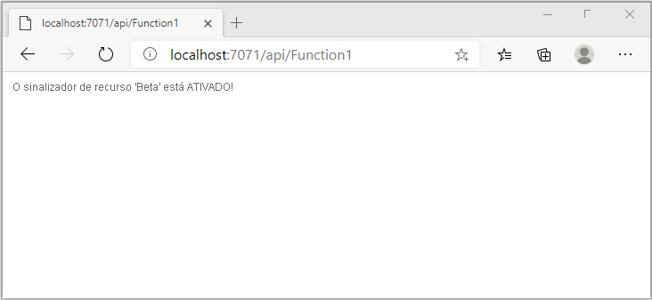

# <a name="quickstart-add-feature-flags-to-an-azure-functions-app"></a>Início Rápido: Adicionar sinalizadores de recurso a um aplicativo Azure Functions

Neste guia de início rápido, você cria um aplicativo Azure Functions e usa sinalizadores de recurso nele. Você usa o gerenciamento de recursos da Configuração de Aplicativos do Azure para armazenar centralmente todos os sinalizadores de recursos e controlar seus estados.

As bibliotecas do Gerenciamento de Recursos do .NET estendem a estrutura com suporte a sinalizadores de recursos. Essas bibliotecas se baseiam no sistema de configuração do .NET. Elas são integradas à Configuração de Aplicativos por meio do provedor de configuração do .NET.

## <a name="prerequisites"></a>Pré-requisitos

- Assinatura do Azure - [criar uma gratuitamente](https://azure.microsoft.com/free/)
- [Visual Studio 2019](https://visualstudio.microsoft.com/vs) com a carga de trabalho de **desenvolvimento do Azure**.
- [Ferramentas do Azure Functions](../azure-functions/functions-develop-vs.md#check-your-tools-version)

## <a name="create-an-app-configuration-store"></a>Criar um repositório de Configuração de Aplicativos

[!INCLUDE [azure-app-configuration-create](../../includes/azure-app-configuration-create.md)]

7. Selecione **Gerenciador de Recursos** >  **+Adicionar** para adicionar um sinalizador de recurso chamado `Beta`.

    > [!div class="mx-imgBorder"]
    > 

    Deixe `label` e `Description` indefinidos por enquanto.

8. Selecione **Aplicar** para salvar o novo sinalizador de recurso.

## <a name="create-a-functions-app"></a>Criar um aplicativo do Functions

[!INCLUDE [Create a project using the Azure Functions template](../../includes/functions-vstools-create.md)]

## <a name="connect-to-an-app-configuration-store"></a>Conectar um repositório de Configuração de Aplicativos

Este projeto usará [injeção de dependência no Azure Functions .NET](/azure/azure-functions/functions-dotnet-dependency-injection). Ele adiciona a Configuração de Aplicativos do Azure como uma fonte de configuração extra em que os sinalizadores de recurso são armazenados.

1. Clique com o botão direito do mouse no projeto e selecione **Gerenciar Pacotes do NuGet**. Na guia **Navegar**, pesquise e adicione os pacotes NuGet a seguir ao projeto.
   - [Microsoft.Extensions.Configuration.AzureAppConfiguration](https://www.nuget.org/packages/Microsoft.Extensions.Configuration.AzureAppConfiguration/) versão 4.1.0 ou posterior
   - [Microsoft.FeatureManagement](https://www.nuget.org/packages/Microsoft.FeatureManagement/) versão 2.2.0 ou posterior
   - [Microsoft.Azure.Functions.Extensions](https://www.nuget.org/packages/Microsoft.Azure.Functions.Extensions/) versão 1.1.0 ou posterior 

2. Adicione um novo arquivo, *Startup.cs*, com o código a seguir. Ele define uma classe chamada `Startup` que implementa a classe abstrata `FunctionsStartup`. Um atributo de assembly é usado para especificar o nome de tipo usado durante a inicialização do Azure Functions.

    ```csharp
    using System;
    using Microsoft.Azure.Functions.Extensions.DependencyInjection;
    using Microsoft.Extensions.Configuration;
    using Microsoft.FeatureManagement;

    [assembly: FunctionsStartup(typeof(FunctionApp.Startup))]

    namespace FunctionApp
    {
        class Startup : FunctionsStartup
        {
            public override void ConfigureAppConfiguration(IFunctionsConfigurationBuilder builder)
            {
            }

            public override void Configure(IFunctionsHostBuilder builder)
            {
            }
        }
    }
    ```


3. Atualize o método `ConfigureAppConfiguration` e adicione o provedor de Configuração de Aplicativos do Azure como uma fonte de configuração extra chamando `AddAzureAppConfiguration()`. 

   O método `UseFeatureFlags()` diz para o provedor carregar os sinalizadores de recurso. Todos os sinalizadores de recurso têm um término de cache padrão de 30 segundos antes de verificar se há alterações. O intervalo de término pode ser atualizado definindo a propriedade `FeatureFlagsOptions.CacheExpirationInterval` passada para o método `UseFeatureFlags`. 

    ```csharp
    public override void ConfigureAppConfiguration(IFunctionsConfigurationBuilder builder)
    {
        builder.ConfigurationBuilder.AddAzureAppConfiguration(options =>
        {
            options.Connect(Environment.GetEnvironmentVariable("ConnectionString"))
                   .Select("_")
                   .UseFeatureFlags();
        });
    }
    ```
   > [!TIP]
   > Se você não quiser que nenhuma configuração diferente dos sinalizadores de recurso seja carregada em seu aplicativo, chame `Select("_")` para carregar apenas uma chave fictícia não existente "_". Por padrão, todos os valores de chave de configuração em seu repositório de Configuração de Aplicativos serão carregados se nenhum método `Select` for chamado.

4. Atualize o método `Configure` para tornar os serviços de Configuração de Aplicativos do Azure e o gerenciador de recursos disponíveis por meio de injeção de dependência.

    ```csharp
    public override void Configure(IFunctionsHostBuilder builder)
    {
        builder.Services.AddAzureAppConfiguration();
        builder.Services.AddFeatureManagement();
    }
    ```

5. Abra *Function1.cs* e adicione os namespaces a seguir.

    ```csharp
    using System.Linq;
    using Microsoft.FeatureManagement;
    using Microsoft.Extensions.Configuration.AzureAppConfiguration;
    ```

   Adicione um construtor usado para obter instâncias de `_featureManagerSnapshot` e `IConfigurationRefresherProvider` por meio de injeção de dependência. No `IConfigurationRefresherProvider`, você pode obter a instância do `IConfigurationRefresher`.

    ```csharp
    private readonly IFeatureManagerSnapshot _featureManagerSnapshot;
    private readonly IConfigurationRefresher _configurationRefresher;

    public Function1(IFeatureManagerSnapshot featureManagerSnapshot, IConfigurationRefresherProvider refresherProvider)
    {
        _featureManagerSnapshot = featureManagerSnapshot;
        _configurationRefresher = refresherProvider.Refreshers.First();
    }
    ```

6. Atualize o método `Run` para alterar o valor da mensagem exibida dependendo do estado do sinalizador de recurso.

   O método `TryRefreshAsync` é chamado no início da chamada de funções para atualizar os sinalizadores de recurso. Ele não estará operacional se a janela de tempo de término do cache não for atingida. Remova o operador `await` se preferir que os sinalizadores de recurso sejam atualizados sem bloquear a chamada de funções atual. Nesse caso, as chamadas de funções posteriores receberão o valor atualizado.

    ```csharp
    [FunctionName("Function1")]
    public async Task<IActionResult> Run(
        [HttpTrigger(AuthorizationLevel.Anonymous, "get", "post", Route = null)] HttpRequest req,
        ILogger log)
    {
        log.LogInformation("C# HTTP trigger function processed a request.");

        await _configurationRefresher.TryRefreshAsync();

        string message = await _featureManagerSnapshot.IsEnabledAsync("Beta")
                ? "The Feature Flag 'Beta' is turned ON"
                : "The Feature Flag 'Beta' is turned OFF";

        return (ActionResult)new OkObjectResult(message);
    }
    ```

## <a name="test-the-function-locally"></a>Testar a função localmente

1. Defina uma variável de ambiente chamada **ConnectionString**, em que o valor é a cadeia de conexão que você recuperou anteriormente em seu repositório de Configuração de Aplicativos em **Chaves de Acesso**. Se você usar o prompt de comando do Windows, execute o comando a seguir e reinicie o prompt de comando para permitir que a alteração entre em vigor:

    ```cmd
        setx ConnectionString "connection-string-of-your-app-configuration-store"
    ```

    Se você usa o Windows PowerShell, execute o comando a seguir:

    ```azurepowershell
        $Env:ConnectionString = "connection-string-of-your-app-configuration-store"
    ```

    Se você usa macOS ou Linux, execute o comando a seguir:

    ```bash
        export ConnectionString='connection-string-of-your-app-configuration-store'
    ```

1. Pressione F5 para testar sua função. Se solicitado, aceite a solicitação do Visual Studio para baixar e instalar as ferramentas **principais (CLI) do Azure Functions**. Além disso, talvez seja necessário habilitar uma exceção de firewall para que as ferramentas possam manipular solicitações HTTP.

1. Copie a URL da sua função da saída do Azure Functions runtime.

    

1. Cole a URL para a solicitação HTTP na barra de endereços do navegador. A imagem a seguir mostra a resposta indicando que o sinalizador de recurso `Beta` está desabilitado. 

    

1. Entre no [portal do Azure](https://portal.azure.com). Escolha **Todos os recursos** e escolha o repositório de Configuração de Aplicativos que você criou.

1. Selecione **Gerenciador de recursos** e altere o estado da chave **Beta** para **Ativado**.

1. Atualize o navegador algumas vezes. Quando o sinalizador de recurso em cache expirar após 30 segundos, a página deverá ter sido alterada para indicar que o sinalizador de recurso `Beta` está ativado, conforme mostra a imagem abaixo.
 
    

> [!NOTE]
> O código de exemplo usado neste tutorial pode ser baixado do [repositório do GitHub da Configuração de Aplicativos do Azure](https://github.com/Azure/AppConfiguration/tree/master/examples/DotNetCore/AzureFunction).

## <a name="clean-up-resources"></a>Limpar os recursos

[!INCLUDE [azure-app-configuration-cleanup](../../includes/azure-app-configuration-cleanup.md)]

## <a name="next-steps"></a>Próximas etapas

Neste guia de início rápido, você criou um sinalizador de recurso e o utilizou com um aplicativo Azure Functions por meio da biblioteca [Microsoft.FeatureManagement](/dotnet/api/microsoft.featuremanagement).

- Saiba mais sobre o [gerenciamento de recursos](./concept-feature-management.md)
- [Gerenciar sinalizadores de recursos](./manage-feature-flags.md)
- [Usar sinalizadores de recursos condicionais](./howto-feature-filters-aspnet-core.md)
- [Habilitar a distribuição em etapas de recursos para públicos-alvo](./howto-targetingfilter-aspnet-core.md)
- [Usar a configuração dinâmica no aplicativo Azure Functions](./enable-dynamic-configuration-azure-functions-csharp.md)