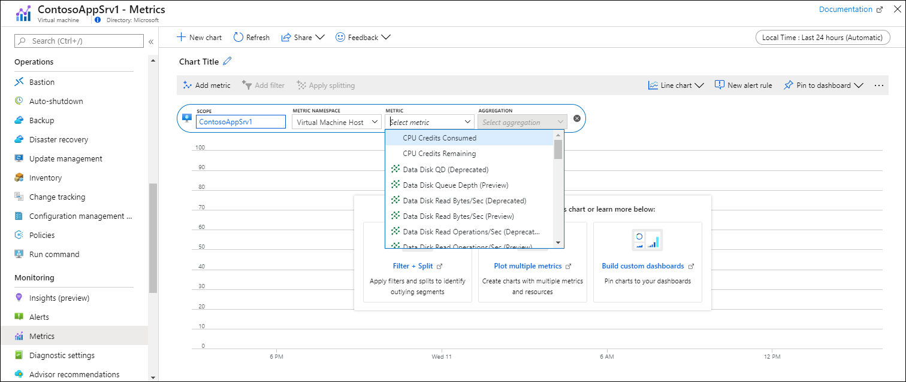

# Início Rápido: Monitorar um recurso do Azure com o Azure Monitor
O [Azure Monitor](../overview.md) inicia a coleta de dados dos recursos do Azure no momento em que eles são criados. Este guia de início rápido apresenta uma breve explicação dos dados coletados automaticamente para um recurso e como exibi-los no portal do Azure para um recurso específico. Posteriormente, você pode adicionar a configuração para coletar dados adicionais e acessar o menu de Azure Monitor para usar as mesmas ferramentas para acessar os dados coletados para todos os recursos em sua assinatura.

Para obter descrições mais detalhadas dos dados de monitoramento coletados dos recursos do Azure, confira [Como monitorar recursos do Azure com o Azure Monitor](../essentials/monitor-azure-resource.md).

## Entre no portal do Azure

Entre no Portal do Azure em [https://portal.azure.com](https://portal.azure.com). 

## Página de visão geral
Muitos serviços incluirão dados de monitoramento na página de **Visão Geral** como uma visualização rápida da operação. Normalmente, isso será baseado em um subconjunto de métricas de plataforma armazenado nas Métricas do Azure Monitor.

1. Localize um recurso do Azure em sua assinatura.
2. Acesse a página **Visão Geral** e observe se há dados de desempenho exibidos. Esses dados serão fornecidos pelo Azure Monitor. O exemplo a seguir é a página **Visão Geral** para uma conta de armazenamento do Azure e você pode ver que são exibidas várias métricas.

    

3. Você pode clicar em qualquer um dos grafos para abrir os dados no Metrics Explorer, que é descrito abaixo.

## Exibir o log de Atividades
O log de atividades fornece informações sobre as operações em cada recurso do Azure na assinatura. Isso incluirá informações como quando um recurso é criado ou modificado, quando um trabalho é iniciado ou quando ocorre uma determinada operação.

1. Na parte superior do menu do recurso, selecione **Log de atividades**.
2. O filtro atual é definido como eventos relacionados ao seu recurso. Se você não vir nenhum evento, tente alterar o **Período** para aumentar o escopo de tempo.

    

4. Se você quiser ver eventos de outros recursos em sua assinatura, altere os critérios no filtro ou até mesmo remova as propriedades do filtro.

    

## Métricas de exibição
Métricas são valores numéricos que descrevem algum aspecto de seu recurso em um momento específico. O Azure Monitor coleta automaticamente as métricas de plataforma a intervalos de um minuto de todos os recursos do Azure. Você pode exibir essas métricas usando o Metrics Explorer.

1. Na seção **Monitoramento** do menu do recurso, selecione **Métricas**. Isso abre o Metrics Explorer com o escopo definido para seu recurso.
2. Agora, clique em **Adicionar métrica** para adicionar uma métrica ao gráfico.
   
   
   
4. Selecione uma **Métrica** na lista suspensa e, em seguida, uma **Agregação**. Isso define como os valores coletados serão amostrados em cada intervalo de tempo.

    

5. Clique em **Adicionar métrica** para adicionar outras combinações de métrica e agregação ao gráfico.

    

## Próximas etapas
Neste guia de início rápido, você exibiu o log de atividades e as métricas de um recurso do Azure coletados automaticamente pelo Azure Monitor. Prossiga para o próximo guia de início rápido, que mostra como coletar o log de atividades em um workspace do Log Analytics, em que ele poderá ser analisado por meio de [consultas de log](../logs/log-query-overview.md).

> [!div class="nextstepaction"]
> [Enviar o log de atividades do Azure para o workspace do Log Analytics](./quick-collect-activity-log-portal.md)