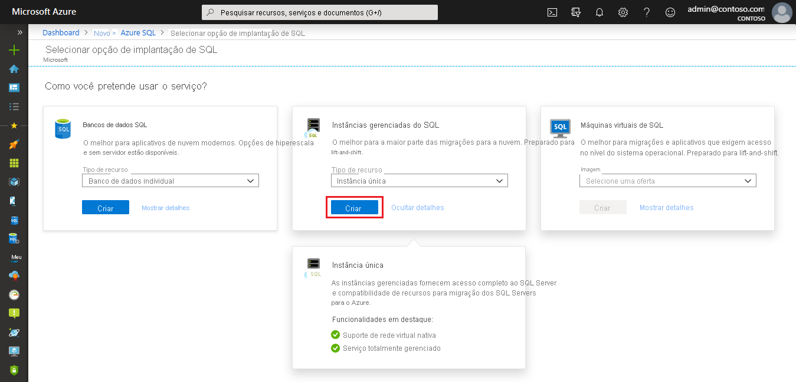
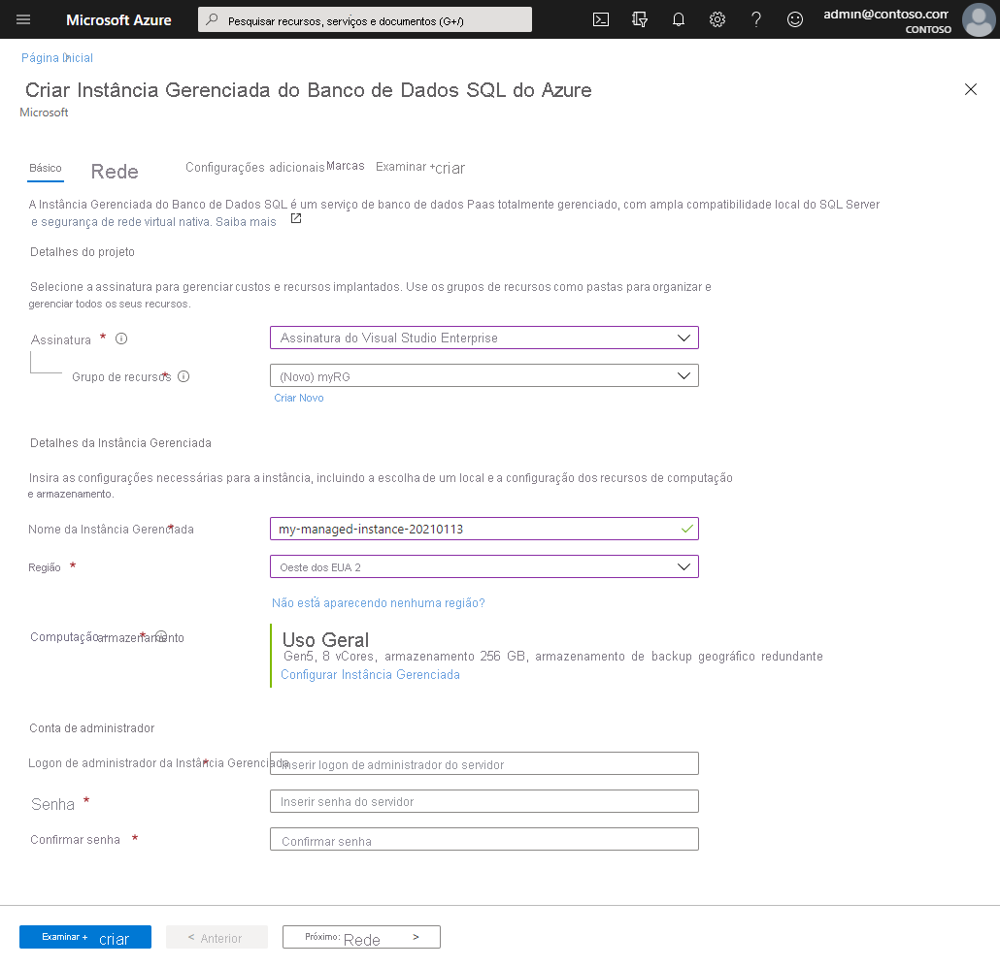
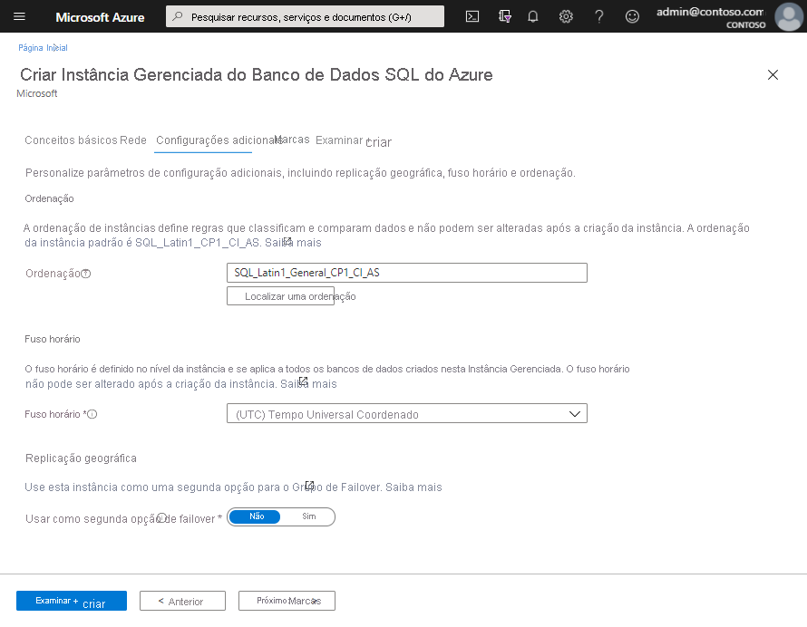

# Início Rápido: Criar uma Instância Gerenciada do SQL Azure
[!INCLUDE[appliesto-sqlmi](../includes/appliesto-sqlmi.md)]

Este início rápido ensina você a criar uma [Instância Gerenciada de SQL do Azure](sql-managed-instance-paas-overview.md) no portal do Azure.

> [!IMPORTANT]
> Para obter as limitações, confira [Regiões compatíveis](resource-limits.md#supported-regions) e [Tipos de assinatura compatíveis](resource-limits.md#supported-subscription-types).

## Criar uma Instância Gerenciada do SQL Azure

Para criar uma Instância Gerenciada de SQL, siga estas etapas: 

### Entre no Portal do Azure

Se você não tiver uma assinatura do Azure, [crie uma conta gratuita](https://azure.microsoft.com/free/).

1. Entre no [portal do Azure](https://portal.azure.com/).
1. No menu esquerdo do portal do Azure, selecione **SQL do Azure**. Se **SQL do Azure** não estiver na lista, selecione **Todos os serviços** e, em seguida, digite **SQL do Azure** na caixa de pesquisa.
1. Selecione **+Adicionar** para abrir a página **Selecionar opção de implantação do SQL**. Veja mais informações sobre a Instância Gerenciada de SQL do Azure selecionando **Mostrar detalhes** no bloco **Instâncias gerenciadas de SQL**.
1. Selecione **Criar**.

   

4. Use as guias no formulário de provisionamento **Criar Instância Gerenciada de SQL do Azure** para adicionar informações obrigatórias e opcionais. As seções a seguir descrevem essas guias.

### Guia Básico

- Preencha as informações obrigatórias exigidas na guia **Conceitos Básicos**. Este é um conjunto mínimo de informações exigido para provisionar uma Instância Gerenciada de SQL.

   

   Use a tabela abaixo como uma referência para obter informações obrigatórias nesta guia.

   | Configuração| Valor sugerido | Descrição |
   | ------ | --------------- | ----------- |
   | **Assinatura** | Sua assinatura. | Uma assinatura que concede a você permissão para criar recursos. |
   | **Grupo de recursos** | Um grupo de recursos novo ou existente.|Para ver os nomes do grupo de recursos válidos, consulte [Regras e restrições de nomenclatura](/azure/architecture/best-practices/resource-naming).|
   | **Nome da Instância Gerenciada** | Qualquer nome válido.|Para ver os nomes válidos, consulte [Regras e restrições de nomenclatura](/azure/architecture/best-practices/resource-naming).|
   | **Região** |A região na qual você deseja criar a instância gerenciada.|Para obter mais informações sobre as regiões, confira [Regiões do Azure](https://azure.microsoft.com/regions/).|
   | **Logon de administrador da Instância Gerenciada** | Qualquer nome de usuário válido. | Para ver os nomes válidos, consulte [Regras e restrições de nomenclatura](/azure/architecture/best-practices/resource-naming). Não use "serveradmin", pois essa é uma função reservada no nível de servidor.|
   | **Senha** | Qualquer senha válida.| A senha deve ter no mínimo 16 caracteres e atender a [requisitos de complexidade definidos](../../virtual-machines/windows/faq.md#what-are-the-password-requirements-when-creating-a-vm).|

- Selecione **Configurar Instância Gerenciada** para dimensionar os recursos de computação e armazenamento e examinar os tipos de preço. Use os controles deslizantes ou as caixas de texto para especificar a quantidade de armazenamento e o número de núcleos virtuais. Quando terminar, selecione **Aplicar** para salvar a seleção. 

   

| Configuração| Valor sugerido | Descrição |
| ------ | --------------- | ----------- |
| **Camada de Serviço** | Selecione uma das opções. | De acordo com o seu cenário, selecione uma das seguintes opções:   <ul><li>**Uso Geral**: para a maioria das cargas de trabalho de produção e a opção padrão.</li><li>**Comercialmente Crítico**: projetada para cargas de trabalho de baixa latência com alta resiliência a falhas e failovers rápidos.</li></ul> Para obter mais informações, confira [Camadas de serviço do Banco de Dados SQL do Azure e da Instância Gerenciada de SQL do Azure](../../azure-sql/database/service-tiers-general-purpose-business-critical.md) e examine [Visão geral dos limites de recursos da Instância Gerenciada de SQL do Azure](../../azure-sql/managed-instance/resource-limits.md).|
| **Geração do Hardware** | Selecione uma das opções. | A geração do hardware define de modo geral os limites de computação e de memória e outras características que afetam o desempenho da carga de trabalho. **Gen5** é o padrão.|
| **Modelo de computação vCore** | Selecione uma opção. | Os vCores representam a quantidade exata de recursos de computação que sempre são provisionados para a carga de trabalho. **Oito vCores** é o padrão.|
| **Armazenamento em GB** | Selecione uma opção. | Tamanho do armazenamento em GB. Selecione-o com base no tamanho de dados esperado. Se você estiver migrando dados existentes do local ou em várias plataformas de nuvem, confira [Visão geral da migração: SQL Server para Instância Gerenciada de SQL](../../azure-sql/migration-guides/managed-instance/sql-server-to-managed-instance-overview.md).|
| **Benefício Híbrido do Azure** | Marque a opção se aplicável. | Para aproveitar uma licença existente do Azure. Para obter mais informações, confira [Benefício Híbrido do Azure – Banco de Dados SQL do Azure e Instância Gerenciada de SQL](../../azure-sql/azure-hybrid-benefit.md). |
| **Redundância do armazenamento de backup** | Selecione **Armazenamento de backup com redundância geográfica**. | Redundância de armazenamento dentro do Azure para o armazenamento de backup. Observe que esse valor não poderá ser alterado posteriormente. O armazenamento de backup com redundância geográfica é o padrão e o recomendado, embora a redundância local e de zona permita maior flexibilidade de custo e residência de dados de região única. Para obter mais informações, confira [Redundância do Armazenamento de Backup](../database/automated-backups-overview.md?tabs=managed-instance#backup-storage-redundancy).|

- Para examinar suas escolhas antes de criar uma Instância Gerenciada de SQL, escolha **Examinar + criar**. Ou configure as opções de rede selecionando **Avançar: Rede**.

### Guia Rede

- Preencha as informações opcionais na guia **Rede**. Se você omitir essas informações, o portal aplicará as configurações padrão.

   

   Use a tabela abaixo como uma referência para obter informações obrigatórias nesta guia.

   | Configuração| Valor sugerido | Descrição |
   | ------ | --------------- | ----------- |
   | **Rede virtual** | Selecione a **Criar nova rede virtual** ou uma rede virtual e uma sub-rede válidas.| Se uma rede ou uma sub-rede não estiver disponível, ela precisará ser [modificada para atender aos requisitos de rede](vnet-existing-add-subnet.md) antes de ser selecionada como um destino para a nova instância gerenciada. Para obter mais informações sobre os requisitos de configuração do ambiente de rede para uma Instância Gerenciada de SQL, confira [Configurar uma rede virtual para uma Instância Gerenciada de SQL](connectivity-architecture-overview.md). |
   | **Tipo de conexão** | Escolha entre um tipo de conexão de proxy e redirecionamento.|Para obter mais informações sobre os tipos de conexão, confira [Tipo de conexão da Instância Gerenciada de SQL do Azure](../database/connectivity-architecture.md#connection-policy).|
   | **Ponto de extremidade público**  | Selecione **Desabilitar**. | Para que a instância gerenciada esteja acessível por meio do ponto de extremidade de dados público, você precisa habilitar essa opção. | 
   | **Permitir o acesso de** (se o **Ponto de extremidade público** estiver habilitado) | Selecione **Sem Acesso**  |A experiência do portal permite configurar um grupo de segurança com um ponto de extremidade público.     De acordo com o seu cenário, selecione uma das seguintes opções:   <ul> <li>**Serviços do Azure**: recomendamos essa opção quando você estiver se conectando de Power BI ou de outro serviço multilocatário. </li> <li> **Internet**: use para fins de teste quando desejar criar rapidamente uma instância gerenciada. Não a recomendamos para ambientes de produção. </li> <li> **Sem acesso**: esta opção cria a regra de segurança **Negar**. Modifique essa regra para tornar uma instância gerenciada acessível por meio de um ponto de extremidade público. </li> </ul>   Para obter mais informações sobre a segurança do ponto de extremidade público, confira [Como usar a Instância Gerenciada de SQL do Azure de maneira segura com um ponto de extremidade público](public-endpoint-overview.md).|

- Selecione **Revisar + criar** para revisar suas escolhas antes de criar uma instância gerenciada. Ou defina mais configurações personalizadas selecionando **Avançar: configurações adicionais**.

### Configurações adicionais

- Preencha as informações opcionais na guia **Configurações adicionais**. Se você omitir essas informações, o portal aplicará as configurações padrão.

   

   Use a tabela abaixo como uma referência para obter informações obrigatórias nesta guia.

   | Configuração| Valor sugerido | Descrição |
   | ------ | --------------- | ----------- |
   | **Ordenação** | Escolha a ordenação que deseja usar para a instância gerenciada. Se estiver migrando bancos de dados do SQL Server, verifique a ordenação de origem usando `SELECT SERVERPROPERTY(N'Collation')` e use esse valor.| Para obter informações sobre ordenações, confira [Definir ou alterar a ordenação do servidor](/sql/relational-databases/collations/set-or-change-the-server-collation).|   
   | **Fuso horário** | Selecione o fuso horário que sua instância gerenciada observará.|Para obter mais informações, confira [Fusos horários](timezones-overview.md).|
   | **Usar como secundário de failover** | Selecione **Sim**. | Habilite esta opção para usar a instância gerenciada como o secundário de um grupo de failover.|
   | **Instância Gerenciada Primária de SQL** (se a opção **Usar como secundário de failover** estiver definida como **Sim**) | Escolha uma instância gerenciada primária existente que será ingressada na mesma zona DNS que a instância gerenciada que você está criando. | Esta etapa habilitará a configuração pós-criação do grupo de failover. Para saber mais, confira [Tutorial: adicionar uma instância gerenciada a um grupo de failover](failover-group-add-instance-tutorial.md).|

- Selecione **Revisar + criar** para revisar suas escolhas antes de criar uma instância gerenciada. Ou, então, configure as marcas do Azure selecionando **Avançar: Marcas** (recomendado).

### Marcações

- Adicione marcas aos recursos no modelo do ARM (modelo do Azure Resource Manager). As [marcas](../../azure-resource-manager/management/tag-resources.md) ajudam você a organizar logicamente seus recursos. Os valores de marca são mostrados nos relatórios de custo e permitem outras atividades de gerenciamento por marca. 

- Considere, pelo menos, marcar a nova Instância Gerenciada de SQL com a marca Proprietário para identificar quem a criou e a marca Ambiente para identificar se esse sistema é de produção, desenvolvimento etc. Para obter mais informações, confira [Desenvolver sua estratégia de nomenclatura e marcação para recursos do Azure](/azure/cloud-adoption-framework/ready/azure-best-practices/naming-and-tagging).
 
- Selecione **Examinar + criar** para prosseguir.

## Examinar + criar

1. Selecione **Examinar + criar** para examinar suas escolhas antes de criar uma instância gerenciada.

   

1. Selecione **Criar** para iniciar o provisionamento da instância gerenciada.

> [!IMPORTANT]
> A implantação de uma instância gerenciada é uma operação de execução longa. A implantação da primeira instância na sub-rede normalmente demora muito mais do que a implantação em uma sub-rede com instâncias gerenciadas existentes. Para obter os tempos de provisionamento médios, confira [Visão geral das operações de gerenciamento da Instância Gerenciada de SQL do Azure](management-operations-overview.md#duration).

## Monitorar o progresso da implantação

1. Selecione o ícone **Notificações** para exibir o status da implantação.

   

1. Selecione **Implantação em andamento** na notificação para abrir a janela da Instância Gerenciada de SQL e monitorar mais detalhadamente o progresso da implantação. 

> [!TIP]
> - Se você fechou o navegador da Web ou saiu da tela de progresso da implantação, monitore a operação de provisionamento por meio da página **Visão geral** da instância gerenciada ou por meio do PowerShell ou da CLI do Azure. Para obter mais informações, confira [Monitorar operações](management-operations-monitor.md#monitor-operations). 
> - Cancele o processo de provisionamento por meio do portal do Azure, do PowerShell, da CLI do Azure ou de outras ferramentas usando a API REST. Confira [Cancelamento das operações de gerenciamento da Instância Gerenciada de SQL do Azure](management-operations-cancel.md).

> [!IMPORTANT]
> - O início da criação da Instância Gerenciada de SQL pode ser atrasado em casos em que existem outras operações de impacto, como operações de restauração ou dimensionamento de execução longa em outras Instâncias Gerenciadas na mesma sub-rede. Para saber mais, confira [Operações de gerenciamento com impacto cruzado](management-operations-overview.md#management-operations-cross-impact).
> - Para poder obter o status da criação da instância gerenciada, você precisa ter **permissões de leitura** no grupo de recursos. Se você não tiver essa permissão ou se revogá-la enquanto a instância gerenciada estiver no processo de criação, isso poderá fazer com que a Instância Gerenciada de SQL não fique visível na lista de implantações do grupo de recursos.
>

## Exibir recursos criados

Após a implantação bem-sucedida de uma instância gerenciada, para exibir os recursos criados:

1. Abra o grupo de recursos da instância gerenciada. 

   

## Exibir e ajustar configurações de rede

Para, opcionalmente, ajustar as configurações de rede, inspecione o seguinte:

1. Na lista de recursos, selecione a tabela de rotas para examinar o objeto UDR (tabela de rotas definida pelo usuário) criado.

2. Na tabela de rotas, examine as entradas para rotear o tráfego bidirecionalmente na rede virtual da Instância Gerenciada de SQL. Se você criar ou configurar a tabela de rotas manualmente, crie essas entradas na tabela de rotas da Instância Gerenciada de SQL.

   

    Para alterar ou adicionar rotas, abra **Rotas** nas configurações da tabela de rotas.

3. Retorne ao grupo de recursos e selecione o objeto NSG (grupo de segurança de rede) criado.

4. Examine as regras de segurança de entrada e saída. 

   

    Para alterar ou adicionar regras, abra **Regras de Segurança de Entrada** e **Regras de Segurança de Saída** nas configurações do grupo de segurança de rede.

> [!IMPORTANT]
> Se você tiver configurado um ponto de extremidade público para a Instância Gerenciada de SQL, precisará abrir portas para permitir o tráfego de rede que permite conexões com a Instância Gerenciada de SQL na Internet pública. Para obter mais informações, confira [Configurar um ponto de extremidade público para a Instância Gerenciada de SQL](public-endpoint-configure.md#allow-public-endpoint-traffic-on-the-network-security-group).
>

## Recuperar detalhes da conexão para a Instância Gerenciada de SQL

Para se conectar à Instância Gerenciada de SQL, siga estas etapas para recuperar o nome do host e o FQDN (nome de domínio totalmente qualificado):

1. Volte ao grupo de recursos e escolha o objeto de instância gerenciada de SQL que foi criado.

2. Na guia **Visão Geral**, localize a propriedade **Host**. Copie o nome do host para a área de transferência da instância gerenciada para uso no próximo guia de início rápido clicando no botão **Copiar para a área de transferência**.

   

   O valor copiado representa um FQDN (nome de domínio totalmente qualificado) que pode ser usado para se conectar à Instância Gerenciada de SQL. Ele é semelhante ao seguinte endereço de exemplo: *nome_do_seu_host.a1b2c3d4e5f6.database.windows.net*.

## Próximas etapas

Para saber mais sobre como se conectar à Instância Gerenciada de SQL:
- Para obter uma visão geral das opções de conexão para aplicativos, confira [Conectar seus aplicativos à Instância Gerenciada de SQL](connect-application-instance.md).
- Para obter um início rápido que mostra como se conectar a uma Instância Gerenciada de SQL em uma máquina virtual do Azure, confira [Configurar uma conexão com uma máquina virtual do Azure](connect-vm-instance-configure.md).
- Para obter um início rápido que mostra como se conectar à Instância Gerenciada de SQL em um computador cliente local usando uma conexão ponto a site, confira [Configurar uma conexão ponto a site](point-to-site-p2s-configure.md).

Para restaurar um banco de dados existente do SQL Server do local para a Instância Gerenciada de SQL: 
- Use o [Serviço de Migração de Banco de Dados do Azure para migração](../../dms/tutorial-sql-server-to-managed-instance.md) para fazer a restauração de um arquivo de backup de banco de dados. 
- Use o [comando T-SQL RESTORE](restore-sample-database-quickstart.md) para fazer a restauração de um arquivo de backup de banco de dados.

Para obter o monitoramento avançado do desempenho de banco de dados da Instância Gerenciada de SQL com inteligência de solução de problemas interna, confira [Monitorar a Instância Gerenciada de SQL do Azure usando a Análise de SQL do Azure](../../azure-monitor/insights/azure-sql.md).