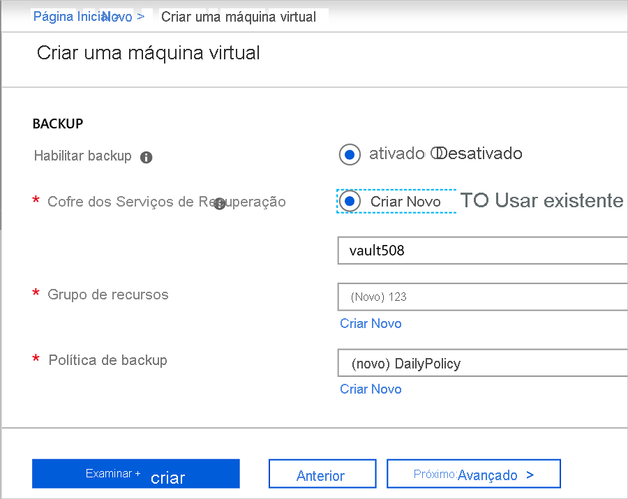

# Habilitar o backup ao criar uma VM do Azure

Use o serviço de Backup do Azure para fazer backup de máquinas virtuais (VMs). As VMs são backup de acordo com um agendamento especificado em uma política de backup e pontos de recuperação são criados a partir de backups. Pontos de recuperação são armazenados em cofres dos serviços de recuperação.

Este artigo fornece detalhes sobre como habilitar o backup quando você cria uma máquina virtual (VM) no portal do Azure.  

## Antes de começar

- [Verificar](backup-support-matrix-iaas.md#supported-backup-actions) quais sistemas operacionais têm suporte se você habilitar o backup quando você cria uma VM.

## Entrar no Azure

Se você não tiver entrado sua conta, entrar para o [portal do Azure](https://portal.azure.com).
 
## Criar uma VM com Backup configurado

1. No portal do Azure, clique em **criar um recurso**.

2. No Azure Marketplace, clique em **computação**e, em seguida, selecione uma imagem de VM.

3. Configurar a VM de acordo com o [Windows](https://docs.microsoft.com/azure/virtual-machines/windows/quick-create-portal) ou [Linux](https://docs.microsoft.com/azure/virtual-machines/linux/quick-create-portal) instruções.

4. Sobre o **gerenciamento** guia de **habilitar backup**, clique em **em**.
5. Backups de Backup do Azure para um cofre dos serviços de recuperação. Clique em **criar novo** se você não tiver um cofre existente.
6. Aceite o nome do cofre sugerido ou especifique seu próprio.
7. Especificar ou criar um grupo de recursos no qual o cofre estará localizado. O cofre do grupo de recursos pode ser diferente do grupo de recursos VM.

     

8. Aceite a política de backup padrão ou modifique as configurações.
    - Uma política de backup Especifica a frequência de instantâneos de backup da VM e por quanto tempo manter as cópias de backup. 
    - A política padrão faz backup da VM, uma vez por dia.
    - Você pode personalizar sua própria política de backup para uma VM do Azure fazer backups diários ou semanais.
    - [Saiba mais](backup-azure-vms-introduction.md#backup-and-restore-considerations) sobre considerações de backup para VMs do Azure.
    - [Saiba mais](backup-instant-restore-capability.md) sobre o instante restaurar a funcionalidade.

       

## Iniciar um backup após a criação da VM 

O backup VM será executado de acordo com a política de backup. No entanto, é recomendável que você execute um backup inicial. 

Depois que a VM for criada, faça o seguinte:

1. Nas propriedades da VM, clique em **Backup**. O status da VM está inicial Backup pendente até que seja executado o backup inicial
2. Clique em **fazer backup agora** para executar um backup sob demanda.

     

## Usar um modelo do Resource Manager para implantar uma VM protegida

As etapas anteriores explicam como usar o portal do Azure para criar uma máquina virtual e protegê-lo em um cofre de serviços de recuperação. Para implantar uma ou mais VMs e protegê-los em um cofre de serviços de recuperação rapidamente, consulte o modelo [implantar uma VM do Windows e habilitar o backup](https://azure.microsoft.com/resources/templates/101-recovery-services-create-vm-and-configure-backup/).

## Próximas etapas 

Agora que você protegeu sua VM, saiba como gerenciar e restaurá-los.

- [Gerenciar e monitorar VMs](backup-azure-manage-vms.md) 
- [Restaurar VM](backup-azure-arm-restore-vms.md) 

Se você tiver algum problema [examine](backup-azure-vms-troubleshoot.md) o guia de solução de problemas.
