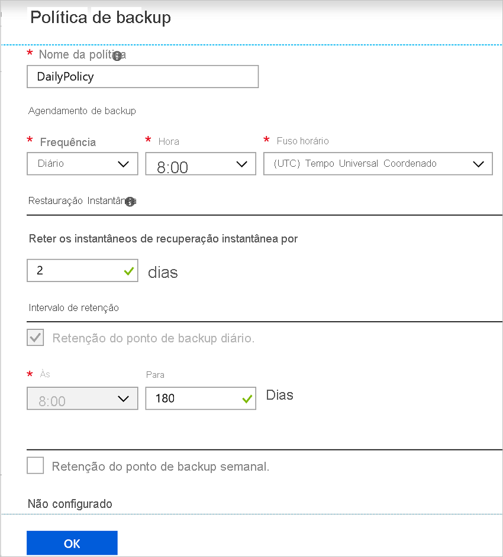
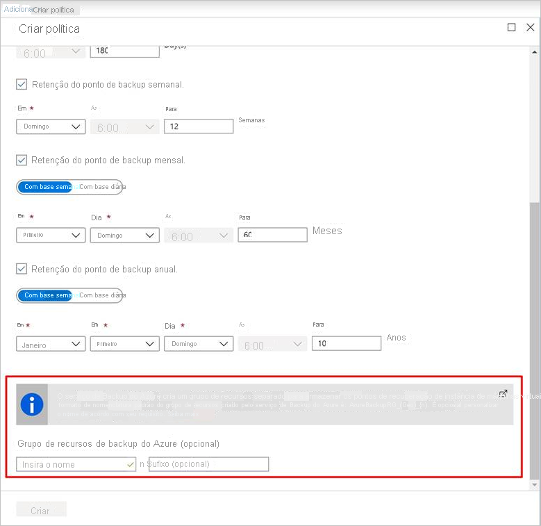

# Habilitar o backup ao criar uma VM do Azure

Use o serviço de backup do Azure para fazer backup de VMs (máquinas virtuais) do Azure. O backup das VMs é feito de acordo com um agendamento especificado em uma política de backup e os pontos de recuperação são criados a partir de backups. Os pontos de recuperação são armazenados em cofres dos serviços de recuperação.

Este artigo fornece detalhes sobre como habilitar o backup quando você cria uma VM (máquina virtual) no portal do Azure.  

## Antes de começar

- [Verifique](backup-support-matrix-iaas.md#supported-backup-actions) quais sistemas operacionais têm suporte se você habilitar o backup ao criar uma VM.

## Entrar no Azure

Se você ainda não tiver entrado em sua conta, entre no [portal do Azure](https://portal.azure.com).

## Criar uma VM com backup configurado

1. Na portal do Azure, selecione **criar um recurso**.

2. No Azure Marketplace, selecione **computação**e, em seguida, selecione uma imagem de VM.

3. Configure a VM de acordo com as instruções do [Windows](../virtual-machines/windows/quick-create-portal.md) ou do [Linux](../virtual-machines/linux/quick-create-portal.md) .

4. Na guia **Gerenciamento** , em **habilitar backup**, selecione **ativado**.
5. Backups de backup do Azure para um cofre dos serviços de recuperação. Selecione **criar novo** se você não tiver um cofre existente.
6. Aceite o nome sugerido do cofre ou especifique o seu próprio.
7. Especifique ou crie um grupo de recursos no qual o cofre será localizado. O cofre do grupo de recursos pode ser diferente do grupo de recursos da VM.

    

8. Aceite a política de backup padrão ou modifique as configurações.
    - Uma política de backup especifica com que frequência fazer instantâneos de backup da VM e por quanto tempo manter essas cópias de backup.
    - A política padrão faz o backup da VM uma vez por dia.
    - Você pode personalizar sua própria política de backup para uma VM do Azure para fazer backups diariamente ou semanalmente.
    - [Saiba mais](backup-azure-vms-introduction.md#backup-and-restore-considerations) sobre considerações de backup para VMs do Azure.
    - [Saiba mais](backup-instant-restore-capability.md) sobre a funcionalidade de restauração instantânea.

      

>[!NOTE]
>[SSE e PMK são os métodos de criptografia padrão](backup-encryption.md) para VMs do Azure. O backup do Azure dá suporte ao backup e à restauração dessas VMs do Azure.

## Grupo de recursos de backup do Azure para máquinas virtuais

O serviço de backup cria um grupo de recursos separado (RG), diferente do grupo de recursos da VM para armazenar a coleção de pontos de restauração (RPC). O RPC hospeda os pontos de recuperação instantânea de VMs gerenciadas. O formato de nomenclatura padrão do grupo de recursos criado pelo serviço de backup é: `AzureBackupRG_<Geo>_<number>` . Por exemplo: *AzureBackupRG_northeurope_1*. Agora você pode personalizar o nome do grupo de recursos criado pelo backup do Azure.

Pontos a serem observados:

1. Você pode usar o nome padrão do RG ou editá-lo de acordo com os requisitos da sua empresa.
2. Você fornece o padrão de nome RG como entrada durante a criação da política de backup da VM. O nome RG deve ter o seguinte formato: `<alpha-numeric string>* n <alpha-numeric string>` . ' n' é substituído por um inteiro (começando em 1) e é usado para escalar horizontalmente se o primeiro RG estiver cheio. Um RG pode ter um máximo de 600 RPCs atualmente.
              
3. O padrão deve seguir as regras de nomenclatura RG abaixo e o comprimento total não deve exceder o comprimento máximo permitido do nome RG.
    1. Os nomes dos grupos de recursos só permitem caracteres alfanuméricos, pontos, sublinhados, hifens e parênteses. Eles não podem terminar em um período.
    2. Os nomes de grupos de recursos podem conter até 74 caracteres, incluindo o nome do RG e o sufixo.
4. O primeiro `<alpha-numeric-string>` é obrigatório, enquanto o segundo depois de ' n' é opcional. Isso se aplicará somente se você fornecer um nome personalizado. Se você não inserir nada em nenhuma das caixas de Text, o nome padrão será usado.
5. Você pode editar o nome do RG modificando a política se e quando necessário. Se o padrão de nome for alterado, o novo RPs será criado no novo RG. No entanto, o antigo RPs ainda residirá no RG antigo e não será movido, pois a coleta de RP não oferece suporte à movimentação de recursos. Eventualmente, o RPs receberá o lixo coletado conforme os pontos expirarem.

6. É aconselhável não bloquear o grupo de recursos criado para uso pelo serviço de backup.

Para configurar o grupo de recursos de backup do Azure para máquinas virtuais usando o PowerShell, consulte [criando o grupo de recursos de backup do Azure durante a retenção de instantâneo](backup-azure-vms-automation.md#creating-azure-backup-resource-group-during-snapshot-retention).

## Iniciar um backup depois de criar a VM

O backup da VM será executado de acordo com sua política de backup. No entanto, recomendamos que você execute um backup inicial.

Depois que a VM for criada, faça o seguinte:

1. Nas propriedades da VM, selecione **backup**. O status da VM é backup inicial pendente até que o backup inicial seja executado.
2. Selecione **fazer backup agora** para executar um backup sob demanda.

    

## Usar um modelo do Resource Manager para implantar uma VM protegida

As etapas anteriores explicam como usar o portal do Azure para criar uma máquina virtual e protegê-la em um cofre dos serviços de recuperação. Para implantar rapidamente uma ou mais VMs e protegê-las em um cofre dos serviços de recuperação, consulte o modelo [implantar uma VM do Windows e habilitar o backup](https://azure.microsoft.com/resources/templates/101-recovery-services-create-vm-and-configure-backup/).

## Próximas etapas

Agora que você protegeu sua VM, saiba como gerenciá-las e restaurá-las.

- [Gerenciar e monitorar VMs](backup-azure-manage-vms.md)
- [Restaurar VM](backup-azure-arm-restore-vms.md)

Se você encontrar problemas, [examine](backup-azure-vms-troubleshoot.md) o guia de solução de problemas.
