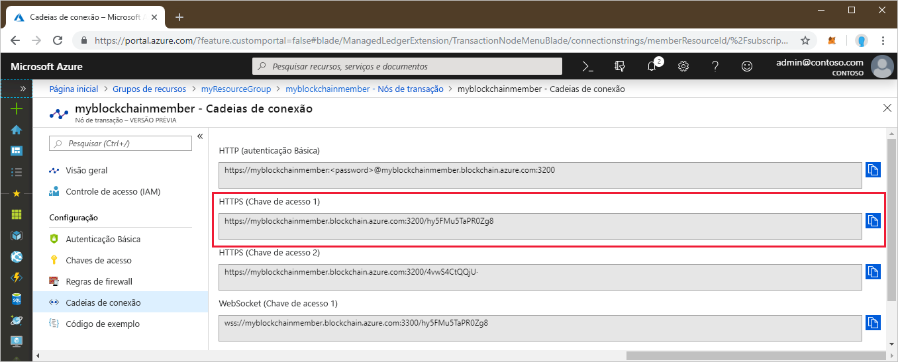

# <a name="quickstart-use-geth-to-attach-to-an-azure-blockchain-service-transaction-node"></a>Início Rápido: Usar o Geth para anexar a um nó de transação do Azure Blockchain Service

Neste Início Rápido, você usa o cliente Geth para se anexar a uma instância do Geth em um nó de transação do Azure Blockchain Service. Depois de anexado, use o console do Geth para chamar uma API JavaScript do Ethereum.

[!INCLUDE [quickstarts-free-trial-note](../../../includes/quickstarts-free-trial-note.md)]

## <a name="prerequisites"></a>Pré-requisitos

* Instalar o [Geth](https://github.com/ethereum/go-ethereum/wiki/geth)
* Concluir [Início Rápido: Criar um membro do blockchain usando o portal do Azure](create-member.md) ou [Início Rápido: Criar um membro do blockchain do Azure Blockchain Service usando a CLI do Azure](create-member-cli.md)

## <a name="get-geth-connection-string"></a>Obter a cadeia de conexão do Geth

Você pode obter a cadeia de conexão Geth para um nó de transação do Azure Blockchain Service no portal do Azure.

1. Entre no [portal do Azure](https://portal.azure.com).
1. Acesse o membro do Azure Blockchain Service. Selecione **Nós de transação** e o link do nó de transação padrão.

    

1. Selecione **Cadeias de conexão**.
1. Copie a cadeia de conexão de **HTTPS (Chave de acesso 1)** . Você precisará da cadeia de caracteres para a próxima seção.

    

## <a name="connect-to-geth"></a>Conectar-se ao Geth

1. Abra um prompt de comando ou shell.
1. Use o subcomando attach do Geth para se anexar à instância em execução do Geth no nó de transação. Cole a cadeia de conexão como um argumento para o subcomando attach. Por exemplo:

    ``` bash
    geth attach <connection string>
    ```

1. Depois de conectado ao console do Ethereum do nó de transação, use a API JavaScript do Ethereum.

    Por exemplo, use a API a seguir para descobrir a chainId.

    ``` bash
    admin.nodeInfo.protocols.istanbul.config.chainId
    ```

    Neste exemplo, a chainId é 661.

    

1. Para se desconectar do console, digite `exit`.

## <a name="next-steps"></a>Próximas etapas

Neste Início Rápido, você usou o cliente Geth para se anexar a uma instância do Geth em um nó de transação do serviço Azure Blockchain. Experimente o próximo tutorial para usar o Azure Blockchain Development Kit para Ethereum para criar, implantar e executar uma função de contrato inteligente por uma transação.

> [!div class="nextstepaction"]
> [Criar, compilar e implantar contratos inteligentes no Azure Blockchain Service](send-transaction.md)
