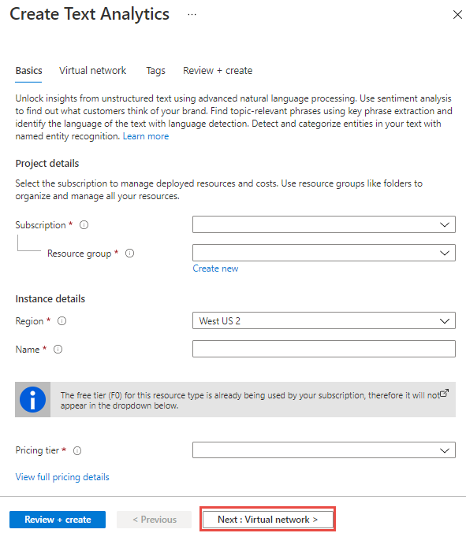

# Criar um recurso de serviços cognitivas usando o portal do Azure

Use este guia de início rápido para começar a usar os serviços cognitivas do Azure usando o portal do Azure. Os serviços cognitivas são representados pelos [recursos](https://docs.microsoft.com/azure/azure-resource-manager/resource-group-portal) do Azure que você cria em sua assinatura do Azure. Depois de criar o recurso, use as chaves e o ponto de extremidade gerados para autenticar seus aplicativos. 

## Pré-requisitos

* Uma assinatura válida do Azure- [crie uma gratuitamente](https://azure.microsoft.com/free/)

[!INCLUDE [cognitive-services-subscription-types](../../includes/cognitive-services-subscription-types.md)]

## Criar um novo recurso de serviços cognitivas do Azure

Antes de criar um recurso de serviços cognitivas, você deve ter um grupo de recursos do Azure para conter o recurso. Ao criar um novo recurso, você tem a opção de criar um novo grupo de recursos ou usar um existente. Este artigo mostra como criar um novo grupo de recursos.

1. Entrar para o [portal do Azure](https://portal.azure.com), clique em  **criar+ um recurso**.

    

2. Você pode encontrar serviços cognitivas disponíveis com as seguintes maneiras:
    * Use a barra de pesquisa e insira o nome do serviço que você deseja assinar.
        * Para criar um recurso de vários serviços, insira **Serviços cognitivas** na barra de pesquisa e selecione o recurso **Serviços cognitivas** .

        

    * Para ver todos os serviços cognitivas disponíveis, selecione **ia + Machine Learning**, no **Azure Marketplace**. Se você não vir o serviço no qual está interessado, clique em **Ver todos** e role até **Serviços cognitivas**. Clique em **mais** para exibir todo o catálogo de API de serviços cognitivos.
    
        

3. Na página **Criar**, forneça as seguintes informações:

    > [!IMPORTANT]
    > Lembre-se do local do Azure, pois você pode precisar dele ao chamar os serviços cognitivas do Azure.

    |    |    |
    |--|--|
    | **Nome** | Um nome descritivo para o recurso de serviços cognitivos. Por exemplo, *MyCognitiveServicesAccount*. |
    | **Assinatura** | Selecione uma das suas assinaturas do Azure disponíveis. |
    | **Localidade** | A localização da sua instância de serviço cognitivo. Locais diferentes podem introduzir latência, mas não têm impacto sobre a disponibilidade de tempo de execução do seu recurso. |
    | **Tipo de preços** | O custo da sua conta de Serviços Cognitivos depende das opções escolhidas e do seu uso. Para obter mais informações, consulte a API [detalhes de preços](https://azure.microsoft.com/pricing/details/cognitive-services/).
    | **Grupo de recursos** | O [grupo de recursos do Azure](https://docs.microsoft.com/azure/architecture/cloud-adoption/governance/resource-consistency/azure-resource-access#what-is-an-azure-resource-group) que conterá o recurso de serviços Cognitivos. Você pode criar um grupo ou adicioná-lo a um grupo pré-existente. |

    

## Obter as chaves para seu recurso

Depois de criar seu recurso, você pode acessá-lo no painel do Azure se você fixou-o. Caso contrário, você pode encontrá-lo em **Grupos de Recursos**. Depois de selecionar o recurso, você pode obter as chaves selecionando **chaves** em **Gerenciamento de recursos**.

[!INCLUDE [cognitive-services-environment-variables](../../includes/cognitive-services-environment-variables.md)]

## Tipos de preço e cobrança

Os tipos de preço (e o valor que você recebe é cobrado) baseiam-se no número de transações que você envia usando suas informações de autenticação. Cada tipo de preço especifica:
* número máximo de transações permitidas por segundo (TPS).
* recursos de serviço habilitados no tipo de preço.
* O custo de uma quantidade predefinida de transações. Ficar acima desse valor causará um encargo extra, conforme especificado nos [detalhes de preços](https://azure.microsoft.com/pricing/details/cognitive-services/custom-vision-service/) do seu serviço.

## Limpar recursos

Se quiser limpar e remover uma assinatura dos Serviços Cognitivos, você poderá excluir o recurso ou grupo de recursos. Excluir o grupo de recursos também exclui todos os outros recursos contidos no grupo.

Para remover um grupo de recursos usando o portal do Azure:

1. No portal do Azure, expanda o menu à esquerda para abrir o menu de serviços e escolha **Grupo de Recursos** para exibir a lista dos seus grupos de recursos.
2. Localize o grupo de recursos a ser excluído e clique com o botão direito do mouse no botão mais (...) no lado direito da listagem.
3. Selecione **Excluir grupo de recursos** e confirme.

## Consulte também

* [Autenticar solicitações para os Serviços Cognitivos do Azure](authentication.md)
* [O que são os serviços cognitivas do Azure?](Welcome.md)
* [Suporte a idioma natural](language-support.md)
* [Suporte a contêiner do Docker](cognitive-services-container-support.md)
