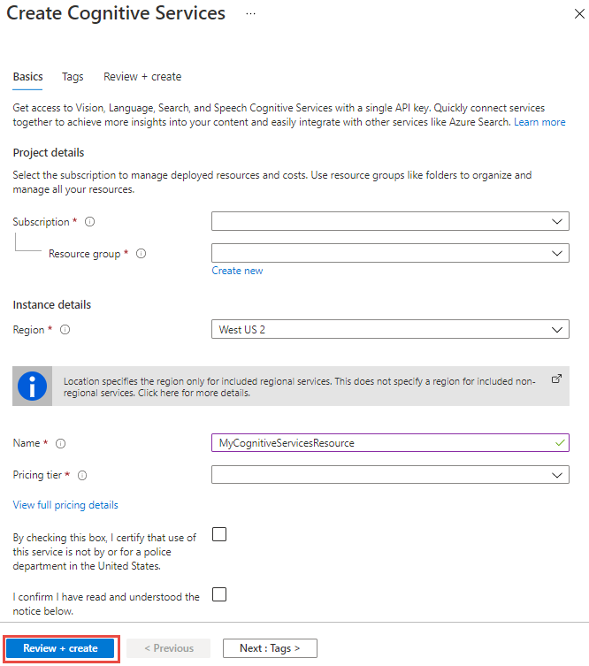

# Início Rápido: criar um recurso dos Serviços Cognitivos usando o portal do Azure

Use esse início rápido para começar a usar os Serviços Cognitivos do Azure. Depois de criar um recurso dos Serviços Cognitivos no portal do Azure, você obterá um ponto de extremidade e uma chave para autenticar seus aplicativos.

Os Serviços Cognitivos do Azure são serviços baseados em nuvem com APIs REST e SDKs de biblioteca de clientes disponíveis para ajudar os desenvolvedores a incutir a inteligência cognitiva nos aplicativos, sem ter conhecimentos ou habilidades diretas sobre os domínios de IA (inteligência artificial) ou ciência de dados. Os Serviços Cognitivos do Azure permitem que os desenvolvedores adicionem com facilidade recursos cognitivos a seus aplicativos, com soluções cognitivas capazes de ver, ouvir, falar, entender e até mesmo começar a racionalizar.

[!INCLUDE [cognitive-services-subscription-types](../../includes/cognitive-services-subscription-types.md)]

## Pré-requisitos

* Uma assinatura válida do Azure; [crie uma gratuitamente](https://azure.microsoft.com/free/cognitive-services/).

## Criar um recurso dos Serviços Cognitivos do Azure

1. Criar um recurso.

### [Recurso de vários serviços](#tab/multiservice)

O recurso de vários serviços é chamado de **Serviços Cognitivos** no Portal. [Criar um recurso dos Serviços Cognitivos](https://ms.portal.azure.com/#create/Microsoft.CognitiveServicesAllInOne).

Neste momento, o recurso de vários serviços permite o acesso aos seguintes Serviços Cognitivos:

* **Visão** – Pesquisa Visual Computacional, Visão Personalizada, Reconhecimento de Formulários, Detecção Facial
* **Fala** – Fala
* **Linguagem** – Reconhecimento vocal (LUIS), Análise de Texto, Tradução
* **Decisão** – Personalizador, Content Moderator

### [Recurso de serviço único](#tab/singleservice)

Use os links abaixo para criar um recurso para os Serviços Cognitivos disponíveis:

| Visão                      | Fala                  | Linguagem                          | Decisão             |
|-----------------------------|-------------------------|-----------------------------------|----------------------|
| [Pesquisa Visual Computacional](https://ms.portal.azure.com/#create/Microsoft.CognitiveServicesComputerVision)         | [Serviços de Fala](https://ms.portal.azure.com/#create/Microsoft.CognitiveServicesSpeechServices)     | [Leitura Avançada](https://ms.portal.azure.com/#create/Microsoft.CognitiveServicesImmersiveReader)              | [Detector de Anomalias](https://ms.portal.azure.com/#create/Microsoft.CognitiveServicesAnomalyDetector) | 
| [Serviço de visão personalizada](https://ms.portal.azure.com/#create/Microsoft.CognitiveServicesCustomVision) |  | [Reconhecimento Vocal (LUIS)](https://ms.portal.azure.com/#create/Microsoft.CognitiveServicesLUISAllInOne) | [Content Moderator](https://ms.portal.azure.com/#create/Microsoft.CognitiveServicesContentModerator) | 
| [Detecção Facial](https://ms.portal.azure.com/#create/Microsoft.CognitiveServicesFace)                    |                         | [O QnA Maker](https://ms.portal.azure.com/#create/Microsoft.CognitiveServicesQnAMaker)                     | [Personalizador](https://ms.portal.azure.com/#create/Microsoft.CognitiveServicesPersonalizer)     |
| [Reconhecimento de Formulários](https://ms.portal.azure.com/#create/Microsoft.CognitiveServicesFormRecognizer)        |                         | [Análise de Texto](https://ms.portal.azure.com/#create/Microsoft.CognitiveServicesTextAnalytics)                |  [Assistente de Métricas](https://go.microsoft.com/fwlink/?linkid=2142156)                    |
| | | [Tradutor](https://ms.portal.azure.com/#create/Microsoft.CognitiveServicesTextTranslation) | |

---

2. Na página **Criar**, forneça as seguintes informações:
<!-- markdownlint-disable MD024 -->

### [Recurso de vários serviços](#tab/multiservice)

|Detalhes do projeto| Descrição   |
|--|--|
| **Assinatura** | Selecione uma das suas assinaturas do Azure disponíveis. |
| **Grupo de recursos** | O grupo de recursos do Azure que conterá o recurso de serviços Cognitivos. Você pode criar um grupo ou adicioná-lo a um grupo pré-existente. |
| **Região** | A localização da sua instância de serviço cognitivo. Locais diferentes podem introduzir latência, mas não têm impacto sobre a disponibilidade de runtime do seu recurso. |
| **Nome** | Um nome descritivo para o recurso de serviços cognitivos. Por exemplo, *MyCognitiveServicesResource*. |
| **Tipo de preços** | O custo da sua conta de Serviços Cognitivos depende das opções escolhidas e do seu uso. Para obter mais informações, consulte a API [detalhes de preços](https://azure.microsoft.com/pricing/details/cognitive-services/).

<!---->
:::image type="content" source="media/cognitive-services-apis-create-account/resource_create_screen-multi.png" alt-text="Tela de criação de recurso multisserviço":::

Leia e aceite as condições (conforme aplicável para você) e selecione **Examinar + criar**.

### [Recurso de serviço único](#tab/singleservice)

|Detalhes do projeto| Descrição   |
|--|--|
| **Assinatura** | Selecione uma das suas assinaturas do Azure disponíveis. |
| **Grupo de recursos** | O grupo de recursos do Azure que conterá o recurso de serviços Cognitivos. Você pode criar um grupo ou adicioná-lo a um grupo pré-existente. |
| **Região** | A localização da sua instância de serviço cognitivo. Locais diferentes podem introduzir latência, mas não têm impacto sobre a disponibilidade de runtime do seu recurso. |
| **Nome** | Um nome descritivo para o recurso de serviços cognitivos. Por exemplo, *MyCognitiveServicesResource*. |
| **Tipo de preços** | O custo da sua conta de Serviços Cognitivos depende das opções escolhidas e do seu uso. Para obter mais informações, consulte a API [detalhes de preços](https://azure.microsoft.com/pricing/details/cognitive-services/).

<!---->
:::image type="content" source="media/cognitive-services-apis-create-account/resource_create_screen.png" alt-text="Tela de criação de recurso de serviço único":::

Selecione **Avançar: Rede Virtual**, escolha o tipo de acesso à rede que deseja permitir para o recurso e selecione **Examinar + criar**.

---

[!INCLUDE [Register Azure resource for subscription](./includes/register-resource-subscription.md)]

## Obter as chaves para o recurso

1. Depois que o recurso for implantado com êxito, clique em **Ir para o recurso** em **Próximas Etapas**.

    

2. No painel de início rápido que é aberto, você pode acessar sua chave e ponto de extremidade.

    

[!INCLUDE [cognitive-services-environment-variables](../../includes/cognitive-services-environment-variables.md)]

## Limpar os recursos

Se quiser limpar e remover uma assinatura dos Serviços Cognitivos, você poderá excluir o recurso ou grupo de recursos. Excluir o grupo de recursos também exclui outros recursos contidos nele.

1. No portal do Azure, expanda o menu à esquerda para abrir o menu de serviços e escolha **Grupo de Recursos** para exibir a lista dos seus grupos de recursos.
2. Localize o grupo de recursos que contém o recurso a ser excluído
3. Clique com o botão direito do mouse na listagem do grupo de recursos. Selecione **Excluir grupo de recursos** e confirme.

## Confira também

* Confira **[Autenticar solicitações para os Serviços Cognitivos do Azure](authentication.md)** para saber como trabalhar com segurança com os Serviços Cognitivos.
* Confira **[O que são os Serviços Cognitivos do Azure?](./what-are-cognitive-services.md)** para obter uma lista de categorias diferentes dentro dos Serviços Cognitivos.
* Confira **[Suporte para linguagem natural](language-support.md)** para ver a lista de linguagens naturais a que os Serviços Cognitivos dão suporte.
* Confira **[Usar os Serviços Cognitivos como contêineres](cognitive-services-container-support.md)** para saber como usar os Serviços Cognitivos no local.
* Confira **[Planejar e gerenciar custos para os Serviços Cognitivos](plan-manage-costs.md)** para estimar o custo de uso dos Serviços Cognitivos.
