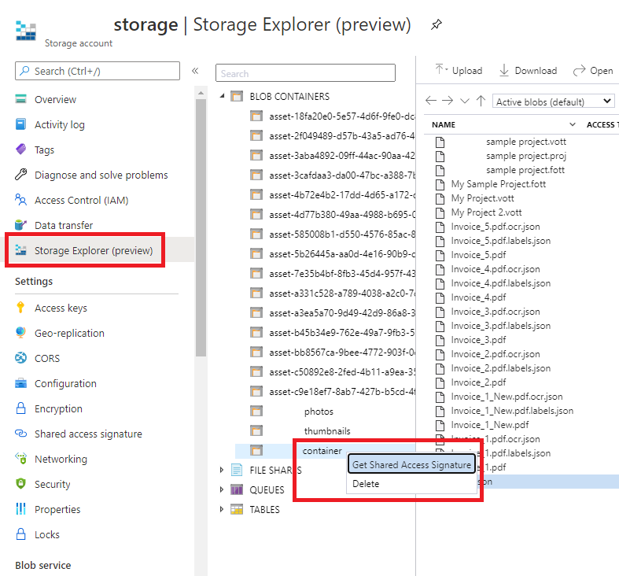

Para recuperar a URL do SAS para os dados de treinamento do modelo personalizado, acesse o recurso de armazenamento no portal do Azure e selecione a guia **Gerenciador de Armazenamento**. Navegue até o contêiner, clique com o botão direito do mouse e selecione **Obter assinatura de acesso compartilhado**. É importante obter o SAS para o contêiner, não para a conta de armazenamento em si. Verifique se as permissões de **Leitura** e **Lista** estão marcadas e clique em **Criar**. Em seguida, copie o valor da seção **URL** para um local temporário. Deve ter o formato: `https://<storage account>.blob.core.windows.net/<container name>?<SAS value>`.
   > [!div class="mx-imgBorder"]
   > 