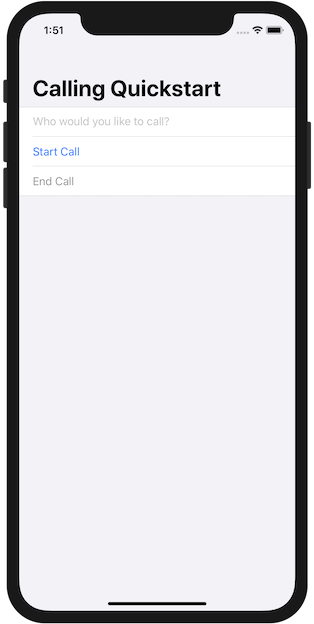

[!INCLUDE [Emergency Calling Notice](../../../includes/emergency-calling-notice-include.md)]
## <a name="prerequisites"></a>Pré-requisitos

- Uma conta do Azure com uma assinatura ativa. [Crie uma conta gratuitamente](https://azure.microsoft.com/free/?WT.mc_id=A261C142F). 
- Um recurso dos Serviços de Comunicação implantado. [Crie um recurso dos Serviços de Comunicação](../../create-communication-resource.md).
- Um número de telefone adquirido no recurso dos Serviços de Comunicação. [como obter um número de telefone](../../telephony-sms/get-phone-number.md).
- Um `User Access Token` para habilitar o cliente de chamada. Para obter mais informações sobre [como obter um `User Access Token`](../../access-tokens.md)
- Conclua o guia de início rápido para [começar a adicionar chamadas ao seu aplicativo](../getting-started-with-calling.md)

### <a name="prerequisite-check"></a>Verificação de pré-requisitos

- Para exibir os números de telefone associados ao seu recurso dos Serviços de Comunicação, entre no [portal do Azure](https://portal.azure.com/), localize o recurso em questão e abra a guia **números de telefone** no painel de navegação esquerdo.
- Você pode criar e executar seu aplicativo com a biblioteca de clientes de Chamada dos Serviços de Comunicação do Azure para iOS:

## <a name="setting-up"></a>Configurando

## <a name="start-a-call-to-phone"></a>Iniciar uma chamada para um telefone

Especifique o número de telefone que você adquiriu no recurso dos Serviços de Comunicação, que será usado para iniciar a chamada:
> [!WARNING]
> Observe que os números de telefone devem ser fornecidos no formato padrão internacional E.164. (por exemplo: +12223334444)

Modifique o manipulador de eventos `startCall` que será executado quando o botão *Iniciar Chamada* for tocado:

```swift
func startCall() {
    // Ask permissions
    AVAudioSession.sharedInstance().requestRecordPermission { (granted) in
        if granted {
            let startCallOptions = ACSStartCallOptions()
            startCallOptions!.alternateCallerID = PhoneNumber(phoneNumber: "+12223334444")
            self.call = self.callAgent!.call([PhoneNumber(phoneNumber: self.callee)], options: startCallOptions)
            self.callDelegate = CallDelegate(self)
            self.call!.delegate = self.callDelegate
        }
    }
}
```

## <a name="run-the-code"></a>Executar o código

Você pode criar e executar o seu aplicativo no simulador de iOS selecionando **Produto** > **Executar** ou usando o atalho de teclado (&#8984;-R).



Você pode fazer uma chamada para o telefone fornecendo um número de telefone no campo de texto adicionado e clicando no botão **Iniciar Chamada**.
> [!WARNING]
> Observe que os números de telefone devem ser fornecidos no formato padrão internacional E.164. (por exemplo: +12223334444)

> [!NOTE]
> Na primeira vez que você fizer uma chamada, o sistema solicitará o acesso ao microfone. Em um aplicativo de produção, você deve usar [verificar o status de permissão](https://developer.apple.com/documentation/uikit/protecting_the_user_s_privacy/requesting_access_to_protected_resources) da API `AVAudioSession` e atualizar normalmente o comportamento do aplicativo quando a permissão não for concedida.
