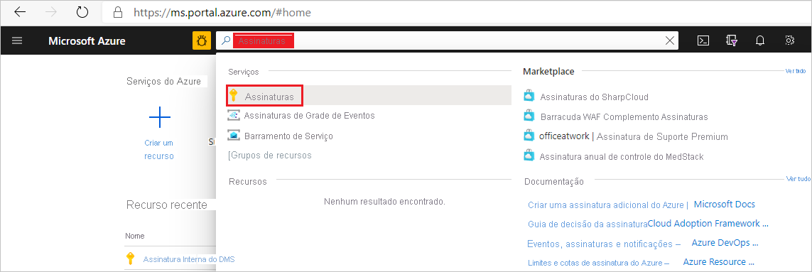
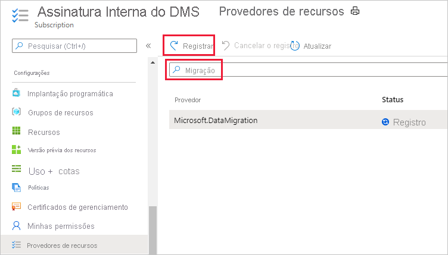
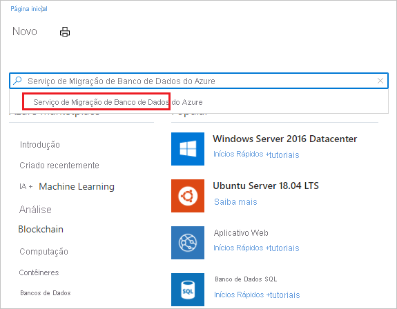
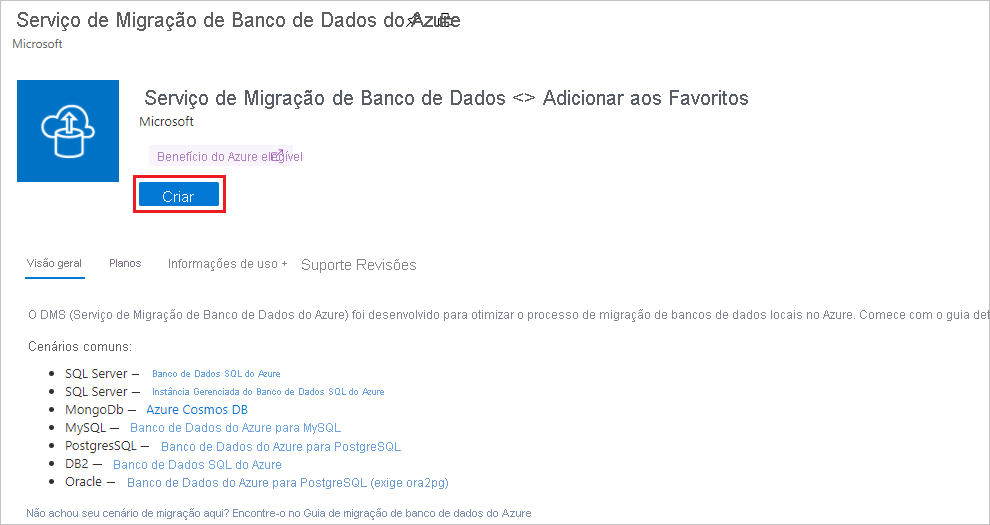
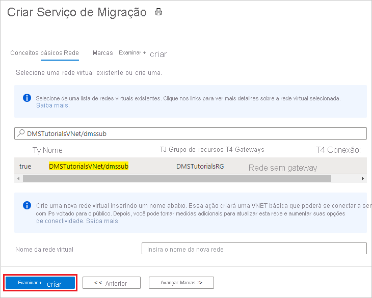

# Início Rápido: Crie uma instância do Serviço de Migração de Banco de Dados do Azure usando o Portal do Azure

Neste guia de início rápido, você usará o portal do Azure para criar uma instância do Serviço de Migração de Banco de Dados do Azure. Depois de criar a instância, use-a para migrar dados de várias fontes de banco de dados para as plataformas de dados do Azure, por exemplo, do SQL Server para o Banco de Dados SQL do Azure ou do SQL Server para uma Instância Gerenciada de SQL do Azure.

Se você não tiver uma assinatura do Azure, crie uma conta [gratuita](https://azure.microsoft.com/free/) antes de começar.

## Entre no Portal do Azure

Abra seu navegador da Web, navegue até o [portal do Microsoft Azure](https://portal.azure.com/) e insira suas credenciais para entrar no portal. A exibição padrão é o painel de serviço.

> [!NOTE]
> É possível criar até 10 instâncias de DMS por assinatura por região. Se você precisar de um número maior de instâncias, crie um tíquete de suporte.

## Registre o provedor de recursos

Registre o provedor de recursos Microsoft.DataMigration antes de criar sua primeira instância do Serviço de Migração de Banco de Dados.

1. No Portal do Azure, pesquise e selecione **Assinaturas**.

   

2. Selecione a assinatura na qual deseja criar a instância do Serviço de Migração de Banco de Dados do Azure e, em seguida, selecione **Provedores de recursos**.

    

3. Pesquise por migração, depois selecione **Registrar** para **Microsoft.DataMigration**.

    

## Crie uma instância do serviço

1. No menu do portal do Azure ou na **Home page**, selecione **Criar um recurso**. Pesquise e selecione o **Serviço de Migração de Banco de Dados do Azure**.

    

2. Na tela **Serviço de Migração de Banco de Dados do Azure**, selecione **Criar**.

    

3. Na tela básica **Criar Serviço de Migração**:

     - Selecione a assinatura.
     - Crie um grupo de recursos ou escolha um existente.
     - Especifique um nome para a instância do Serviço de Migração de Banco de Dados do Azure.
     - Selecione a localização na qual deseja criar a instância do Serviço de Migração de Banco de Dados do Azure.
     - Escolha **Azure** como o modo de serviço.
     - Selecione um tipo de preço. Para obter mais informações sobre os custos e camadas de preços, consulte a [página de preços](https://aka.ms/dms-pricing).
     
    

     - Selecione Avançar: Rede.

4. Na tela de rede **Criar Serviço de Migração**:

    - Selecione uma rede virtual existente ou crie uma. A rede virtual fornece ao Serviço de Migração de Banco de Dados do Azure o acesso ao banco de dados de origem e ao ambiente de destino. Para obter mais informações sobre como criar uma rede virtual no portal do Azure, confira o artigo [Criar uma rede virtual usando o portal do Azure](../virtual-network/quick-create-portal.md).

    

    - Selecione **Examinar + Criar** para criar o serviço. 
    
    - Após alguns instantes, sua instância do Serviço de Migração de Banco de Dados do Azure será criada e estará pronta para uso:

    

## Limpar os recursos

Você pode limpar os recursos criados neste guia de início rápido excluindo o [grupo de recursos do Azure](../azure-resource-manager/management/overview.md). Para excluir o grupo de recursos, navegue até a instância do Serviço de Migração de Banco de Dados do Azure que você criou. Selecione o nome do **Grupo de recursos** e selecione **Excluir grupo de recursos**. Essa ação exclui todos os ativos no grupo de recursos, bem como o grupo em si.

## Próximas etapas

* [Migrar o SQL Server para o Banco de Dados SQL do Azure offline](tutorial-sql-server-to-azure-sql.md)
* [Migrar o SQL Server para o Banco de Dados SQL do Azure online](tutorial-sql-server-azure-sql-online.md)
* [Migrar o SQL Server para uma Instância Gerenciada de SQL do Azure offline](tutorial-sql-server-to-managed-instance.md)
* [Migrar o SQL Server para uma Instância Gerenciada de SQL do Azure online](tutorial-sql-server-managed-instance-online.md)