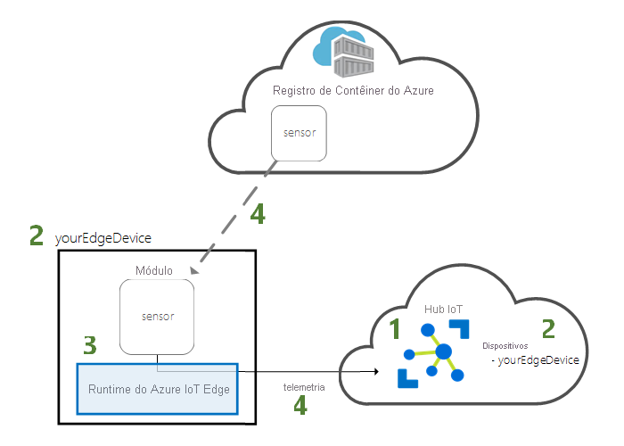
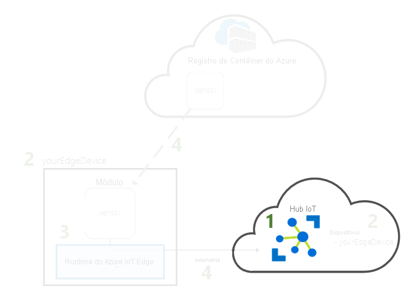
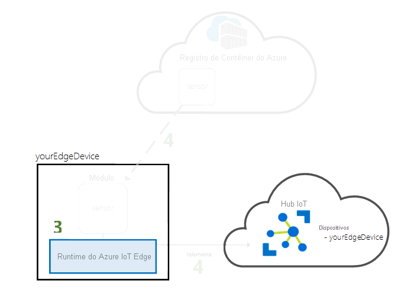
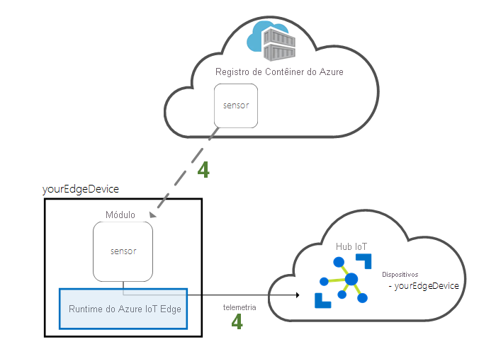

# <a name="quickstart-deploy-your-first-iot-edge-module-to-a-windows-device-preview"></a>Início rápido: Implantar seu primeiro módulo do IoT Edge em um dispositivo Windows (versão prévia)

Experimente o Azure IoT Edge neste guia de início rápido implantando um código em contêineres em um dispositivo IoT Edge do Linux no Windows. O IoT Edge permite que você gerencie remotamente o código em seus dispositivos para que você possa enviar mais cargas de trabalho para a borda. Para este guia de início rápido, recomendamos usar seu dispositivo para ver como é fácil usar o Azure IoT Edge para Linux no Windows.

Neste guia de início rápido, você aprende a:

* Crie um Hub IoT.
* Registrar um dispositivo IoT Edge em seu Hub IoT.
* Instalar e iniciar o runtime do IoT Edge para Linux no Windows no seu dispositivo.
* Implantar remotamente um módulo em um dispositivo IoT Edge e enviar a telemetria.



Este guia de início rápido explica como configurar seu dispositivo Azure IoT Edge para Linux no Windows. Em seguida, implante um módulo do portal do Azure em seu dispositivo. O módulo usado neste guia de início rápido é um sensor simulado que gera dados de temperatura, umidade e pressão. Os outros tutoriais do Azure IoT Edge se baseiam no trabalho feito aqui com a implantação de módulos adicionais que analisam os dados simulados para obter informações de negócios.

Se você não tiver uma assinatura do Azure ativa, crie uma [conta gratuita](https://azure.microsoft.com/free) antes de começar.

>[!NOTE]
>O IoT Edge para Linux no Windows está em [versão prévia pública](https://azure.microsoft.com/support/legal/preview-supplemental-terms/).

## <a name="prerequisites"></a>Pré-requisitos

Prepare seu ambiente para a CLI do Azure.

[!INCLUDE [azure-cli-prepare-your-environment-no-header.md](../../includes/azure-cli-prepare-your-environment-no-header.md)]

Recursos de nuvem:

* Um grupo de recursos para gerenciar todos os recursos que você usará neste início rápido.

   ```azurecli-interactive
   az group create --name IoTEdgeResources --location westus2
   ```

Dispositivo IoT Edge:

* Seu dispositivo precisa ser um computador ou um servidor Windows, versão 1809 ou posterior
* No mínimo, 4 GB de memória; recomendado: 8 GB de memória
* 10 GB de espaço livre em disco

## <a name="create-an-iot-hub"></a>Crie um hub IoT

Comece o início rápido criando um Hub IoT com a CLI do Azure.



O nível gratuito do Hub IoT funciona para este guia de início rápido. Se você tiver usado o Hub IoT antes e já tiver um hub criado, poderá usar esse Hub IoT.

O código a seguir cria um hub **F1** disponível no grupo de recursos `IoTEdgeResources`. Substitua `{hub_name}` por um nome exclusivo para o hub IoT. A criação de um Hub IoT pode demorar alguns minutos.

   ```azurecli-interactive
   az iot hub create --resource-group IoTEdgeResources --name {hub_name} --sku F1 --partition-count 2
   ```

   Se você receber um erro porque já exsite um hub gratuito na sua assinatura, altere o SKU para **S1**. Caso você receba um erro que o nome do Hub IoT não está disponível, isso significa que alguém já tem um hub com esse nome. Tente usar um novo nome.

## <a name="register-an-iot-edge-device"></a>Registrar um dispositivo IoT Edge

Registre um dispositivo IoT Edge no Hub IoT recém-criado.


Crie uma identidade de dispositivo para seu dispositivo simulado para que ele possa se comunicar com o hub IoT. A identidade do dispositivo reside na nuvem e você usa uma cadeia de conexão de dispositivo exclusiva para associar um dispositivo físico a uma identidade do dispositivo.

Como os dispositivos IoT Edge se comportam e podem ser gerenciados diferentemente de dispositivos IoT comuns, declare essa identidade para ser um dispositivo IoT Edge com o sinalizador `--edge-enabled`.

1. No Azure Cloud Shell, digite o comando a seguir para criar um dispositivo denominado **myEdgeDevice** no seu hub.

   ```azurecli-interactive
   az iot hub device-identity create --device-id myEdgeDevice --edge-enabled --hub-name {hub_name}
   ```

   Se você receber um erro sobre as chaves de política do iothubowner, verifique se o Cloud Shell está executando a última versão da extensão azure-iot.

2. Veja a cadeia de conexão para o seu dispositivo, o que vincula o dispositivo físico à sua identidade no Hub IoT. Ele contém o nome do seu hub IoT, o nome do seu dispositivo e uma chave compartilhada que autentica as conexões entre os dois.

   ```azurecli-interactive
   az iot hub device-identity connection-string show --device-id myEdgeDevice --hub-name {hub_name}
   ```

3. Copie o valor da chave `connectionString` da saída JSON e salve-o. Esse valor é a cadeia de conexão do dispositivo. Você usará essa cadeia de conexão para configurar o tempo de execução do IoT Edge na próxima seção.

   

## <a name="install-and-start-the-iot-edge-runtime"></a>Instalar e iniciar o runtime do IoT Edge

Instale o IoT Edge para Linux no Windows no seu dispositivo e configure-o com uma cadeia de conexão do dispositivo.



1. [Baixe o Windows Admin Center](https://aka.ms/WACDownloadEFLOW).

1. Siga o assistente de instalação para configurar o Windows Admin Center no seu dispositivo.

1. Quando estiver no Windows Admin Center, no canto superior direito da tela, selecione o **ícone de engrenagem de Configurações**

1. No menu Configurações, em Gateway, selecione **Extensões**

1. Selecione a guia **Feeds** e **Adicionar**.

1. Insira https://aka.ms/wac-insiders-feed na caixa de texto e escolha **Adicionar**.

1. Depois que o feed for adicionado, procure a guia **Extensões disponíveis**. Pode levar alguns instantes para que a lista de extensões seja atualizada.

1. Na lista de **Extensões disponíveis**, selecione **Azure IoT Edge**

1. **Instalar** a extensão

1. Depois que a extensão for instalada, procure a página principal do painel selecionando **Windows Admin Center** no canto superior esquerdo da tela.

1. Você verá a conexão de host local que representa o computador em que você está executando o Windows Admin Center.

   :::image type="content" source="media/quickstart/windows-admin-center-start-page.png" alt-text="Captura de tela – Página Inicial do Windows Admin Center":::

1. Selecione **Adicionar**.

   :::image type="content" source="media/quickstart/windows-admin-center-start-page-add.png" alt-text="Captura de tela – Botão Adicionar da Página Inicial do Windows Admin Center":::

1. Localize o bloco do Azure IoT Edge e selecione **Criar**. Isso iniciará o assistente de instalação.

    :::image type="content" source="media/quickstart/select-tile-screen.png" alt-text="Captura de tela – Bloco do Azure IoT Edge para Linux no Windows":::

1. Prossiga com o assistente de instalação para aceitar o EULA e escolha **Avançar**

    :::image type="content" source="media/quickstart/wizard-welcome-screen.png" alt-text="Captura de tela – Boas-vindas ao assistente":::

1. Escolha **Dados de diagnóstico opcionais** para fornecer dados de diagnóstico estendidos que ajudam a Microsoft a monitorar e manter a qualidade de serviço e clique em **Avançar: Implantar**

    :::image type="content" source="media/quickstart/diagnostic-data-screen.png" alt-text="Captura de tela – Dados de diagnóstico":::

1. Na tela **Selecionar dispositivo de destino**, escolha o dispositivo de destino desejado para confirmar se ele atende aos requisitos mínimos. Para este guia de início rápido, estamos instalando o IoT Edge no dispositivo local. Portanto, escolha a conexão localhost. Após a confirmação, escolha **Avançar** para continuar

    :::image type="content" source="media/quickstart/wizard-select-target-device-screen.png" alt-text="Captura de tela – Selecionar dispositivo de destino":::

1. Aceite as configurações padrão escolhendo **Avançar**.

1. A tela de implantação mostra o processo de download e instalação do pacote, configuração do host e configuração final da VM do Linux.  Uma implantação bem-sucedida terá a seguinte aparência:

    :::image type="content" source="media/quickstart/wizard-deploy-success-screen.png" alt-text="Captura de tela – Êxito na implantação do assistente":::

1. Clique em **Avançar: Conectar** para prosseguir para a etapa final a fim de provisionar seu dispositivo Azure IoT Edge com a identificação do dispositivo da instância do hub IoT.

1. Copie a cadeia de conexão do dispositivo no Hub IoT do Azure e cole-a no campo da cadeia de conexão do dispositivo. Em seguida, escolha **Provisionamento com o método selecionado**.

    > [!NOTE]
    > Veja a etapa 3 na seção anterior, [Registrar um dispositivo IoT Edge](#register-an-iot-edge-device), para recuperar a cadeia de conexão.

    :::image type="content" source="media/quickstart/wizard-provision.png" alt-text="Captura de tela – Provisionamento do assistente":::

1. Depois que o provisionamento for concluído, selecione **Concluir** para terminar e voltar à tela inicial do Windows Admin Center. Agora você conseguirá ver seu dispositivo listado como um dispositivo IoT Edge.

    :::image type="content" source="media/quickstart/windows-admin-center-device-screen.png" alt-text="Captura de tela – Dispositivo Azure IoT Edge do Windows Admin Center":::

1. Selecione o dispositivo Azure IoT Edge para ver o painel dele. Você verá que as cargas de trabalho do seu dispositivo gêmeo no Hub IoT do Azure foram implantadas. A **Lista de Módulos do IoT Edge** mostrará um módulo em execução, **edgeAgent**, e o **Status do IoT Edge** mostrará **Ativo (em execução)** .

Seu dispositivo IoT Edge agora está configurado. Ele está pronto para executar os módulos implantados na nuvem.

## <a name="deploy-a-module"></a>Implantar um módulo

Gerencie o dispositivo Azure IoT Edge na nuvem para implantar um módulo que envia dados telemétricos ao Hub IoT.



[!INCLUDE [iot-edge-deploy-module](../../includes/iot-edge-deploy-module.md)]

## <a name="view-generated-data"></a>Exibir os dados gerados

Neste guia de início rápido, você criou um novo dispositivo IoT Edge e instalou o runtime do IoT Edge nele. Em seguida, você usou o portal do Azure para implantar um módulo do IoT Edge para ser executado no dispositivo sem precisar fazer alterações no próprio dispositivo.

Nesse caso, o módulo enviado por push gera dados de ambiente de exemplo que você pode usar para testar mais tarde. O sensor simulado está monitorando um computador e o ambiente em torno do computador. Por exemplo, esse sensor pode estar em uma sala de servidor, em um chão de fábrica ou em uma turbina eólica. A mensagem inclui a temperatura ambiente e umidade, temperatura do computador, pressão e um carimbo de data/hora. Os tutoriais do IoT Edge usam os dados criados por esse módulo de dados de teste para análise.

Confirme se o módulo implantado por meio da nuvem está em execução no dispositivo IoT Edge acessando o shell de comando no Windows Admin Center.

1. Conectar-se ao dispositivo IoT Edge recém-criado

   :::image type="content" source="media/quickstart/connect-edge-screen.png" alt-text="Captura de tela – Conectar dispositivo":::

2. Na página **Visão Geral**, você verá a **Lista de Módulos do IoT Edge** e **Status do IoT Edge**, em que é possível ver os vários módulos que foram implantados, bem como o status do dispositivo.  

3. Em **Ferramentas**, selecione **Shell de Comando**. O shell de comando é um terminal do PowerShell que usa automaticamente o SSH (Secure Shell) para se conectar à VM do Linux do dispositivo Azure IoT Edge no seu computador Windows.

   :::image type="content" source="media/quickstart/command-shell-screen.png" alt-text="Captura de tela – Shell de comando":::

4. Para verificar os três módulos no seu dispositivo, execute o seguinte **comando do Bash**:

   ```bash
   sudo iotedge list
   ```

   :::image type="content" source="media/quickstart/iotedge-list-screen.png" alt-text="Captura de tela – Lista do shell de comando":::

5. Exiba as mensagens que estão sendo enviadas do módulo sensor de temperatura para a nuvem.

   ```bash
   iotedge logs SimulatedTemperatureSensor -f
   ```

   >[!TIP]
   >Ao fazer referência a nomes de módulo, comandos do IoT Edge diferenciam maiúsculas de minúsculas.

   :::image type="content" source="media/quickstart/temperature-sensor-screen.png" alt-text="Captura de tela – Sensor de temperatura":::

Você também pode exibir as mensagens que são recebidas pelo seu hub IoT usando a [Extensão do Hub IoT do Azure para o Visual Studio Code](https://marketplace.visualstudio.com/items?itemName=vsciot-vscode.azure-iot-toolkit).

## <a name="clean-up-resources"></a>Limpar os recursos

Se você deseja prosseguir para os tutoriais do IoT Edge, pode usar o dispositivo registrado e configurado neste guia de início rápido. Caso contrário, você pode excluir os recursos do Azure que criou para evitar encargos.

Se você tiver criado a sua máquina virtual e o Hub IoT em um novo grupo de recursos, é possível excluir esse grupo e todos os recursos associados. Verifique novamente o conteúdo do grupo de recursos para ter certeza de que não haja nada que você queira manter. Caso não queira excluir o grupo inteiro, é possível excluir recursos individuais em vez disso.

> [!IMPORTANT]
> A exclusão de um grupo de recursos é irreversível.

Remova o grupo **IoTEdgeResources**. A exclusão de um grupo de recursos pode demorar alguns minutos.

```azurecli-interactive
az group delete --name IoTEdgeResources
```

Para confirmar se o grupo de recursos foi removido, veja a lista de grupos de recursos.

```azurecli-interactive
az group list
```

### <a name="clean-removal-of-azure-iot-edge-for-linux-on-windows"></a>Remoção do Azure IoT Edge para Linux no Windows

Desinstale o Azure IoT Edge para Linux no Windows no dispositivo IoT Edge por meio da extensão do painel no Windows Admin Center.

1. No Windows Admin Center, acesse a conexão do dispositivo Azure IoT Edge para Linux no Windows. A extensão da ferramenta do painel do Azure será carregada.
2. Selecione **Desinstalar**. Depois que o Azure IoT Edge para Linux no Windows for removido, o Windows Admin Center acessará a página inicial e removerá a entrada de conexão do dispositivo Azure IoT Edge da lista.

Outra maneira de remover o Azure IoT Edge do sistema Windows é acessar **Iniciar** > **Configurações** > **Aplicativos** > **Azure IoT Edge** > **Desinstalar** no dispositivo IoT Edge. Isso removerá o Azure IoT Edge do seu dispositivo IoT Edge, mas deixará a conexão para trás no Windows Admin Center. O Windows Admin Center também pode ser desinstalado por meio do menu Configurações.

## <a name="next-steps"></a>Próximas etapas

Neste início rápido, você criou um dispositivo IoT Edge e usou a interface de nuvem do Azure IoT Edge para implantar código no dispositivo. Agora, você tem um dispositivo de teste que gera dados brutos sobre seu ambiente.

A próxima etapa é configurar seu ambiente de desenvolvimento local para que você possa começar a criar módulos de IoT Edge que executem a sua lógica de negócios.

> [!div class="nextstepaction"]
> [Iniciar o desenvolvimento de módulos do IoT Edge](tutorial-develop-for-linux.md)
