# <a name="quickstart-create-and-manage-logic-app-workflow-definitions-by-using-visual-studio-code"></a>Início Rápido: Criar e gerenciar definições do fluxo de trabalho de aplicativos lógicos usando o Visual Studio Code

Com o [Azure Logic Apps](../logic-apps/logic-apps-overview.md) e o Visual Studio Code, você pode criar e gerenciar aplicativos lógicos que ajudam a automatizar tarefas, fluxos de trabalho e processos para integrar aplicativos, dados, sistemas e serviços em organizações e empresas. Este início rápido mostra como criar e editar as definições de fluxo de trabalho subjacentes, que usam o JSON (JavaScript Object Notation), para aplicativos lógicos por meio de uma experiência baseada em código. Também é possível trabalhar em aplicativos lógicos existentes já implantados no Azure.

Embora seja possível executar essas mesmas tarefas no [portal do Azure](https://portal.azure.com) e no Visual Studio, você poderá começar mais rapidamente no Visual Studio Code quando já conhecer definições de aplicativo lógico e desejar trabalhar diretamente no código. Por exemplo, é possível desabilitar, habilitar, excluir e atualizar aplicativos lógicos já criados. Além disso, você pode trabalhar em aplicativos lógicos e nas contas de integração de qualquer plataforma de desenvolvimento em que o Visual Studio Code é executado, como Linux, Windows e Mac.

Para este artigo, você pode criar o mesmo aplicativo lógico com base neste [início rápido](../logic-apps/quickstart-create-first-logic-app-workflow.md), que se concentra mais nos conceitos básicos. Você também pode [aprender a criar o aplicativo de exemplo no Visual Studio](quickstart-create-logic-apps-with-visual-studio.md) e [aprender a criar e gerenciar aplicativos por meio da CLI do Azure (Interface de linha de comando do Azure)](quickstart-logic-apps-azure-cli.md). No Visual Studio Code, o aplicativo lógico se parece com este exemplo:

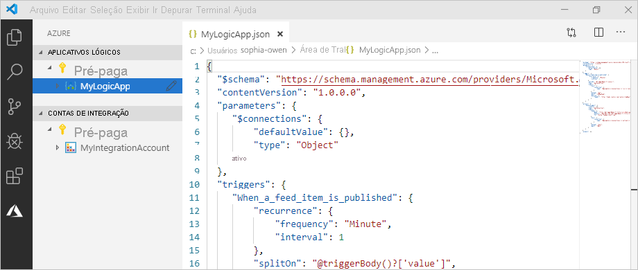

Antes de começar, verifique se você tem estes itens:

* Se você não tiver uma conta e uma assinatura do Azure, [inscreva-se em uma conta gratuita do Azure](https://azure.microsoft.com/free/).

* Conhecimento básico sobre as [definições de fluxo de trabalho de aplicativo lógico](../logic-apps/logic-apps-workflow-definition-language.md) e a estrutura dele, conforme descrito com o JSON

  Se você for novo nos Aplicativos Lógicos, experimente este [início rápido](../logic-apps/quickstart-create-first-logic-app-workflow.md) que explica como criar seus primeiros aplicativos lógicos no portal do Azure e se concentra mais nos conceitos básicos.

* Acesso à web para entrar no Azure e sua assinatura do Azure

* Baixe e instale essas ferramentas, caso você ainda não as tenha:

  * [Visual Studio Code versão 1.25.1 ou posterior](https://code.visualstudio.com/), que é gratuito

  * Extensão do Visual Studio Code para Aplicativos Lógicos do Azure

    É possível baixar e instalar essa extensão do [Visual Studio Marketplace](https://marketplace.visualstudio.com/items?itemName=ms-azuretools.vscode-logicapps) ou diretamente do Visual Studio Code. Após instalar, verifique se você recarregou o Visual Studio Code.

    

    Para verificar se a extensão foi instalada corretamente, selecione o ícone do Azure que aparece na barra de ferramentas do código do Visual Studio Code.

    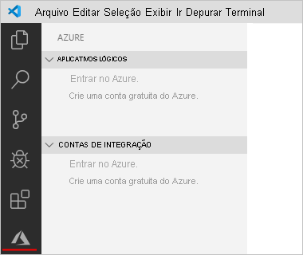

    Para obter mais informações, consulte [Marketplace de extensão](https://code.visualstudio.com/docs/editor/extension-gallery). Para contribuir com a versão de software livre dessa extensão, visite a [Extensão de Aplicativos Lógicos do Azure para Visual Studio Code no GitHub](https://github.com/Microsoft/vscode-azurelogicapps).

<a name="access-azure"></a>

## <a name="access-azure-from-visual-studio"></a>Acessar o Azure no Visual Studio

1. Abra o Visual Studio Code. Na barra de ferramentas Código do Visual Studio, selecione o ícone do Azure.

   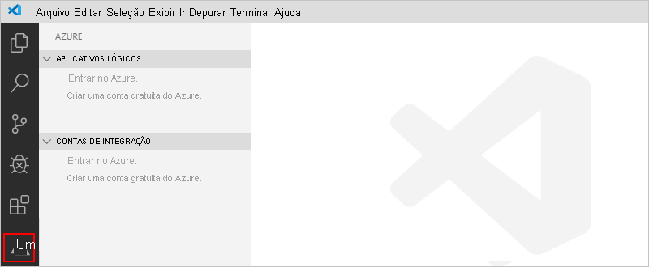

1. Na janela do Azure, em **Aplicativos Lógicos**, selecione **Fazer login no Azure**. Quando a página de entrada da Microsoft solicitar, entre com sua conta do Azure.

   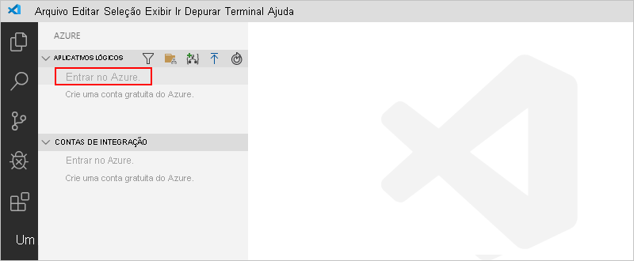

   1. Se a entrada demorar mais do que o normal, o Visual Studio Code solicitará que você entre usando um site de autenticação da Microsoft fornecendo um código de dispositivo. Para entrar com o código, selecione **Usar Código do Dispositivo**.

      

   1. Para copiar o código, selecione **Copiar e abrir**.

      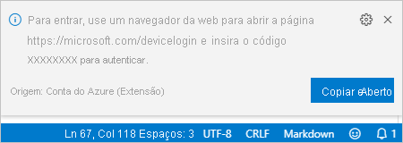

   1. Para abrir uma nova janela do navegador e continuar para o site de autenticação, selecione **Abrir link**.

      

   1. Na página **Entrar na sua conta**, insira seu código de autenticação e selecione **Avançar**.

      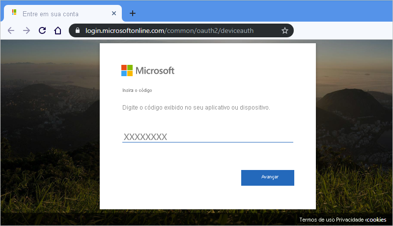

1. Selecione sua conta do Azure. Depois de entrar, você pode fechar o navegador e retornar ao código do Visual Studio.

   No painel do Azure, as seções **Aplicativos Lógicos** e **Contas de Integração** agora mostram as assinaturas do Azure associadas à sua conta. No entanto, se você não vir as assinaturas esperadas ou se as seções mostrarem muitas assinaturas, siga estas etapas:

   1. Passe o ponteiro do mouse sobre o rótulo **Aplicativos Lógicos**. Quando a barra de ferramentas for exibida, selecione **Selecionar assinaturas** (ícone de filtro).

      

   1. Na lista exibida, selecione as assinaturas que você quer que sejam exibidas.

1. Em **Aplicativos Lógicos**, selecione a assinatura que você quer. O nó da assinatura expande e mostra todos os aplicativos lógicos existentes nela.

   

   > [!TIP]
   > Em **Contas de Integração**, selecionar sua assinatura mostra todas as contas de integração existentes nela.

<a name="create-logic-app"></a>

## <a name="create-new-logic-app"></a>Criar novo aplicativo lógico

1. Caso ainda não tenha entrado na sua conta e assinatura do Azure de dentro do Visual Studio Code, siga as [etapas anteriores para entrar agora](#access-azure).

1. No Visual Studio Code, em **Aplicativos Lógicos**, abra o menu de atalho de sua assinatura e selecione **Criar Aplicativo Lógico**.

   

   É exibida uma lista que mostra os grupos de recursos do Azure em sua assinatura.

1. Na lista de grupos de recursos, selecione **Criar um novo grupo de recursos** ou um grupo de recursos existente. Para este exemplo, crie um novo grupo de recursos.

   

1. Forneça um nome para o grupo de recursos do Azure e pressione ENTER.

   

1. Selecione a região do Azure onde você deseja salvar os metadados do aplicativo lógico.

   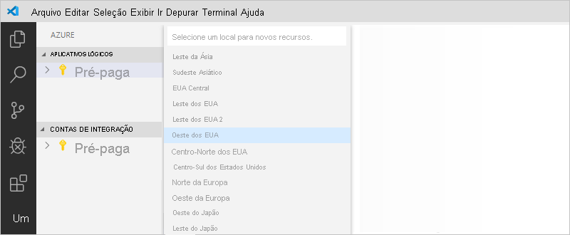

1. Forneça um nome para seu aplicativo lógico e pressione Enter.

   

   Seu novo aplicativo lógico em branco aparece na janela do Azure, sob sua assinatura do Azure. O Visual Studio Code também abre um arquivo JSON (.logicapp.json) que inclui uma definição de fluxo de trabalho esqueleto para seu aplicativo lógico. Agora, você pode começar a criar manualmente a definição de fluxo de trabalho de seu aplicativo lógico neste arquivo JSON. Para ver a referência técnica sobre a estrutura e a sintaxe de uma definição de fluxo de trabalho, confira [Esquema de linguagem de definição de fluxo de trabalho para os Aplicativos Lógicos do Azure](../logic-apps/logic-apps-workflow-definition-language.md).

   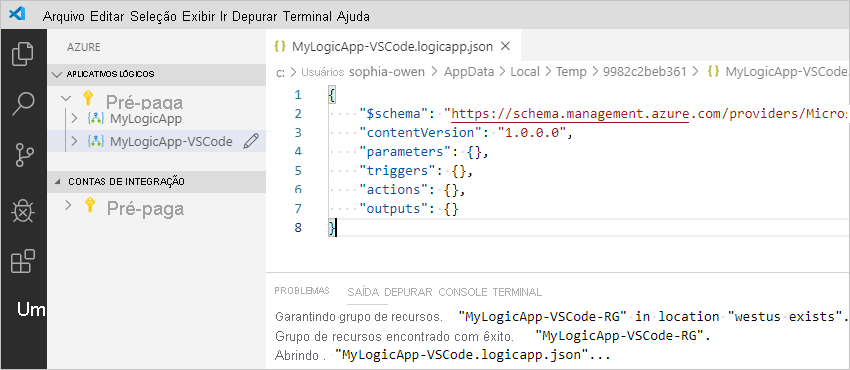

   Este é um exemplo de definição de fluxo de trabalho de aplicativo lógico, que começa com um gatilho de RSS e uma ação do Outlook do Office 365. Normalmente, os elementos JSON aparecem em ordem alfabética em cada seção. No entanto, este exemplo mostra esses elementos aproximadamente na ordem em que as etapas do aplicativo lógico aparecem no designer.

   > [!IMPORTANT]
   > Caso deseje reutilizar esse exemplo de definição de aplicativo lógico, você precisará ter uma conta organizacional, por exemplo, @fabrikam.com. Certifique-se de substituir o endereço de email fictício pelo seu próprio endereço de email. Para usar um conector de email diferente, como o Outlook.com ou o Gmail, substitua a ação `Send_an_email_action` por uma ação semelhante disponível de um [conector de email com suporte dos Aplicativos Lógicos do Azure](../connectors/apis-list.md).
   >
   > Se você quiser usar o conector do Gmail, somente as contas comerciais do G Suite poderão usar esse conector sem restrição nos aplicativos lógicos. 
   > Se você tiver uma conta de consumidor do Gmail, poderá usar esse conector somente com serviços específicos do Google aprovados ou poderá [criar um aplicativo cliente do Google para usar para autenticação com o conector do Gmail](/connectors/gmail/#authentication-and-bring-your-own-application). 
   > Para obter mais informações, confira [Políticas de privacidade e segurança de dados para os conectores do Google nos Aplicativos Lógicos do Azure](../connectors/connectors-google-data-security-privacy-policy.md).

   ```json
   {
      "$schema": "https://schema.management.azure.com/providers/Microsoft.Logic/schemas/2016-06-01/workflowdefinition.json#",
      "contentVersion": "1.0.0.0",
      "parameters": {
         "$connections": {
            "defaultValue": {},
            "type": "Object"
         }
      },
      "triggers": {
         "When_a_feed_item_is_published": {
            "recurrence": {
               "frequency": "Minute",
               "interval": 1
            },
            "splitOn": "@triggerBody()?['value']",
            "type": "ApiConnection",
            "inputs": {
               "host": {
                  "connection": {
                     "name": "@parameters('$connections')['rss']['connectionId']"
                  }
               },
               "method": "get",
               "path": "/OnNewFeed",
               "queries": {
                  "feedUrl": "http://feeds.reuters.com/reuters/topNews"
               }
            }
         }
      },
      "actions": {
         "Send_an_email_(V2)": {
            "runAfter": {},
            "type": "ApiConnection",
            "inputs": {
               "body": {
                  "Body": "<p>Title: @{triggerBody()?['title']}<br>\n<br>\nDate published: @{triggerBody()?['updatedOn']}<br>\n<br>\nLink: @{triggerBody()?['primaryLink']}</p>",
                  "Subject": "RSS item: @{triggerBody()?['title']}",
                  "To": "sophia-owen@fabrikam.com"
               },
               "host": {
                  "connection": {
                     "name": "@parameters('$connections')['office365']['connectionId']"
                  }
               },
               "method": "post",
               "path": "/v2/Mail"
            }
         }
      },
      "outputs": {}
   }
   ```

1. Quando terminar, salve sua definição de fluxo de trabalho de aplicativo lógico. (Menu Arquivo > Salvar ou pressione Ctrl + S)

1. Quando for solicitado a carregar o aplicativo lógico em sua assinatura do Azure, selecione **Carregar**.

   Esta etapa publica seu aplicativo lógico no [portal do Azure](https://portal.azure.com), o que coloca sua lógica ativa e em execução no Azure.

   

## <a name="view-logic-app-in-designer"></a>Exibir aplicativo lógico no designer

No Visual Studio Code, você pode abrir seu aplicativo lógico no modo de exibição de design somente leitura. Embora você não possa editar o aplicativo lógico no designer, é possível verificar visualmente o fluxo de trabalho do aplicativo lógico usando o modo de exibição do designer.

Na janela do Azure, em **Aplicativos Lógicos**, abra o menu de atalho do aplicativo lógico e selecione **Abrir no Designer**.

O designer somente leitura é aberto em uma janela separada e mostra o fluxo de trabalho do aplicativo lógico, por exemplo:


## <a name="view-in-azure-portal"></a>Exibir no portal do Azure

Para examinar seu aplicativo lógico no portal do Azure, siga estas etapas:

1. Entre no [portal do Azure](https://portal.azure.com) usando a mesma conta e assinatura do Azure associada ao seu aplicativo lógico.

1. Na caixa de pesquisa do portal do Azure, insira o nome do seu aplicativo lógico. Na lista de resultados, selecione seu aplicativo lógico.

   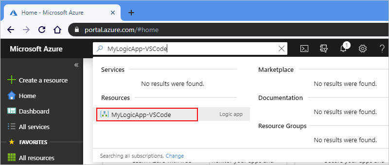

<a name="disable-enable-logic-app"></a>

## <a name="disable-or-enable-logic-app"></a>Desabilitar ou habilitar o aplicativo lógico

No Visual Studio Code, se editar um aplicativo lógico publicado e salvar suas alterações, você *substituirá* seu aplicativo já implantado. Para evitar interromper seu aplicativo lógico em produção e minimizar interrupções, desative seu aplicativo lógico primeiro. Em seguida, você pode reativar o aplicativo lógico depois de confirmar que ele ainda funciona.

1. Caso ainda não tenha entrado na sua conta e assinatura do Azure de dentro do Visual Studio Code, siga as [etapas anteriores para entrar agora](#access-azure).

1. Na janela do Azure, em **Aplicativos Lógicos**, expanda sua assinatura do Azure para que possa exibir todos os aplicativos lógicos nela.

   1. Para desabilitar o aplicativo lógico que deseja, abra o menu do aplicativo lógico e selecione **Desabilitar**.

      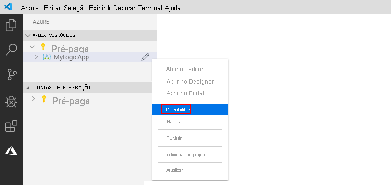

   1. Quando estiver pronto para reativar o aplicativo lógico, abra o menu do aplicativo e selecione **Habilitar**.

      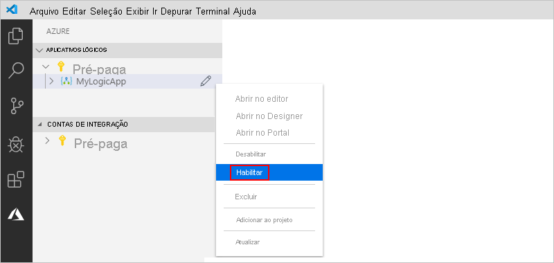

<a name="edit-logic-app"></a>

## <a name="edit-deployed-logic-app"></a>Editar aplicativo lógico implantado

No Visual Studio Code, você pode abrir e editar a definição de fluxo de trabalho de um aplicativo lógico já implantado no Azure.

> [!IMPORTANT] 
> Antes de editar um aplicativo lógico em execução ativa na produção, evite o risco de interromper o aplicativo lógico e minimize interrupções [desabilitando seu aplicativo lógico primeiro](#disable-enable-logic-app).

1. Caso ainda não tenha entrado na sua conta e assinatura do Azure de dentro do Visual Studio Code, siga as [etapas anteriores para entrar agora](#access-azure).

1. Na janela do Azure, em **Aplicativos Lógicos**, expanda sua assinatura do Azure e selecione o aplicativo lógico desejado.

1. Abra o menu de seu aplicativo lógico e selecione **Abrir no Editor**. Ou, ao lado do nome do seu aplicativo lógico, selecione o ícone de edição.

   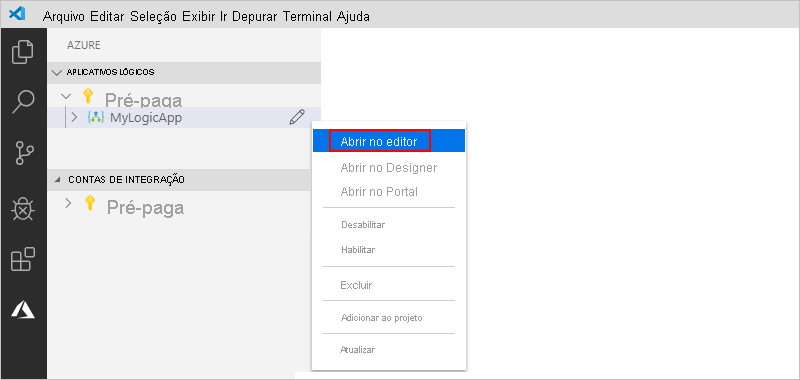

   O Visual Studio Code abre o arquivo .logicapp.json na pasta temporária local para que você possa exibir a definição de fluxo de trabalho de seu aplicativo lógico.

   

1. Faça suas alterações na definição de fluxo de trabalho de seu aplicativo lógico.

1. Quando terminar, salve as alterações. (Menu Arquivo > Salvar ou pressione Ctrl + S)

1. Quando for solicitado a carregar suas alterações e *substituir* o aplicativo lógico existente no portal do Azure, selecione **Carregar**.

   Esta etapa publica as atualizações em seu aplicativo lógico no [portal do Azure](https://portal.azure.com).

   

## <a name="view-or-promote-other-versions"></a>Exibir ou promover outras versões

No Visual Studio Code, você pode abrir e examinar as versões anteriores de seu aplicativo lógico. Você também pode promover uma versão anterior para a versão atual.

> [!IMPORTANT] 
> Antes de alterar um aplicativo lógico em execução ativa na produção, evite o risco de interromper o aplicativo lógico e minimize interrupções [desabilitando seu aplicativo lógico primeiro](#disable-enable-logic-app).

1. Na janela do Azure, em **Aplicativos Lógicos**, expanda sua assinatura do Azure para que possa exibir todos os aplicativos lógicos nela.

1. Em sua assinatura, expanda o aplicativo lógico e expanda **Versões**.

   A lista **Versões** mostra as versões anteriores do aplicativo lógico, se existirem.

   

1. Para exibir uma versão anterior, selecione uma das etapas:

   * Para exibir a definição de JSON, em **Versões**, selecione o número de versão da definição. Ou abra o menu de atalho da versão e selecione **Abrir no Editor**.

     É aberto um novo arquivo no computador local, que mostra a definição de JSON da versão.

   * Para exibir a versão no modo de exibição de designer somente leitura, abra o menu de atalho da versão e selecione **Abrir no designer**.

1. Para promover uma versão anterior para a versão atual, siga estas etapas:

   1. Em **Versões**, abra o menu de atalho da versão anterior e selecione **Promover**.

      

   1. Para continuar depois que o Visual Studio Code solicitar uma confirmação, selecione **Sim**.

      

      O Visual Studio Code promove a versão selecionada para a versão atual e atribui um novo número à versão promovida. A antiga versão atual agora aparece sob a versão promovida.

## <a name="next-steps"></a>Próximas etapas

> [!div class="nextstepaction"]
> [Criar aplicativos lógicos com e sem estado no Visual Studio Code (versão prévia)](../logic-apps/create-stateful-stateless-workflows-visual-studio-code.md)
