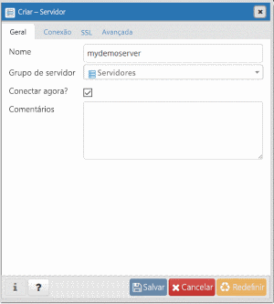
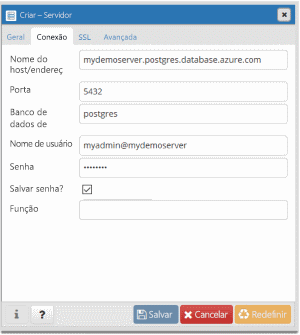
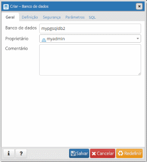

# <a name="quickstart-create-an-azure-database-for-postgresql---single-server-using-the-azure-cli"></a>Início Rápido: Criar um Banco de Dados do Azure para PostgreSQL – Servidor único usando a CLI do Azure

> [!TIP]
> Considere usar o comando mais simples da CLI do Azure [az postgres up](/cli/azure/ext/db-up/postgres#ext-db-up-az-postgres-up) (atualmente em versão prévia). Experimente o [início rápido](./quickstart-create-server-up-azure-cli.md).

O Banco de Dados do Azure para PostgreSQL é um serviço gerenciado que permite executar, gerenciar e dimensionar os bancos de dados altamente disponíveis do PostgreSQL na nuvem. A CLI do Azure é usada para criar e gerenciar recursos do Azure da linha de comando ou em scripts. Este início rápido mostra como criar um Banco de Dados do Azure para o servidor PostgreSQL em um [grupo de recursos do Azure](https://docs.microsoft.com/azure/azure-resource-manager/resource-group-overview) usando a CLI do Azure.

Se você não tiver uma assinatura do Azure, crie uma conta [gratuita](https://azure.microsoft.com/free/) antes de começar.

[!INCLUDE [cloud-shell-try-it](../../includes/cloud-shell-try-it.md)]

Se você optar por instalar e usar a CLI localmente, este artigo exigirá que seja executada a CLI do Azure versão 2.0 ou posterior. Para ver a versão instalada, execute o comando `az --version`. Se você precisa instalar ou atualizar, consulte [Instalar a CLI do Azure]( /cli/azure/install-azure-cli). 

Se você estiver executando a CLI localmente, precisará entrar em sua conta usando o comando [az login](/cli/azure/authenticate-azure-cli?view=interactive-log-in). Observe a propriedade **ID** da saída do comando para obter o nome da assinatura correspondente.
```azurecli-interactive
az login
```

Se tiver várias assinaturas, escolha a que for adequada para cobrança do recurso. Selecione a ID da assinatura específica em sua conta usando o comando [az account set](/cli/azure/account). Substitua a propriedade **ID** da saída **az logon** para a sua assinatura no espaço reservado da ID de assinatura.
```azurecli-interactive
az account set --subscription <subscription id>
```

## <a name="create-a-resource-group"></a>Criar um grupo de recursos

Crie um [grupo de recursos do Azure](../azure-resource-manager/resource-group-overview.md) usando o comando [az group create](/cli/azure/group). Um grupo de recursos é um contêiner lógico no qual os recursos do Azure são implantados e gerenciados em grupo. Você deve fornecer um nome exclusivo. O exemplo a seguir cria um grupo de recursos denominado `myresourcegroup` no local `westus`.
```azurecli-interactive
az group create --name myresourcegroup --location westus
```

## <a name="create-an-azure-database-for-postgresql-server"></a>Criar um Banco de Dados do Azure para o servidor PostgreSQL

Crie um [Banco de Dados do Azure para PostgreSQL](overview.md) usando o comando [az postgres server create](/cli/azure/postgres/server). Um servidor pode conter vários bancos de dados.


**Configuração** | **Valor de exemplo** | **Descrição**
---|---|---
Nome | mydemoserver | Escolha um nome exclusivo que identifica o Banco de Dados do Azure para o servidor PostgreSQL. O nome do servidor pode conter apenas letras minúsculas, números e o caractere de hífen (-). Ele deve conter de 3 a 63 caracteres.
resource-group | myresourcegroup | Forneça o nome do grupo de recursos do Azure.
sku-name | GP_Gen5_2 | O nome da SKU. Segue a convenção {tipo de preço}\_{geração de computação}\_{vCores} em formato abreviado. Embaixo desta tabela há mais informações sobre o parâmetro sku-name.
backup-retention | 7 | Quanto tempo um backup deve ser retido. A unidade é dias. O intervalo é de 7 a 35. 
geo-redundant-backup | Desabilitado | Indica se os backups com redundância geográfica devem ser habilitados para este servidor ou não. Valores permitidos: Habilitado, Desabilitado.
location | westus | O local do Azure para o servidor.
ssl-enforcement | habilitado | Se o ssl deve ser habilitado ou não para este servidor. Valores permitidos: Habilitado, Desabilitado.
storage-size | 51200 | A capacidade de armazenamento do servidor (a unidade é megabytes). O tamanho de armazenamento válido é no mínimo 5.120 MB e aumenta em incrementos de 1.024 MB. Confira o documento [tipos de preço](./concepts-pricing-tiers.md) para obter mais informações sobre limites de tamanho de armazenamento. 
version | 9.6. | A versão principal do PostgreSQL.
admin-user | myadmin | O nome de usuário para o logon de administrador. Não pode ser **azure_superuser**, **admin**, **administrator**, **root**, **guest** nem **public**.
admin-password | *senha de segurança* | A senha do usuário administrador. Ele deve conter entre 8 e 128 caracteres. A senha precisa conter caracteres de três das seguintes categorias: Letras maiúsculas, letras minúsculas, números e caracteres não alfanuméricos.


O valor do parâmetro sku-name segue a convenção {camada de preços}\_{geração de cálculo}\_{vCores} como nestes exemplos:
+ `--sku-name B_Gen5_1` é mapeado para Básico, Gen 5 e 1 vCore. Essa opção é o menor SKU disponível.
+ `--sku-name GP_Gen5_32` mapeia para Uso Geral, Gen 5 e 32 vCores.
+ `--sku-name MO_Gen5_2` mapeia para Otimizado para Memória, Gen 5 e 2 vCores.

Veja a documentação das [camadas de preços](./concepts-pricing-tiers.md) para entender os valores válidos por região e por camada.

O exemplo a seguir cria um servidor PostgreSQL 9.6 no Oeste dos EUA chamado `mydemoserver` em seu grupo de recursos `myresourcegroup` com o logon de administrador de servidor `myadmin`. Esse é um servidor **Gen 4** de **Finalidade Geral** com **2 vCores**. Substitua o `<server_admin_password>` com seu próprio valor.
```azurecli-interactive
az postgres server create --resource-group myresourcegroup --name mydemoserver  --location westus --admin-user myadmin --admin-password <server_admin_password> --sku-name GP_Gen4_2 --version 9.6
```

> [!NOTE]
> Considere usar o tipo de preço Básico se computação leve e E/S forem adequadas para sua carga de trabalho. Observe que servidores criados no tipo de preço Básico não podem ser dimensionados mais tarde para Uso Geral ou Otimizado para Memória. Veja a [página de preço](https://azure.microsoft.com/pricing/details/postgresql/) para obter mais informações.
> 

## <a name="configure-a-server-level-firewall-rule"></a>Configurar uma regra de firewall no nível de servidor

Crie uma regra de firewall no nível de servidor do PostgreSQL do Azure com o comando [az postgres server firewall-rule create](/cli/azure/postgres/server/firewall-rule). Uma regra de firewall de nível de servidor permite que um aplicativo externo, tal como [psql](https://www.postgresql.org/docs/9.2/static/app-psql.html) ou [PgAdmin](https://www.pgadmin.org/), conecte-se ao servidor por meio do firewall do serviço Azure PostgreSQL. 

Você pode definir uma regra de firewall que abranja um intervalo de IP aos quais você possa se conectar de sua rede. O exemplo a seguir usa [az postgres server firewall-rule create](/cli/azure/postgres/server/firewall-rule) para criar uma regra de firewall `AllowMyIP` para um único endereço IP.
```azurecli-interactive
az postgres server firewall-rule create --resource-group myresourcegroup --server mydemoserver --name AllowMyIP --start-ip-address 192.168.0.1 --end-ip-address 192.168.0.1
```

> [!NOTE]
> O servidor PostgreSQL do Azure se comunica pela porta 5432. Ao se conectar de dentro de uma rede corporativa, o tráfego de saída pela porta 5432 talvez não seja permitido pelo firewall de sua rede. Solicite que seu departamento de TI abra a porta 5432 para se conectar ao seu servidor PostgreSQL do Azure.

## <a name="get-the-connection-information"></a>Obter informações de conexão

Para se conectar ao servidor, é preciso fornecer credenciais de acesso e informações do host.
```azurecli-interactive
az postgres server show --resource-group myresourcegroup --name mydemoserver
```

O resultado está no formato JSON. Anote o **administratorLogin** e o **fullyQualifiedDomainName**.
```json
{
  "administratorLogin": "myadmin",
  "earliestRestoreDate": null,
  "fullyQualifiedDomainName": "mydemoserver.postgres.database.azure.com",
  "id": "/subscriptions/00000000-0000-0000-0000-000000000000/resourceGroups/myresourcegroup/providers/Microsoft.DBforPostgreSQL/servers/mydemoserver",
  "location": "westus",
  "name": "mydemoserver",
  "resourceGroup": "myresourcegroup",
  "sku": {
    "capacity": 2,
    "family": "Gen5",
    "name": "GP_Gen5_2",
    "size": null,
    "tier": "GeneralPurpose"
  },
  "sslEnforcement": "Enabled",
  "storageProfile": {
    "backupRetentionDays": 7,
    "geoRedundantBackup": "Disabled",
    "storageMb": 5120
  },
  "tags": null,
  "type": "Microsoft.DBforPostgreSQL/servers",
  "userVisibleState": "Ready",
  "version": "9.6"
}
```

## <a name="connect-to-postgresql-database-using-psql"></a>Conectar-se ao banco de dados PostgreSQL usando psql

Se o computador cliente tiver o PostgreSQL instalado, você poderá usar uma instância local do [psql](https://www.postgresql.org/docs/current/static/app-psql.html) para se conectar a um servidor PostgreSQL do Azure. Usaremos agora o utilitário de linha de comando psql para nos conectarmos ao servidor PostgreSQL do Azure.

1. Execute o comando psql a seguir para se conectar a um Banco de Dados do Azure para servidor PostgreSQL
   ```bash
   psql --host=<servername> --port=<port> --username=<user@servername> --dbname=<dbname>
   ```

   Por exemplo, o comando a seguir se conecta ao banco de dados padrão chamado **postgres** no seu servidor PostgreSQL **mydemoserver.postgres.database.azure.com** usando as credenciais de acesso. Insira o `<server_admin_password>` que você escolheu quando uma senha foi solicitada a você.
  
   ```bash
   psql --host=mydemoserver.postgres.database.azure.com --port=5432 --username=myadmin@mydemoserver --dbname=postgres
   ```

   > [!TIP]
   > Se você preferir usar um caminho de URL para se conectar ao Postgres, codifique a URL de entrada @ do nome de usuário com `%40`. Por exemplo, a cadeia de conexão para psql seria,
   > ```
   > psql postgresql://myadmin%40mydemoserver@mydemoserver.postgres.database.azure.com:5432/postgres
   > ```


2. Quando já estiver conectado ao servidor, crie um banco de dados em branco no prompt.
   ```sql
   CREATE DATABASE mypgsqldb;
   ```

3. No prompt, execute o seguinte comando para mudar a conexão para o banco de dados **mypgsqldb** recém-criado:
   ```sql
   \c mypgsqldb
   ```

## <a name="connect-to-the-postgresql-server-using-pgadmin"></a>Conectar-se ao Servidor PostgreSQL usando pgAdmin

pgAdmin é uma ferramenta de software livre usada com PostgreSQL. Instale o pgAdmin por meio do [site do pgAdmin](https://www.pgadmin.org/). A versão de pgAdmin que você está usando pode ser diferente da que é usada neste Início Rápido. Leia a documentação de pgAdmin se precisar de orientação adicional.

1. Abra o aplicativo pgAdmin no computador cliente.

2. Na barra de ferramentas, vá para **Objeto**, passe o mouse sobre **Criar** e selecione **Servidor**.

3. Na caixa de diálogo **Criar – Servidor**, na guia **Geral**, insira um nome amigável exclusivo para o servidor, como **mydemoserver**.

   

4. Na caixa de diálogo **Criar - Servidor** da guia **Conexão**, preencha a tabela de configurações.

   

    parâmetro pgAdmin |Valor|DESCRIÇÃO
    ---|---|---
    Nome/endereço do host | Nome do servidor | O valor do nome do servidor usado ao criar o Banco de Dados do Azure para o servidor PostgreSQL anteriormente. Nosso servidor de exemplo é **mydemoserver.postgres.database.azure.com.** Use o nome de domínio totalmente qualificado ( **\*.postgres.database.azure.com**), conforme mostrado no exemplo. Caso não se lembre do nome do servidor, siga as etapas da seção anterior para obter as informações de conexão. 
    Porta | 5432 | A porta a ser usada ao se conectar ao Banco de Dados do Azure para o servidor PostgreSQL. 
    Banco de dados de manutenção | *postgres* | O nome do banco de dados padrão gerado pelo sistema.
    Nome de Usuário | Nome de logon do administrador do servidor | O nome de usuário de logon do administrador do servidor fornecido ao criar o Banco de Dados do Azure para o servidor PostgreSQL anteriormente. Caso não se lembre do nome de usuário, siga as etapas da seção anterior para obter as informações de conexão. O formato é *nome de usuário\@nome do servidor*.
    Senha | Sua senha de administrador | A senha que você escolheu ao criar o servidor anteriormente neste Guia de início rápido.
    Função | Deixar em branco | Não é necessário fornecer um nome de função neste momento. Deixe o campo em branco.
    Modo SSL | *Exigir* | Você pode definir o modo SSL na guia SSL do pgAdmin. Por padrão, todos os Bancos de Dados do Azure para servidores PostgreSQL são criados com a imposição de SSL ligada. Para desligar a imposição de SSL, confira [Imposição de SSL](./concepts-ssl-connection-security.md).
    
5. Clique em **Salvar**.

6. No painel **Navegador** à esquerda, expanda o nó **Servidores**. Selecione o servidor, por exemplo, **mydemoserver**. Clique nele para se conectar a ele.

7. Expanda o nó do servidor e expanda **Bancos de Dados** nele. A lista deve conter o banco de dados *postgres* existente e outros bancos de dados criados. Você pode criar vários bancos de dados por servidor com o Banco de Dados do Azure para PostgreSQL.

8. Clique com o botão direito do mouse em **Bancos de Dados**, escolha o menu **Criar** e, em seguida, selecione **Banco de Dados**.

9. Digite um nome de banco de dados de sua escolha no campo **Banco de Dados**, como **mypgsqldb2**.

10. Selecione o **Proprietário** do banco de dados na caixa de listagem. Escolha o nome de logon do administrador do servidor, como o exemplo, **myadmin**.

    

11. Selecione **Salvar** para criar um novo banco de dados em branco.

12. No painel **Procurar**, veja o banco de dados criado na lista de bancos de dados com o nome do servidor.


## <a name="clean-up-resources"></a>Limpar recursos

Limpe todos os recursos que você criou no início rápido, excluindo o [Grupo de recursos do Azure](../azure-resource-manager/resource-group-overview.md).

> [!TIP]
> Outros inícios rápidos nessa coleção aproveitam esse início rápido. Se você planeja continuar trabalhando com os inícios rápidos subsequentes, não limpe os recursos criados neste início rápido. Se não planeja continuar, siga estas etapas para excluir todos os recursos criados por esse início rápido na CLI do Azure.

```azurecli-interactive
az group delete --name myresourcegroup
```

Se você quiser simplesmente excluir o servidor recém-criado, poderá executar o comando [az postgres server delete](/cli/azure/postgres/server).
```azurecli-interactive
az postgres server delete --resource-group myresourcegroup --name mydemoserver
```

## <a name="next-steps"></a>Próximas etapas
> [!div class="nextstepaction"]
> [Migre seu banco de dados usando Exportar e Importar](./howto-migrate-using-export-and-import.md)

