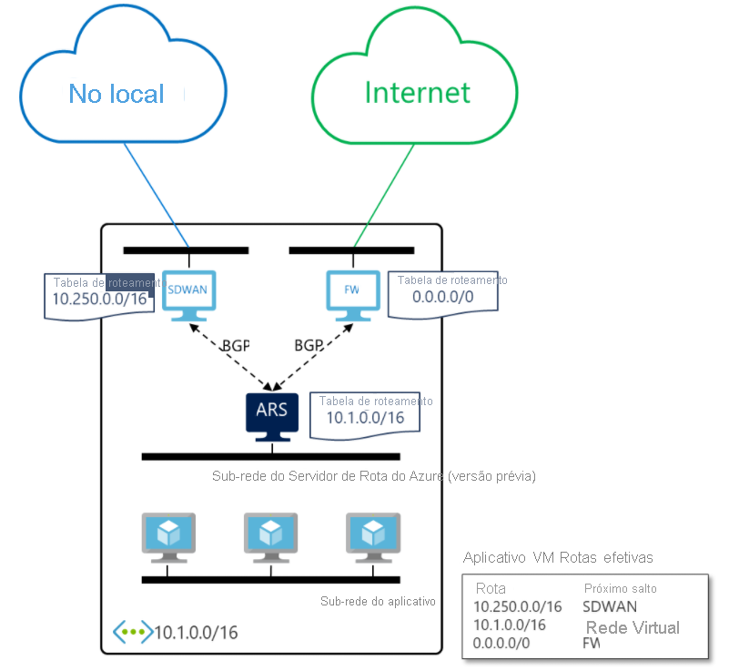

# O que é o Servidor de Rota do Azure (versão prévia)? 

O Servidor de Rota do Azure simplifica o roteamento dinâmico entre a NVA (solução de virtualização de rede) e a rede virtual. Permite trocar informações de roteamento diretamente por meio do protocolo de roteamento BGP (Border Gateway Protocol) entre qualquer NVA que dê suporte ao protocolo de roteamento BGP e a SDN (rede definida pelo software) do Azure na rede virtual do Azure (VNET), sem a necessidade de configurar ou manter manualmente as tabelas de rotas. O Servidor de Rota do Azure é um serviço totalmente gerenciado, além de ser configurado com alta disponibilidade.

> [!IMPORTANT]
> No momento, o Servidor de Rota do Azure (versão prévia) está na versão prévia pública.
> Essa versão prévia é fornecida sem um contrato de nível de serviço e não é recomendada para cargas de trabalho de produção. Alguns recursos podem não ter suporte ou podem ter restrição de recursos.
> Para obter mais informações, consulte [Termos de Uso Complementares de Versões Prévias do Microsoft Azure](https://azure.microsoft.com/support/legal/preview-supplemental-terms/).

## Como ele funciona?

O diagrama a seguir ilustra como o Servidor de Rota do Azure funciona com uma NVA de SD-WAN e uma NVA de segurança em uma rede virtual. Depois de estabelecer o emparelhamento via protocolo BGP, o Servidor de Rota do Azure receberá uma rota local (10.250.0.0/16) do dispositivo de SD-WAN e uma rota padrão (0.0.0.0/0) do firewall. Essas rotas são configuradas automaticamente nas VMs na rede virtual. Como resultado, todo o tráfego destinado à rede local será enviado para o dispositivo de SD-WAN. Enquanto todo o tráfego de entrada na Internet será enviado ao firewall. Na direção oposta, o Servidor de Rota do Azure enviará o endereço de rede virtual (10.1.0.0/16) para ambas as NVAs. O dispositivo de SD-WAN pode propagá-lo também para a rede local.

## Principais benefícios 

O Servidor de Rota do Azure simplifica a configuração, o gerenciamento e a implantação da NVA na rede virtual.  

* Você não precisa mais atualizar manualmente a tabela de roteamento na NVA sempre que os endereços de rede virtual forem atualizados. 

* Você não precisa mais atualizar as [rotas definidas pelo usuário](../virtual-network/virtual-networks-udr-overview.md) manualmente sempre que a NVA anunciar novas rotas ou retirar as antigas. 

* Você não precisa mais configurar um balanceador de carga na frente da NVA para fins de resiliência ou desempenho. Ao emparelhar várias instâncias da NVA com o Servidor de Rota do Azure, você pode configurar os atributos BGP na NVA. Esses atributos BGP informarão ao Servidor de Rota do Azure qual instância de NVA deve estar ativa ou passiva. 

* A interface entre a NVA e o Servidor de Rota do Azure é baseada em um protocolo padrão comum. Contanto que a NVA dê suporte ao BGP, pode ser emparelhada com o Servidor de Rota do Azure. Para obter mais informações, confira [Protocolos de roteamento com suporte do Servidor de Rota](route-server-faq.md#protocol).

* Você pode implantar o Servidor de Rota do Azure em qualquer uma das redes virtuais novas ou existentes. 

## Perguntas frequentes

Para perguntas frequentes sobre o Servidor de Rotas do Azure, confira [Perguntas frequentes sobre o Servidor de Rota do Azure](route-server-faq.md).

## Próximas etapas

- [Saiba como configurar o Servidor de Rota do Azure.](quickstart-configure-route-server-portal.md)
- [Saiba como o Servidor de Rota do Azure funciona com o Azure ExpressRoute e a VPN do Azure](expressroute-vpn-support.md)
