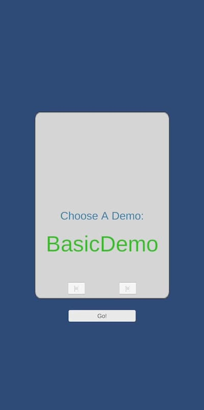

# Início Rápido: Criar um aplicativo para Unity Android com as Âncoras Espaciais do Azure

Este Início Rápido aborda como criar um aplicativo para Unity Android usando as [Âncoras Espaciais do Azure](../overview.md). As Âncoras Espaciais do Azure são um serviço de desenvolvedor multiplataforma para você criar experiências de realidade misturada usando objetos que persistem sua localização em todos os dispositivos ao longo do tempo. Quando terminar, você terá um aplicativo do ARCore Android criado com o Unity que pode salvar e fazer recall de uma âncora espacial.

Você aprenderá a:

> [!div class="checklist"]
> * Criar uma conta de Âncoras Espaciais
> * Preparar as configurações de build do Unity
> * Configurar o identificador e a chave de conta das Âncoras Espaciais
> * Exportar o projeto do Android Studio
> * Implantar e executar um dispositivo Android

[!INCLUDE [quickstarts-free-trial-note](../../../includes/quickstarts-free-trial-note.md)]

## Pré-requisitos

Para concluir este início rápido, certifique-se de que:

- Um computador Windows ou macOS com o <a href="https://unity3d.com/get-unity/download" target="_blank">Unity 2019.4 (LTS)</a>, incluindo o **Suporte de Build do Android** com os módulos do **SDK do Android e NDK Tools** e **OpenJDK**.
  - Se estiver executando no Windows, você também precisará do <a href="https://git-scm.com/download/win" target="_blank">Git para Windows</a> e do <a href="https://git-lfs.github.com/">Git LFS</a>.
  - Se estiver executando no macOS, instale o Git por meio do HomeBrew. Insira o seguinte comando em uma única linha do Terminal: `/usr/bin/ruby -e "$(curl -fsSL https://raw.githubusercontent.com/Homebrew/install/master/install)"`. Em seguida, execute `brew install git` e `brew install git-lfs`.
- Um dispositivo Android <a href="https://developer.android.com/studio/debug/dev-options" target="_blank">habilitado para desenvolvedor</a> e <a href="https://developers.google.com/ar/discover/supported-devices" target="_blank">compatível com ARCore</a>.
  - Drivers de dispositivo adicionais podem ser necessários para que seu computador se comunique com seu dispositivo Android. Para obter mais informações e instruções, acesse [aqui](https://developer.android.com/studio/run/device.html).

[!INCLUDE [Create Spatial Anchors resource](../../../includes/spatial-anchors-get-started-create-resource.md)]

## Baixe e abra o projeto de exemplo do Unity

[!INCLUDE [Clone Sample Repo](../../../includes/spatial-anchors-clone-sample-repository.md)]

[!INCLUDE [Open Unity Project](../../../includes/spatial-anchors-open-unity-project.md)]

[!INCLUDE [Android Unity Build Settings](../../../includes/spatial-anchors-unity-android-build-settings.md)]

[!INCLUDE [Configure Unity Scene](../../../includes/spatial-anchors-unity-configure-scene.md)]

## Exportar o projeto do Android Studio

[!INCLUDE [Export Unity Project](../../../includes/spatial-anchors-unity-export-project-snip.md)]

Selecione o dispositivo em **Executar Dispositivo** e escolha **Compilar e Executar**. Você precisará salvar um arquivo `.apk`, que poderá nomear como quiser.

No aplicativo, selecione **BasicDemo** usando as setas e pressione o botão **Ir!** para executar a demonstração. Siga as instruções para colocar uma âncora e fazer recall dela.

Siga as instruções no aplicativo para colocar uma âncora e fazer recall dela.

## Solução de problemas

### Problemas de renderização

Quando você executar o aplicativo, se a câmera não for exibida como a tela de fundo (por exemplo, é exibida uma tela em branco, azul ou com outras texturas), provavelmente, você precisará importar novamente os ativos no Unity. Interrompa o aplicativo. No menu superior do Unity, escolha **Ativos -> Reimportar todos**. Em seguida, execute o aplicativo novamente.

[!INCLUDE [Clean-up section](../../../includes/clean-up-section-portal.md)]

[!INCLUDE [Next steps](../../../includes/spatial-anchors-quickstarts-nextsteps.md)]

> [!div class="nextstepaction"]
> [Tutorial: Compartilhar as Âncoras Espaciais nos dispositivos](../tutorials/tutorial-share-anchors-across-devices.md)

> [!div class="nextstepaction"]
> [Como configurar as Âncoras Espaciais do Azure em um projeto do Unity](../how-tos/setup-unity-project.md)
