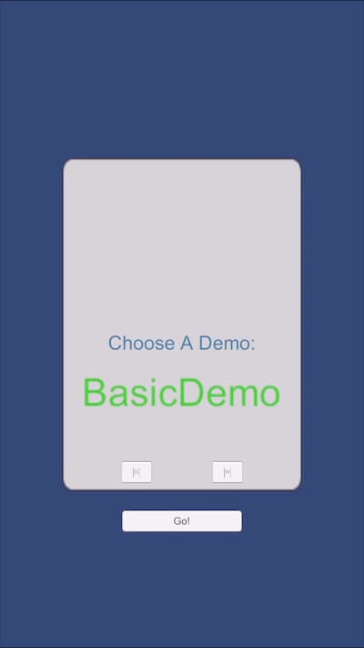

# Início Rápido: criar um aplicativo Unity para iOS com as Âncoras Espaciais do Azure

Este início rápido aborda como criar um aplicativo Unity para iOS usando as [Âncoras Espaciais do Azure](../overview.md). As Âncoras Espaciais do Azure são um serviço de desenvolvedor multiplataforma para você criar experiências de realidade misturada usando objetos que persistem sua localização em todos os dispositivos ao longo do tempo. Quando terminar, você terá um aplicativo do ARKit iOS criado com o Unity que pode salvar e fazer recall de uma âncora espacial.

Você aprenderá a:

> [!div class="checklist"]
> * Criar uma conta de Âncoras Espaciais
> * Preparar as configurações de build do Unity
> * Configurar o identificador e a chave de conta das Âncoras Espaciais
> * Exportar o projeto do Xcode
> * Implantar e executar em um dispositivo iOS

[!INCLUDE [quickstarts-free-trial-note](../../../includes/quickstarts-free-trial-note.md)]

## Pré-requisitos

Para concluir este início rápido, certifique-se de que:

- Um computador macOS com o <a href="https://unity3d.com/get-unity/download" target="_blank">Unity 2019.4 (LTS)</a> e a última versão do <a href="https://geo.itunes.apple.com/us/app/xcode/id497799835?mt=12" target="_blank">Xcode</a> instalados.
- Git instalado via Homebrew. Insira o seguinte comando em uma única linha do Terminal: `/usr/bin/ruby -e "$(curl -fsSL https://raw.githubusercontent.com/Homebrew/install/master/install)"`. Em seguida, execute `brew install git` e `brew install git-lfs`.
- Um dispositivo iOS <a href="https://developer.apple.com/documentation/arkit/verifying_device_support_and_user_permission" target="_blank">compatível com ARKit</a> habilitado para desenvolvedor.

[!INCLUDE [Create Spatial Anchors resource](../../../includes/spatial-anchors-get-started-create-resource.md)]

## Baixe e abra o projeto de exemplo do Unity

[!INCLUDE [Clone Sample Repo](../../../includes/spatial-anchors-clone-sample-repository.md)]

[!INCLUDE [Open Unity Project](../../../includes/spatial-anchors-open-unity-project.md)]

[!INCLUDE [iOS Unity Build Settings](../../../includes/spatial-anchors-unity-ios-build-settings.md)]

[!INCLUDE [Configure Unity Scene](../../../includes/spatial-anchors-unity-configure-scene.md)]

## Exportar o projeto do Xcode

[!INCLUDE [Export Unity Project](../../../includes/spatial-anchors-unity-export-project-snip.md)]

[!INCLUDE [Configure Xcode](../../../includes/spatial-anchors-unity-ios-xcode.md)]

No aplicativo, selecione **BasicDemo** usando as setas e pressione o botão **Ir!** para executar a demonstração. Siga as instruções para colocar uma âncora e fazer recall dela.

Ao concluir, interrompa o aplicativo pressionando **Parar** no Xcode.

## Solução de problemas

### Problemas de renderização

Ao executar o aplicativo, se a câmera não for exibida como a tela de fundo (por exemplo, é exibida uma tela em branco, azul ou outras texturas), você provavelmente precisará reimportar os ativos no Unity. Interrompa o aplicativo. No menu superior do Unity, escolha **Ativos -> Reimportar todos**. Em seguida, execute o aplicativo novamente.

[!INCLUDE [Clean-up section](../../../includes/clean-up-section-portal.md)]

[!INCLUDE [Next steps](../../../includes/spatial-anchors-quickstarts-nextsteps.md)]

> [!div class="nextstepaction"]
> [Tutorial: Compartilhar as Âncoras Espaciais nos dispositivos](../tutorials/tutorial-share-anchors-across-devices.md)

> [!div class="nextstepaction"]
> [Como configurar as Âncoras Espaciais do Azure em um projeto do Unity](../how-tos/setup-unity-project.md)
