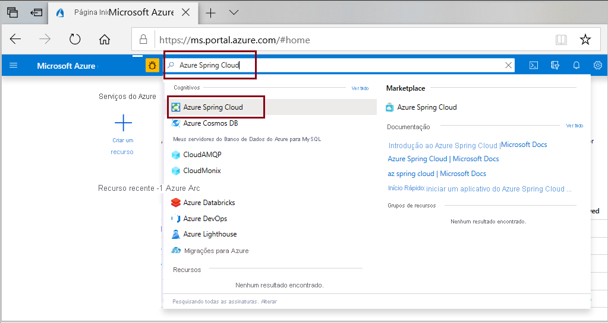

# <a name="quickstart-provision-azure-spring-cloud-service"></a>Início Rápido: Provisionar o serviço Azure Spring Cloud

::: zone pivot="programming-language-csharp"
Neste guia de início rápido, você usa a CLI do Azure para provisionar uma instância do serviço Azure Spring Cloud.

## <a name="prerequisites"></a>Pré-requisitos

* Uma conta do Azure com uma assinatura ativa. [Crie uma conta gratuitamente](https://azure.microsoft.com/free/?WT.mc_id=A261C142F).
* [SDK do .NET Core 3.1](https://dotnet.microsoft.com/download/dotnet-core/3.1). O serviço Azure Spring Cloud dá suporte ao .NET Core 3.1 e versões posteriores.
* [A CLI do Azure versão 2.0.67 ou superior](/cli/azure/install-azure-cli).
* [Git](https://git-scm.com/).

## <a name="install-azure-cli-extension"></a>Instalar a extensão de CLI do Azure

Verifique se a sua versão da CLI do Azure é 2.0.67 ou posterior:

```azurecli
az --version
```

Instalar a extensão do Azure Spring Cloud para a CLI do Azure usando o seguinte comando:

```azurecli
az extension add --name spring-cloud
```

## <a name="log-in-to-azure"></a>Fazer logon no Azure

1. Faça logon na CLI do Azure.

    ```azurecli
    az login
    ```

1. Se você tiver mais de uma assinatura, escolha a que deseja usar para este guia de início rápido.

   ```azurecli
   az account list -o table
   ```

   ```azurecli
   az account set --subscription <Name or ID of a subscription from the last step>
   ```

## <a name="provision-an-instance-of-azure-spring-cloud"></a>Provisionar uma instância do Azure Spring Cloud

1. Crie um [grupo de recursos](../azure-resource-manager/management/overview.md) para conter o serviço Azure Spring Cloud. O nome do grupo de recursos pode incluir caracteres alfanuméricos, sublinhados, parênteses, hifens, pontos (exceto no final) e Unicode.

   ```azurecli
   az group create --location eastus --name <resource group name>
   ```

1. Provisione uma instância do serviço Azure Spring Cloud. O nome da instância de serviço deve ser único, ter entre 4 e 32 caracteres e pode conter apenas letras minúsculas, números e hifens. O primeiro caractere do nome do serviço deve ser uma letra e o último caractere deve ser uma letra ou um número.

    ```azurecli
    az spring-cloud create -n <service instance name> -g <resource group name>
    ```

    Esse comando pode levar vários minutos para ser concluído.

1. Defina o nome do grupo de recursos padrão e o nome da instância de serviço para que você não precise especificar repetidamente esses valores em comandos subsequentes.

   ```azurecli
   az configure --defaults group=<resource group name>
   ```

   ```azurecli
   az configure --defaults spring-cloud=<service instance name>
   ```
::: zone-end

::: zone pivot="programming-language-java"
Você pode criar uma instância do Azure Spring Cloud usando o portal do Azure ou a CLI do Azure.  Ambos os métodos são explicados nos procedimentos a seguir.
## <a name="prerequisites"></a>Pré-requisitos

* [Instalar o JDK 8](/java/azure/jdk/)
* [Inscrever-se em uma assinatura do Azure](https://azure.microsoft.com/free/)
* (Opcional) [Instale a CLI do Azure versão 2.0.67 ou superior](/cli/azure/install-azure-cli) e instale a extensão do Azure Spring Cloud com o comando: `az extension add --name spring-cloud`
* (Opcional) [Instale o Azure Toolkit for IntelliJ](https://plugins.jetbrains.com/plugin/8053-azure-toolkit-for-intellij/) e [conecte-se](/azure/developer/java/toolkit-for-intellij/create-hello-world-web-app#installation-and-sign-in)

## <a name="provision-an-instance-of-azure-spring-cloud"></a>Provisionar uma instância do Azure Spring Cloud

#### <a name="portal"></a>[Portal](#tab/Azure-portal)

O procedimento a seguir cria uma instância do Azure Spring Cloud usando o portal do Azure.

1. Em uma nova guia, abra o [portal do Azure](https://ms.portal.azure.com/). 

2. Na caixa de pesquisa superior, pesquise **Azure Spring Cloud**.

3. Selecione **Azure Spring Cloud** nos resultados.

    

4. Na página do Azure Spring Cloud, clique em **+ Adicionar**.

    

5. Preencha o formulário na página **Criar** do Azure Spring Cloud.  Considere as seguintes diretrizes:
    - **Assinatura**: selecione a assinatura da qual você deseja que este recurso seja cobrado.
    - **Grupo de recursos**: a criação de grupos de recursos para novos recursos é uma melhor prática. Observe que isso será usado em etapas posteriores como **\<resource group name\>** .
    - **Nome/Detalhes do Serviço**: Especifique o **\<service instance name\>** .  O nome deve ter entre 4 e 32 caracteres e pode conter apenas letras minúsculas, números e hifens.  O primeiro caractere do nome do serviço deve ser uma letra e o último caractere deve ser uma letra ou um número.
    - **Localização**: selecione a localização de sua instância de serviço.

    

6. Clique em **Examinar e criar**.

> [!div class="nextstepaction"]
> [Encontrei um problema](https://www.research.net/r/javae2e?tutorial=asc-cli-quickstart&step=public-endpoint)

#### <a name="cli"></a>[CLI](#tab/Azure-CLI)

O procedimento a seguir usa a extensão da CLI do Azure para provisionar uma instância do Azure Spring Cloud.

1. Faça logon na CLI do Azure e escolha sua assinatura ativa.

    ```azurecli
    az login
    az account list -o table
    az account set --subscription <Name or ID of subscription, skip if you only have 1 subscription>
    ```

1. Prepare um nome para seu serviço do Azure Spring Cloud.  O nome deve ter entre 4 e 32 caracteres e pode conter apenas letras minúsculas, números e hifens.  O primeiro caractere do nome do serviço deve ser uma letra e o último caractere deve ser uma letra ou um número.

1. Crie um grupo de recursos para conter seu serviço do Azure Spring Cloud.

    ```azurecli
    az group create --location eastus --name <resource group name>
    ```

    Saiba mais sobre [grupos de recursos do Azure](../azure-resource-manager/management/overview.md).

1. Abra uma janela da CLI do Azure e execute os seguintes comandos para provisionar uma instância do Azure Spring Cloud.

    ```azurecli
    az spring-cloud create -n <service instance name> -g <resource group name>
    ```

    A instância de serviço levará cerca de cinco minutos para ser implantada.
---
::: zone-end

## <a name="next-steps"></a>Próximas etapas

Neste guia de início rápido, você criou recursos do Azure que continuarão acumulando encargos se permanecerem em sua assinatura. Se você não pretende prosseguir para o próximo início rápido, confira [Limpar recursos](spring-cloud-quickstart-logs-metrics-tracing.md#clean-up-resources). Caso contrário, avance para o próximo início rápido:

> [!div class="nextstepaction"]
> [Configurar o servidor de configuração](spring-cloud-quickstart-setup-config-server.md)
