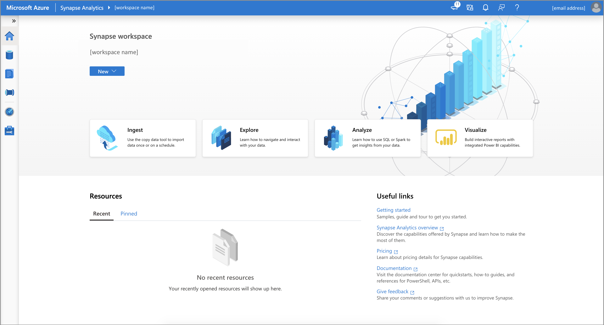

# <a name="quickstart-create-an-azure-synapse-workspace-with-azure-powershell"></a>Início Rápido: Criar um workspace do Azure Synapse com o Azure PowerShell

O Azure PowerShell é um conjunto de cmdlets para gerenciar recursos do Azure diretamente do PowerShell. Você pode usá-la em seu navegador com o Azure Cloud Shell. Você também pode instalá-lo no macOS, Linux ou Windows.

Neste guia de início rápido, você aprenderá a criar um workspace do Azure Synapse usando o Azure PowerShell.

Se você não tiver uma assinatura do Azure, crie uma conta [gratuita](https://azure.microsoft.com/free/) antes de começar.

## <a name="prerequisites"></a>Pré-requisitos

- [Conta de armazenamento do Azure Data Lake Storage Gen2](../storage/common/storage-account-create.md)

    > [!IMPORTANT]
    > O workspace do Azure Synapse precisa conseguir fazer leituras e gravações na conta do ADLS Gen2 selecionada. Para qualquer conta de armazenamento vinculada como a conta de armazenamento primária, você precisa habilitar o **namespace hierárquico** na criação da conta de armazenamento, conforme descrito em [Criar uma Conta de Armazenamento](../storage/common/storage-account-create.md?tabs=azure-powershell#create-a-storage-account).

Se você optar por usar o Cloud Shell, confira [Visão geral do Azure Cloud Shell](../cloud-shell/overview.md) para obter mais informações.

### <a name="install-the-azure-powershell-module-locally"></a>Instalar o módulo do Azure PowerShell localmente

Se você optar por usar o PowerShell localmente, este artigo exigirá que você instale o módulo Az PowerShell e conecte-se à sua conta do Azure usando o cmdlet [Connect-AzAccount](/powershell/module/az.accounts/connect-azaccount). Para obter mais informações sobre como instalar o módulo Az PowerShell, confira [Instalar o Azure PowerShell](/powershell/azure/install-az-ps).

Para obter mais informações sobre a autenticação com o Azure PowerShell, confira [Entrar com o Azure PowerShell](/powershell/azure/authenticate-azureps).

### <a name="install-the-azure-synapse-powershell-module"></a>Instalar o módulo do PowerShell do Azure Synapse

> [!IMPORTANT]
> Enquanto o módulo **Az.Synapse** do PowerShell está em versão prévia, você precisa instalá-lo separadamente usando o cmdlet `Install-Module`. Depois que esse módulo do PowerShell estiver em disponibilidade geral, ele fará parte das versões futuras do módulo Az PowerShell e estará disponível por padrão no Azure Cloud Shell.

```azurepowershell-interactive
Install-Module -Name Az.Synapse
```

## <a name="create-an-azure-synapse-workspace-using-azure-powershell"></a>Criar um workspace do Azure Synapse usando o Azure PowerShell

1. Defina as variáveis de ambiente necessárias para criar recursos para o workspace do Azure Synapse.

   |        Nome da variável        |                                                 Descrição                                                 |
   | --------------------------- | ----------------------------------------------------------------------------------------------------------- |
   | StorageAccountName          | Nome de sua conta de armazenamento existente do ADLS Gen2.                                                           |
   | StorageAccountResourceGroup | Nome do seu grupo de recursos da conta de armazenamento do ADLS Gen2.                                             |
   | FileShareName               | Nome do sistema de arquivos de armazenamento existente.                                                                  |
   | SynapseResourceGroup        | Escolha um novo nome para o grupo de recursos do Azure Synapse.                                                    |
   | Região                      | Escolha uma das [regiões do Azure](https://azure.microsoft.com/global-infrastructure/geographies/#overview). |
   | SynapseWorkspaceName        | Escolha um nome exclusivo para seu novo workspace do Azure Synapse.                                                  |
   | SqlUser                     | Escolha um valor para um novo nome de usuário.                                                                          |
   | SqlPassword                 | Escolha uma senha segura.                                                                                   |
   | ClientIP                    | Endereço IP público do sistema do qual você está executando o PowerShell.                                             |
   |                             |                                                                                                             |

1. Crie um grupo de recursos como um contêiner para seu workspace do Azure Synapse:

   ```azurepowershell-interactive
   New-AzResourceGroup -Name $SynapseResourceGroup -Location $Region
   ```

1. Crie um workspace do Azure Synapse:

   ```azurepowershell-interactive
   $Cred = New-Object -TypeName System.Management.Automation.PSCredential ($SqlUser, (ConvertTo-SecureString $SqlPassword -AsPlainText -Force))

   $WorkspaceParams = @{
     Name = $SynapseWorkspaceName
     ResourceGroupName = $SynapseResourceGroup
     DefaultDataLakeStorageAccountName = $StorageAccountName
     DefaultDataLakeStorageFilesystem = $FileShareName
     SqlAdministratorLoginCredential = $Cred
     Location = $Region
   }
   New-AzSynapseWorkspace @WorkspaceParams
   ```

1. Obtenha a URL da Web e de desenvolvimento para o workspace do Azure Synapse:

   ```azurepowershell-interactive
   $WorkspaceWeb = (Get-AzSynapseWorkspace -Name $SynapseWorkspaceName -ResourceGroupName $StorageAccountResourceGroup).ConnectivityEndpoints.Web
   $WorkspaceDev = (Get-AzSynapseWorkspace -Name $SynapseWorkspaceName -ResourceGroupName $StorageAccountResourceGroup).ConnectivityEndpoints.Dev
   ```

1. Crie uma regra de firewall para permitir o acesso ao workspace do Azure Synapse em seu computador:

   ```azurepowershell-interactive
   $FirewallParams = @{
     WorkspaceName = $SynapseWorkspaceName
     Name = 'Allow Client IP'
     ResourceGroupName = $StorageAccountResourceGroup
     StartIpAddress = $ClientIP
     EndIpAddress = $ClientIP
   }
   New-AzSynapseFirewallRule @FirewallParams
   ```

1. Abra o endereço URL da Web do workspace do Azure Synapse armazenado na variável de ambiente `WorkspaceWeb` para acessar seu workspace:

   ```azurepowershell-interactive
   Start-Process $WorkspaceWeb
   ```

   

## <a name="clean-up-resources"></a>Limpar os recursos

Siga as etapas abaixo para excluir o workspace do Azure Synapse.

> [!WARNING]
> A exclusão de um workspace do Azure Synapse removerá os mecanismos de análise e os dados armazenados no banco de dados dos metadados do workspace e dos pools de SQL independentes. Não será mais possível se conectar aos pontos de extremidade do SQL ou do Apache Spark. Todos os artefatos de código serão excluídos (consultas, notebooks, definições de trabalho e pipelines). A exclusão do workspace **não** afetará os dados do Data Lake Storage Gen2 vinculados ao workspace.

Se o workspace do Azure Synapse criado neste artigo não for necessário, você poderá excluí-lo executando o exemplo a seguir.

```azurepowershell-interactive
Remove-AzSynapseWorkspace -Name $SynapseWorkspaceNam -ResourceGroupName $SynapseResourceGroup
```

## <a name="next-steps"></a>Próximas etapas

Em seguida, você poderá [criar pools de SQL](quickstart-create-sql-pool-studio.md) ou [criar pools do Apache Spark](quickstart-create-apache-spark-pool-studio.md) para começar a analisar e explorar seus dados.