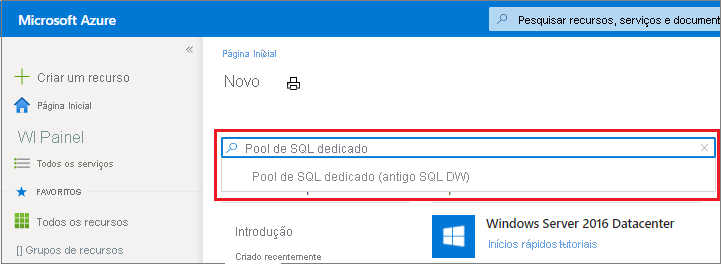
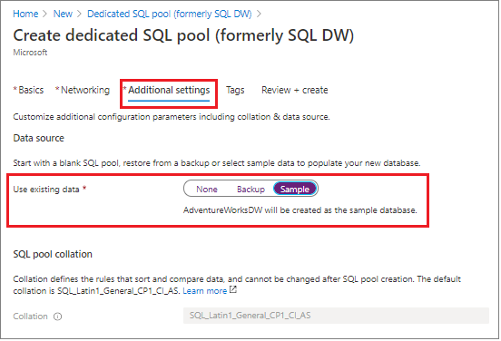

# <a name="quickstart-create-and-query-a-dedicated-sql-pool-formerly-sql-dw-in-azure-synapse-analytics-using-the-azure-portal"></a>Início rápido: Criar e consultar um pool de SQL dedicado (antigo SQL DW) no Azure Synapse Analytics usando o portal do Azure

Crie e consulte rapidamente um pool de SQL dedicado (antigo SQL DW) no Azure Synapse Analytics usando o portal do Azure.

## <a name="prerequisites"></a>Pré-requisitos

1. Se você não tiver uma assinatura do Azure, crie uma conta [gratuita](https://azure.microsoft.com/free/) antes de começar.

   > [!NOTE]
   > A criação de um pool de SQL dedicado (antigo SQL DW) no Azure Synapse pode resultar em um novo serviço faturável. Para obter mais informações, confira [Preços do Azure Synapse Analytics](https://azure.microsoft.com/pricing/details/synapse-analytics/).

2. Baixe e instale a versão mais recente do [SQL Server Management Studio](/sql/ssms/download-sql-server-management-studio-ssms?toc=/azure/synapse-analytics/sql-data-warehouse/toc.json&bc=/azure/synapse-analytics/sql-data-warehouse/breadcrumb/toc.json&view=azure-sqldw-latest&preserve-view=true) (SSMS).

## <a name="sign-in-to-the-azure-portal"></a>Entre no Portal do Azure

Entre no [portal do Azure](https://portal.azure.com/).

## <a name="create-a-sql-pool"></a>Criar um pool de SQL

Os data warehouses são criados por meio do pool de SQL dedicado (antigo SQL DW) no Azure Synapse Analytics. Um pool de SQL dedicado (antigo SQL DW) é criado com um conjunto definido de [recursos de computação](memory-concurrency-limits.md). O banco de dados é criado dentro de um [grupo de recursos do Azure](../../azure-resource-manager/management/overview.md?toc=/azure/synapse-analytics/sql-data-warehouse/toc.json&bc=/azure/synapse-analytics/sql-data-warehouse/breadcrumb/toc.json) e em um [servidor SQL lógico](../../azure-sql/database/logical-servers.md?toc=/azure/synapse-analytics/sql-data-warehouse/toc.json&bc=/azure/synapse-analytics/sql-data-warehouse/breadcrumb/toc.json).

Siga estas etapas para criar um pool de SQL dedicado (antigo SQL DW) que contém os dados de exemplo de **AdventureWorksDW**.

1. Selecione **Criar um recurso** no canto superior esquerdo do portal do Azure.

   

2. Na barra de pesquisa, digite "pool de SQL dedicado" e selecione o pool de SQL dedicado (antigo SQL DW). Selecione **Criar** na página que será aberta.

   

3. Em **Informações Básicas**, forneça a assinatura, o grupo de recursos, o nome do pool de SQL dedicado (antigo SQL DW) e o nome do servidor:

   | Configuração | Valor sugerido | Descrição |
   | :------ | :-------------- | :---------- |
   | **Assinatura** | Sua assinatura | Para obter detalhes sobre suas assinaturas, consulte [Assinaturas](https://account.windowsazure.com/Subscriptions). |
   | **Grupo de recursos** | myResourceGroup | Para ver os nomes do grupo de recursos válidos, consulte [Regras e restrições de nomenclatura](/azure/architecture/best-practices/resource-naming?toc=/azure/synapse-analytics/sql-data-warehouse/toc.json&bc=/azure/synapse-analytics/sql-data-warehouse/breadcrumb/toc.json). |
   | **Nome do pool de SQL** | Qualquer nome globalmente exclusivo (um exemplo é *mySampleDataWarehouse*) | Para ver os nomes do banco de dados válidos, consulte [Identificadores do Banco de Dados](/sql/relational-databases/databases/database-identifiers?toc=/azure/synapse-analytics/sql-data-warehouse/toc.json&bc=/azure/synapse-analytics/sql-data-warehouse/breadcrumb/toc.json&view=azure-sqldw-latest&preserve-view=true).  |
   | **Servidor** | Qualquer nome exclusivo globalmente | Selecione um servidor ou crie um nome do servidor selecionando **Criar**. Para ver os nomes do servidor válidos, consulte [Regras e restrições de nomenclatura](/azure/architecture/best-practices/resource-naming?toc=/azure/synapse-analytics/sql-data-warehouse/toc.json&bc=/azure/synapse-analytics/sql-data-warehouse/breadcrumb/toc.json). |

   

4. Em **Nível de desempenho**, escolha **Selecionar nível de desempenho** para alterar opcionalmente sua configuração com um controle deslizante.

     

   Para obter mais informações sobre os níveis de desempenho, confira [Gerenciar a computação no Azure Synapse Analytics](sql-data-warehouse-manage-compute-overview.md).

5. Selecione **Configurações Adicionais** e, em **Usar dados existentes**, escolha **Amostra** para que o AdventureWorksDW seja criado como o banco de dados de exemplo.

    

6. Agora que você concluiu a guia Básico do formulário do Azure Synapse Analytics, selecione **Examinar + Criar** e, em seguida, **Criar** para criar o pool de SQL. O provisionamento demora alguns minutos.

   

   

7. Na barra de ferramentas, selecione **Notificações** para monitorar o processo de implantação.

   

## <a name="create-a-server-level-firewall-rule"></a>Criar uma regra de firewall no nível de servidor

O serviço do Azure Synapse cria um firewall no nível do servidor. Esse firewall impede que aplicativos e ferramentas externas se conectem ao servidor ou a quaisquer bancos de dados no servidor. Para habilitar a conectividade, é possível adicionar regras de firewall que habilitem a conectividade para endereços IP específicos. Siga estas etapas para criar uma [regra de firewall de nível de servidor](../../azure-sql/database/firewall-configure.md?toc=/azure/synapse-analytics/sql-data-warehouse/toc.json&bc=/azure/synapse-analytics/sql-data-warehouse/breadcrumb/toc.json) para o endereço IP do seu cliente.

> [!NOTE]
> O Azure Synapse comunica-se pela porta 1433. Se você estiver tentando conectar-se de dentro de uma rede corporativa, o tráfego de saída pela porta 1433 talvez não seja permitido pelo firewall de sua rede. Se isso acontecer, você não conseguirá se conectar ao servidor, a menos que o departamento de TI abra a porta 1433.

1. Após a conclusão da implantação, selecione **Todos os serviços** no menu à esquerda. Selecione **Bancos de dados** e selecione a estrela ao lado de **Azure Synapse Analytics** para adicionar o Azure Synapse Analytics aos seus favoritos.

2. Selecione **Azure Synapse Analytics** no menu à esquerda e, em seguida, selecione **mySampleDataWarehouse** na página **Azure Synapse Analytics**. A página de visão geral de seu banco de dados é aberta, mostrando o nome do servidor totalmente qualificado (como **sqlpoolservername.database.windows.net**) e fornece opções para configurações adicionais.

3. Copie esse nome do servidor totalmente qualificado para se conectar ao servidor e a seus bancos de dados neste e nos próximos inícios rápidos. Para abrir as configurações do servidor, selecione o nome do servidor.

   

4. Selecione **Mostrar configurações de firewall**.

   

5. A página **Configurações do firewall** do servidor será aberta.

   

6. Para adicionar IP do cliente ao endereço IP atual a uma nova regra de firewall, selecione **Adicionar IP do cliente** na barra de ferramentas. Uma regra de firewall pode abrir a porta 1433 para um único endereço IP ou um intervalo de endereços IP.

7. Selecione **Salvar**. Uma regra de firewall no nível do servidor é criada para o endereço IP atual que abre a porta 1433 no servidor lógico.

8. Selecione **OK** e, em seguida, feche a página **Configurações do Firewall**.

Agora você pode se conectar ao servidor e aos respectivos pools de SQL usando esse endereço IP. A conexão funciona no SQL Server Management Studio ou em outra ferramenta de sua escolha. Quando você se conectar, use a conta ServerAdmin criada anteriormente.

> [!IMPORTANT]
> Por padrão, o acesso através do firewall do Banco de Dados SQL está habilitado para todos os serviços do Azure. Selecione **DESLIGAR** nesta página e, em seguida, selecione **Salvar** para desabilitar o firewall para todos os serviços do Azure.

## <a name="get-the-fully-qualified-server-name"></a>Obter o nome do servidor totalmente qualificado

Obtenha o nome do servidor totalmente qualificado para o seu servidor no portal do Azure. Posteriormente, você usará o nome totalmente qualificado ao se conectar ao servidor.

1. Entre no [portal do Azure](https://portal.azure.com/).

2. Selecione **Azure Synapse Analytics** no menu à esquerda e, em seguida, a página **Azure Synapse Analytics**.

3. No painel **Essentials**, na página do Portal do Azure de seu banco de dados, localize e copie o **Nome do servidor**. Neste exemplo, o nome totalmente qualificado é sqlpoolservername.database.windows.net.

    

## <a name="connect-to-the-server-as-server-admin"></a>Conectar-se ao servidor como administrador do servidor

Esta seção usa o [SSMS](/sql/ssms/download-sql-server-management-studio-ssms?toc=/azure/synapse-analytics/sql-data-warehouse/toc.json&bc=/azure/synapse-analytics/sql-data-warehouse/breadcrumb/toc.json&view=azure-sqldw-latest&preserve-view=true) (SQL Server Management Studio) para estabelecer uma conexão com o servidor.

1. Abra o SQL Server Management Studio.

2. Na caixa de diálogo **Conectar ao Servidor**, insira as informações a seguir:

   | Configuração | Valor sugerido | Descrição |
   | :------ | :-------------- | :---------- |
   | Tipo de servidor | Mecanismo de banco de dados | Esse valor é obrigatório |
   | Nome do servidor | O nome do servidor totalmente qualificado | Aqui está um exemplo: **sqlpoolservername.database.windows.net**. |
   | Autenticação | Autenticação do SQL Server | A Autenticação do SQL é o único tipo de autenticação configurado neste tutorial. |
   | Logon | A conta do administrador do servidor | A conta que você especificou quando criou o servidor. |
   | Senha | A senha para sua conta do administrador do servidor | A senha que você especificou quando criou o servidor. |
   ||||

   

3. Selecione **Conectar**. A janela Pesquisador de Objetos será aberta no SSMS.

4. No Pesquisador de Objetos, expanda **Bancos de Dados**. Em seguida, expanda **meuBancoDeDadosDeExemplo** para exibir os objetos no novo banco de dados.

   

## <a name="run-some-queries"></a>Executar algumas consultas

Não é recomendável executar consultas grandes conectado como o administrador do servidor, pois ele usa uma [classe de recurso limitado](resource-classes-for-workload-management.md). Em vez disso, configure o [Isolamento de carga de trabalho](./quickstart-configure-workload-isolation-tsql.md) conforme [ilustrado nos tutoriais](./load-data-wideworldimportersdw.md#create-a-user-for-loading-data).

O Azure Synapse Analytics usa o T-SQL como linguagem de consulta. Para abrir uma janela de consulta e executar algumas consultas T-SQL, use as seguintes etapas:

1. Selecione com o botão direito do mouse em **mySampleDataWarehouse** e selecione **Nova Consulta**. Uma janela de nova consulta é aberta.

2. Na janela de consulta, digite o seguinte comando para ver uma lista de bancos de dados.

    ```sql
    SELECT * FROM sys.databases
    ```

3. Selecione **Executar**. Os resultados da consulta mostram dois bancos de dados: **mestre** e **meuDataWarehouseDeExemplo**.

   

4. Para examinar alguns dados, use o comando a seguir para ver o número de clientes com o sobrenome Alves com três filhos em casa. Os resultados listam seis clientes.

    ```sql
    SELECT LastName, FirstName FROM dbo.dimCustomer
    WHERE LastName = 'Adams' AND NumberChildrenAtHome = 3;
    ```

   

## <a name="clean-up-resources"></a>Limpar os recursos

Você está sendo cobrado por unidades de data warehouse e pelos dados armazenados no seu pool de SQL dedicado (antigo SQL DW). Esses recursos de computação e armazenamento são cobrados separadamente.

- Caso deseje manter os dados no armazenamento, pause a computação quando não estiver usando o pool de SQL dedicado (antigo SQL DW). Ao pausar a computação, você será cobrado apenas pelo armazenamento de dados. Você poderá retomar a computação sempre que estiver pronto para trabalhar com os dados.

- Se quiser remover custos futuros, exclua o pool de SQL dedicado (antigo SQL DW).

Execute estas etapas para limpar os recursos desnecessários.

1. Entre no [portal do Azure](https://portal.azure.com) e selecione seu pool de SQL dedicado (antigo SQL DW).

   

2. Para pausar a computação, selecione o botão **Pausar**. Quando o pool de SQL dedicado (antigo SQL DW) estiver em pausa, você verá um botão **Retomar**. Para retomar a computação, selecione **Retomar**.

3. Para remover o pool de SQL dedicado (antigo SQL DW) e não ser cobrado pela computação nem pelo armazenamento, selecione **Excluir**.

4. Para remover o servidor criado, selecione **sqlpoolservername.database.windows.net** na imagem anterior e escolha **Excluir**. Tenha cuidado com essa exclusão, uma vez que a exclusão do servidor também exclui todos os bancos de dados atribuídos ao servidor.

5. Para remover o grupo de recursos, selecione **myResourceGroup** e, em seguida, **Excluir grupo de recursos**.

Deseja otimizar e reduzir seus gastos com a nuvem?

[!INCLUDE [cost-management-horizontal](../../../includes/cost-management-horizontal.md)]

## <a name="next-steps"></a>Próximas etapas

Para saber mais sobre como carregar dados no seu pool de SQL dedicado (antigo SQL DW), prossiga para o artigo [Carregar dados em um pool de SQL dedicado](load-data-from-azure-blob-storage-using-copy.md).