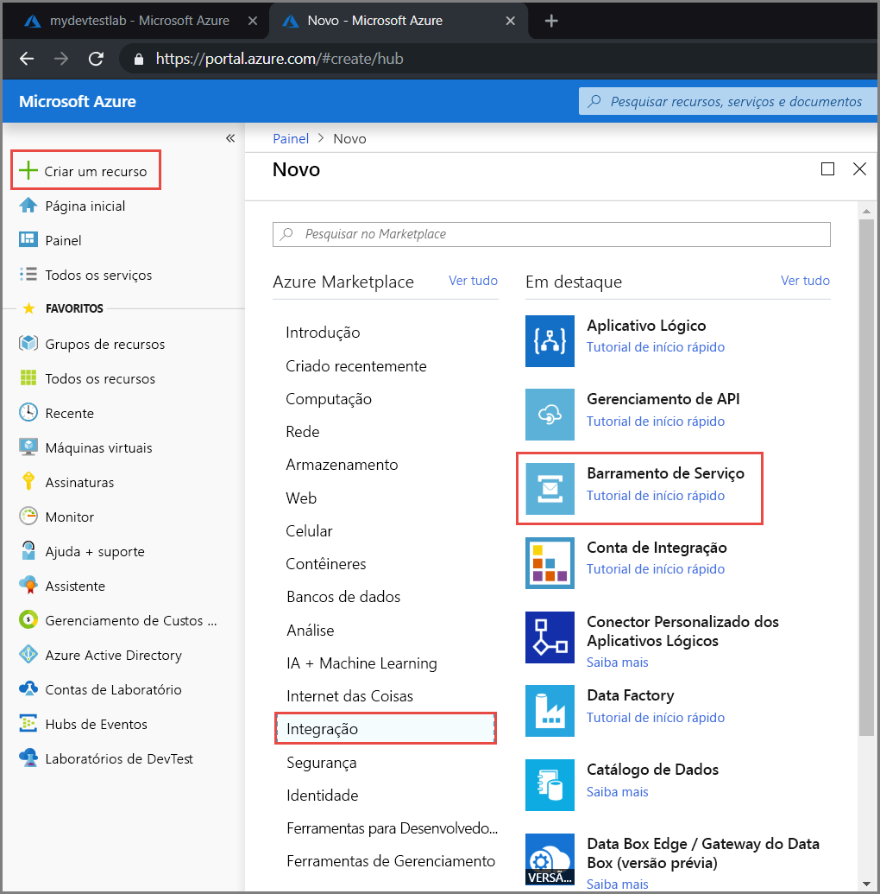
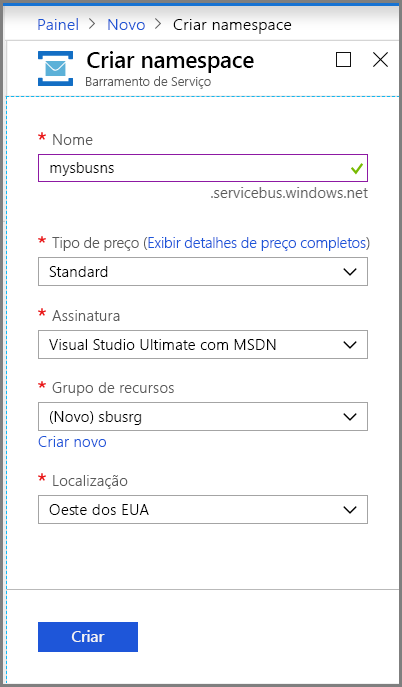
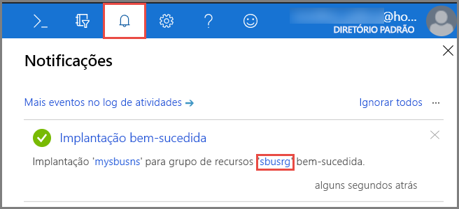
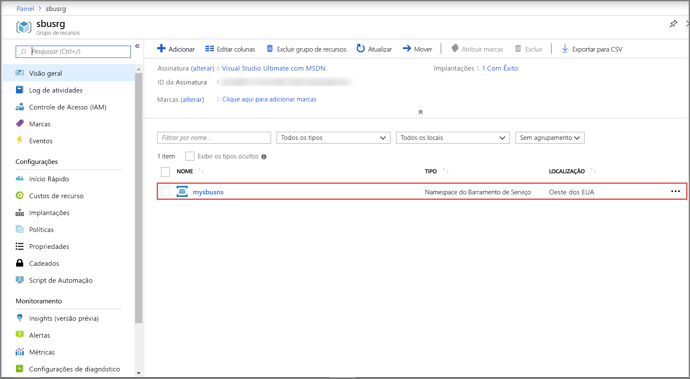
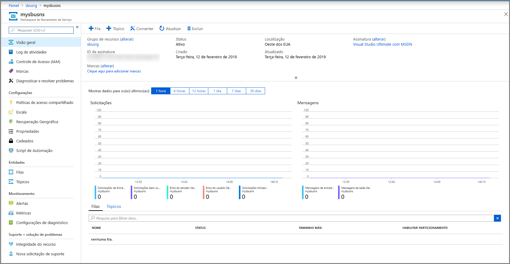
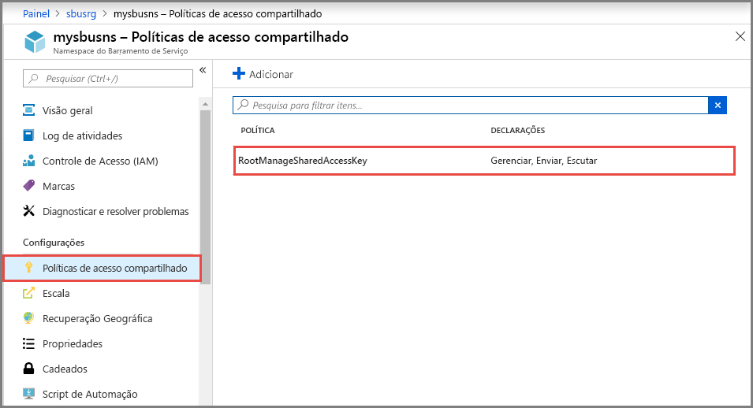
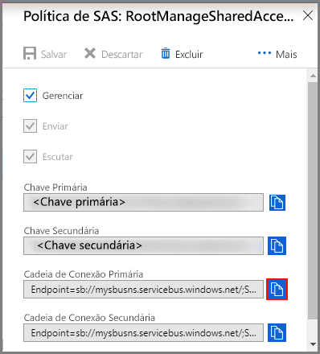

## Criar um namespace no Portal do Azure
Para começar a usar as entidades de mensagens do Barramento de Serviço no Azure, primeiro é necessário criar um namespace com um nome exclusivo no Azure. Um namespace fornece um contêiner de escopo para endereçar recursos do barramento de serviço dentro de seu aplicativo.

Para criar um namespace:

1. Entre no [Portal do Azure](https://portal.azure.com)
2. No painel de navegação esquerdo do portal, selecione **+ Criar um recurso**, depois em **Integração** e em **Barramento de Serviço**.

    
3. Na caixa de diálogo **Criar namespace**, execute as seguintes etapas: 
    1. Insira um **nome para o namespace**. O sistema imediatamente verifica para ver se o nome está disponível. Para obter uma lista de regras para nomear namespaces, consulte [Criar a API REST do Namespace](/rest/api/servicebus/create-namespace).
    2. Selecione o tipo de preço (Básico, Standard ou Premium) do namespace. Se você quiser usar [tópicos e assinaturas](../articles/service-bus-messaging/service-bus-queues-topics-subscriptions.md#topics-and-subscriptions), escolha Standard ou Premium. Não há suporte para os tópicos/assinaturas no tipo de preço básico.
    3. Se você tiver selecionado o tipo de preço **Premium**, siga estas etapas: 
        1. Especifique o número de **unidades do sistema de mensagens**. A camada Premium fornece isolamento de recursos no nível de CPU e memória, de modo que cada carga de trabalho seja executada isoladamente. Esse contêiner de recursos é chamado de unidade do sistema de mensagens. Um namespace premium tem pelo menos uma unidade do sistema de mensagens. Você pode selecionar 1, 2 ou 4 unidades do sistema de mensagens para cada namespace Premium do Barramento de Serviço. Para saber mais, confira [Sistema de Mensagens Premium do Barramento de Serviço](../articles/service-bus-messaging/service-bus-premium-messaging.md).
        2. Especifique se você deseja que o namespace tenha **redundância de zona**. A redundância de zona fornece disponibilidade avançada ao espalhar réplicas em zonas de disponibilidade de uma região sem nenhum custo adicional. Para obter mais informações, confira [Zonas de disponibilidade no Azure](../articles/availability-zones/az-overview.md).
    4. Em **Assinatura**, escolha uma assinatura do Azure na qual criar o namespace.
    5. Em **Grupo de recursos**, escolha um grupo de recursos existente no qual o namespace residirá ou então crie um novo.      
    6. Em **Localização**, escolha a região na qual o namespace deve ser hospedado.
    7. Selecione **Criar**. Agora, o sistema cria o seu namespace e o habilita. Talvez você precise aguardar vários minutos, conforme o sistema fornece recursos para sua conta.
   
        
4. Confirme se o namespace do barramento de serviço foi implantado com êxito. Para ver as notificações, selecione o **ícone de sino (Alertas)** na barra de ferramentas. Selecione o **nome do grupo de recursos** na notificação, conforme mostrado na imagem. Você vê o grupo de recursos que contém o namespace do barramento de serviço.

    
5. Na página **Grupo de recursos** do seu grupo de recursos, selecione o **namespace do barramento de serviço**. 

    
6. Você verá a home page do namespace do barramento de serviço. 

    

## Obtenha a cadeia de conexão 
A criação de um novo namespace gera automaticamente uma regra de SAS (assinatura de acesso compartilhado) inicial com um par de chaves primárias e secundárias associado que concede, cada um, controle total sobre todos os aspectos do namespace. Consulte [Autenticação e autorização do Barramento de Serviço](../articles/service-bus-messaging/service-bus-authentication-and-authorization.md) para obter informações sobre como criar regras com direitos mais restritos para remetentes e destinatários regulares. Para copiar as chaves primária e secundária para seu namespace, siga estas etapas: 

1. Clique em **Todos os recursos** e depois clique no nome do namespace recém-criado.
2. Na janela namespace, clique em **Políticas de acesso compartilhado**.
3. Na tela **Políticas de acesso compartilhado**, clique em **RootManageSharedAccessKey**.
   
    
4. Na janela **Política: RootManageSharedAccessKey**, clique no botão Copiar próximo à **Cadeia de Conexão Primária**, para copiar a cadeia de conexão na área de transferência para uso posterior. Cole esse valor no Bloco de notas ou em outro local temporário.
   
    
5. Repita a etapa anterior, copiando e colando o valor de **chave primária** para um local temporário para uso posterior.

<!--Image references-->

