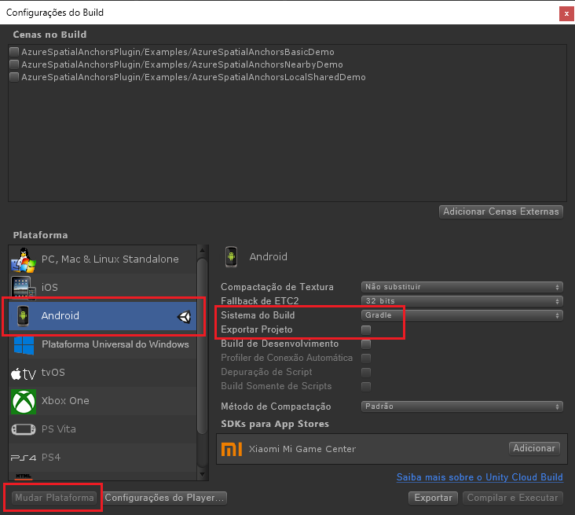

Abra **Configurações de Build** selecionando **Arquivo** > **Configurações de Build**.

Na seção **Plataforma**, selecione **Android**. Selecione **Mudar Plataforma** para alterar a plataforma para **Android**. O Unity poderá solicitar que você instale componentes de suporte Android, se estiverem faltando.

Feche a janela **Configurações de Build**.

